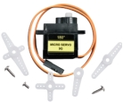
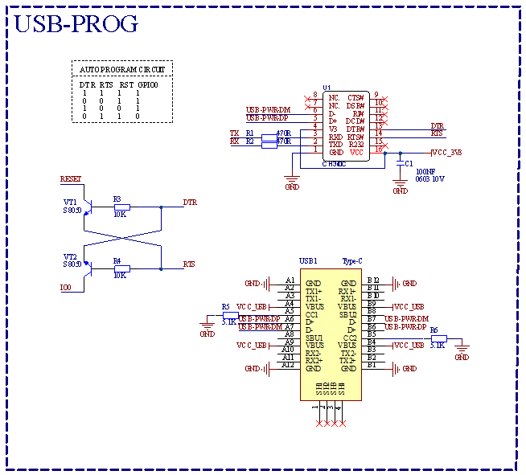
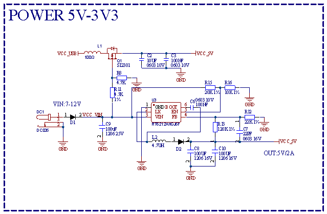

# 1. 产品介绍

## 1.1 产品简介

您想学习编程吗？目前，编程已发展到较低年龄组，每个人都能编程将会是一种趋势。使用此产品和教程，您可以轻松了解并学习基于ESP32开发环境下42款传感器/模块原理及使用方法，学会编写程序使用它们。

Keyes ESP32 42合 1 传感器套装主要包含了我们常用的42款传感器/模块，还有对应的ESP32主控板和XH-2.54mm端子连接线。42款传感器/模块和我们提供的ESP32主控板接口完全匹配。使用时，我们只需要用连接线将传感器/模块连接在ESP32主控板上，简单方便。

为了让你对这42款传感器/模块有更深入的了解，我们还基于这42款传感器/模块做了多个学习课程。这些课程适用于Raspberry Pi系统上的Arduino IDE C语言软件平台、Windows系统上的Arduino IDE C语言软件平台以及Windows系统上的MicroPython语言软件平台。课程中我们提供了对应的原理图、接线方法、Arduino C语言代码、实验结果和简单的代码介绍等信息。通过这些课程，可以让我们对编程方法、逻辑、电子电路有了更深刻的理解。       

此外，如果您对本教程和工具包有任何困难或问题，您可以随时向我们咨询。

## 1.2 清单

| 序号 |              名称              | 数量 |          KE3057          |          KE3057S          |
| :--: | :----------------------------: | :--: | :----------------------: | :-----------------------: |
|  1   |          紫色LED模块           |  1   |     |  |
|  2   |          共阴RGB模块           |  1   |  |  |
|  3   |           交通灯模块           |  1   |  |  |
|  4   |         有源蜂鸣器模块         |  1   |  |  |
|  5   |       8002b功放 喇叭模块       |  1   |     |  |
|  6   |          单路按键模块          |  1   |  |  |
|  7   |           倾斜传感器           |  1   |  |  |
|  8   |       人体红外热释传感器       |  1   |  |  |
|  9   |           避障传感器           |  1   |  |  |
|  10  |          6812 RGB模块          |  1   |  |  |
|  11  |    NTC-MF52AT模拟温度传感器    |  1   |  |     |
|  12  |         光敏电阻传感器         |  1   |  |  |
|  13  |           声音传感器           |  1   |  |  |
|  14  |        旋转电位器传感器        |  1   |  |  |
|  15  |          红外接收模块          |  1   |  |  |
|  16  |           干簧管模块           |  1   |  |  |
|  17  |         旋转编码器模块         |  1   |  |  |
|  18  |            摇杆模块            |  1   |  |  |
|  19  |      HT16K33_8X8点阵模块       |  1   |  |  |
|  20  |      TM1650四位数码管模块      |  1   |  |  |
|  21  |         薄膜压力传感器         |  1   |  |  |
|  22  |      DS1307时钟传感器模块      |  1   |  |  |
|  23  |      HC-SR04超声波传感器       |  1   |     |      |
|  24  |         超声波转接模块         |  1   |  |  |
|  25  |          电容触摸模块          |  1   |  |  |
|  26  |           光折断模块           |  1   |  |  |
|  27  |           霍尔传感器           |  1   |  |  |
|  28  |           火焰传感器           |  1   |  |  |
|  29  |         单路循线传感器         |  1   |  |  |
|  30  |       MQ-2模拟气体传感器       |  1   |  |  |
|  31  | XHT11温湿度传感器（兼容DHT11） |  1   |  |  |
|  32  |       DS18B20温度传感器        |  1   |     |     |
|  33  |          130电机模块           |  1   |     |     |
|  34  |            激光模块            |  1   |     |     |
|  35  |           水滴传感器           |  1   |     |     |
|  36  |        单路5V继电器模块        |  1   |     |     |
|  37  |          RFID刷卡模块          |  1   |     |     |
|  38  |           碰撞传感器           |  1   |     |     |
|  39  |         MQ-3酒精传感器         |  1   |     |     |
|  40  |       LCD_128X32_DOT模块       |  1   |     |     |
|  41  |         五路AD按键模块         |  1   |     |     |
|  42  |    ADXL345加速度传感器模块     |  1   |     |     |
|  43  |        ESP32 PLUS开发板        |  1   |     |      |
|  44  |         舵机 配十字臂          |  1   |   |    |
|  45  |             遥控器             |  1   |   |    |
|  46  |              白卡              |  1   |   |    |
|  47  |             钥匙扣             |  1   |   |    |
|  48  |             电池盒             |  1   |     |      |
|  49  |           USB线 白色           |  1   |   |    |
|  50  |    XH2.54-3P 转杜邦线母单线    |  16  |   |    |
|  51  |    XH2.54-4P 转杜邦线母单线    |  10  |   |    |
|  52  |    XH2.54-5P 转杜邦线母单线    |  3   |   |    |

## 1.3 主板介绍

**一、简介**

这是一款基于ESP32开发板，集成了ESP32-WOROOM-32模组的通用型的WIFI加蓝牙开发板，引脚兼容Arduino。有丰富的外设，包括霍尔传感器，高速SDIO/SPI、UART、I2S和I2C等，适用于搭配传感器模块进行学习。并且可以搭载freeRTOS操作系统，非常适用于物联网、智能家居方案。

---

**二、参数**

|   输出电压   |    3.3V-5V     |
| :----------: | :------------: |
|   输出电流   |   MAX：1.2A    |
|   最大功率   |  最大输出10W   |
| 工作温度范围 |  -10~50摄氏度  |
|     尺寸     | 69\*54\*14.5mm |
|     重量     |     25.5g      |
|  定位孔直径  |     3.2mm      |
|   环保属性   |      ROHS      |

---

**三、接口图**

---

**四、原理图**

