产品介绍
========

首先感谢选择keyes产品, 我们将继续为你提供好的产品和服务!

--------------

**关于keyes**

Keyes是KEYES
Corporation旗下最畅销的品牌，我们的产品包括Arduino开发板、扩展板、传感器模块；树莓派、micro：bit扩展板和智能小车；以及为各阶段客户设计的完整入门套件。这些入门套件旨在为任何水平的客户学习Arduino、树莓派、micro：bit相关知识。

我们所有产品，均符合国际质量标准，在世界各地不同市场中，得到了极大的赞赏。

欢迎从我们的官方网站查看更多内容：

http://www.keyes-robot.com

--------------

**售后服务**

1. 如果发现某些东西丢失或损坏，或者学习套件时遇到一些困难。keyes会提供免费和快速的支持，如果您有任何疑问，请联系我们专业的销售人员。

2. 欢迎提出建议和反馈，我们会根据您的反馈不断更新套件和教程，以使其更好。谢谢！

--------------

**产品安全**

1. 本产品内含细小的零件（螺丝等），请放在儿童接触不到的地方，防止划伤或误食。8岁及以下儿童使用，请在大人监督下使用。
2. 本产品包含导电部件(控制板和电子模块），请按照本教程的要求进行操作，不当的操作可能导致过热并且损害零件，请勿触摸并立即断开电路电源（请按照正确的方式安装电池）。

--------------

**版权**

keyes商标和徽标是KEYES DIY ROBOT
co.,LTD的版权,任何人和公司在没有授权的情况下，不得复制，售卖，转卖，keyes品牌的产品。如果您有兴趣在当地售卖我们的产品，请联系我们专业的批发销售人员。

--------------

套件介绍
--------

|image1|

您想学习编程吗？目前，编程已发展到较低年龄组，每个人都能编程将会是一种趋势。使用此产品和教程，您可以轻松了解并学习基于ESP32开发环境下42款传感器/模块原理及使用方法，学会编写程序使用它们。

Keyes ESP32 42合 1
传感器套装主要包含了我们常用的42款传感器/模块，还有对应的ESP32主控板和XH-2.54mm高温硅胶连接线。42款传感器/模块和我们提供的ESP32主控板接口完全匹配。使用时，我们只需要用连接线将传感器/模块连接在ESP32主控板上，简单方便。

为了让你对这42款传感器/模块有更深入的了解，我们还基于这42款传感器/模块做了多个学习课程。这些课程适用于Raspberry
Pi系统上的Arduino IDE C语言软件平台、Windows系统上的Arduino IDE
C语言软件平台以及Windows系统上的MicroPython语言软件平台。课程中我们提供了对应的原理图、接线方法、Arduino
C语言代码、实验结果和简单的代码介绍等信息。通过这些课程，可以让我们对编程方法、逻辑、电子电路有了更深刻的理解。

此外，如果您对本教程和工具包有任何困难或问题，您可以随时向我们咨询。

--------------

套件清单
--------

+------+-----------------+-----------------+-----------------+--------+
| 序号 | KE3057          | KE3057S         | 规格            | 倍用量 |
+======+=================+=================+=================+========+
| 1    | |image208|      | |img| KE4075S   | 紫色LED模块     | 1      |
|      | KE4075          |                 |                 |        |
+------+-----------------+-----------------+-----------------+--------+
| 2    | |image209|      | |image210|      | 共阴RGB模块     | 1      |
|      | KE4074          | KE4074S         |                 |        |
+------+-----------------+-----------------+-----------------+--------+
| 3    | |image211|      | |image212|      | 交通灯模块      | 1      |
|      | KE4008          | KE4008S         |                 |        |
+------+-----------------+-----------------+-----------------+--------+
| 4    | |image213|      | |image214|      | 有源蜂鸣器模块  | 1      |
|      | KE4010          | KE4010S         |                 |        |
+------+-----------------+-----------------+-----------------+--------+
| 5    | |image215|      | |image216|      | 8002b功放       | 1      |
|      | KE4067          | KE4067S         | 喇叭模块        |        |
+------+-----------------+-----------------+-----------------+--------+
| 6    | |image217|      | |image218|      | 单路按键模块    | 1      |
|      | KE4012          | KE4012S         |                 |        |
+------+-----------------+-----------------+-----------------+--------+
| 7    | |image219|      | |image220|      | 倾斜传感器      | 1      |
|      | KE4017          | KE4017S         |                 |        |
+------+-----------------+-----------------+-----------------+--------+
| 8    | |image221|      | |image222|      | 人体            | 1      |
|      | KE4018          | KE4018S         | 红外热释传感器  |        |
+------+-----------------+-----------------+-----------------+--------+
| 9    | |image223|      | |image224|      | 避障传感器      | 1      |
|      | KE4019          | KE4019S         |                 |        |
+------+-----------------+-----------------+-----------------+--------+
| 10   | |image225|      | |image226|      | 6812 RGB模块    | 1      |
|      | KE4009          | KE4009S         |                 |        |
+------+-----------------+-----------------+-----------------+--------+
| 11   | |image227|      | |image228|      | NTC-MF52A       | 1      |
|      | KE4025          | KE4025S         | T模拟温度传感器 |        |
+------+-----------------+-----------------+-----------------+--------+
| 12   | |image229|      | |image230|      | 光敏电阻传感器  | 1      |
|      | KE4026          | KE4026S         |                 |        |
+------+-----------------+-----------------+-----------------+--------+
| 13   | |image231|      | |image232|      | 声音传感器      | 1      |
|      | KE4027          | KE4027S         |                 |        |
+------+-----------------+-----------------+-----------------+--------+
| 14   | |image233|      | |image234|      | 旋              | 1      |
|      | KE4030          | KE4030S         | 转电位器传感器  |        |
+------+-----------------+-----------------+-----------------+--------+
| 15   | |image235|      | |image236|      | 红外接收模块    | 1      |
|      | KE4036          | KE4036S         |                 |        |
+------+-----------------+-----------------+-----------------+--------+
| 16   | |image237|      | |image238|      | 干簧管模块      | 1      |
|      | KE4015          | KE4015S         |                 |        |
+------+-----------------+-----------------+-----------------+--------+
| 17   | |image239|      | |image240|      | 旋转编码器模块  | 1      |
|      | KE4049          | KE4049S         |                 |        |
+------+-----------------+-----------------+-----------------+--------+
| 18   | |image241|      | |image242|      | 摇杆模块        | 1      |
|      | KE4050          | KE4050S         |                 |        |
+------+-----------------+-----------------+-----------------+--------+
| 19   | |image243|      | |image244|      | HT16            | 1      |
|      | KE4066          | KE4066S         | K33_8X8点阵模块 |        |
+------+-----------------+-----------------+-----------------+--------+
| 20   | |image245|      | |image246|      | TM165           | 1      |
|      | KE4060          | KE4060S         | 0四位数码管模块 |        |
+------+-----------------+-----------------+-----------------+--------+
| 21   | |image247|      | |image248|      | 薄膜压力传感器  | 1      |
|      | KE4069          | KE4069S         |                 |        |
+------+-----------------+-----------------+-----------------+--------+
| 22   | |image249|      | |image250|      | DS130           | 1      |
|      | KE4072          | KE4072S         | 7时钟传感器模块 |        |
+------+-----------------+-----------------+-----------------+--------+
| 23   | |image251|      | |image252|      | HC-S            | 1      |
|      | MD0017          | MD0017          | R04超声波传感器 |        |
+------+-----------------+-----------------+-----------------+--------+
| 24   | |image253|      | |image254|      | 超声波转接模块  | 1      |
|      | KE4039          | KE4039S         |                 |        |
+------+-----------------+-----------------+-----------------+--------+
| 25   | |image255|      | |image256|      | 电容触摸模块    | 1      |
|      | KE4013          | KE4013S         |                 |        |
+------+-----------------+-----------------+-----------------+--------+
| 26   | |image257|      | |image258|      | 光折断模块      | 1      |
|      | KE4014          | KE4014S         |                 |        |
+------+-----------------+-----------------+-----------------+--------+
| 27   | |image259|      | |image260|      | 霍尔传感器      | 1      |
|      | KE4016          | KE4016S         |                 |        |
+------+-----------------+-----------------+-----------------+--------+
| 28   | |image261|      | |image262|      | 火焰传感器      | 1      |
|      | KE4020          | KE4020S         |                 |        |
+------+-----------------+-----------------+-----------------+--------+
| 29   | |image263|      | |image264|      | 单路循线传感器  | 1      |
|      | KE4024          | KE4024S         |                 |        |
+------+-----------------+-----------------+-----------------+--------+
| 30   | |image265|      | |image266|      | MQ-             | 1      |
|      | KE4029          | KE4029S         | 2模拟气体传感器 |        |
+------+-----------------+-----------------+-----------------+--------+
| 31   | |image267|      | |image268|      | XHT11温湿度传感 | 1      |
|      | KE4033          | KE4033S         | 器（兼容DHT11） |        |
+------+-----------------+-----------------+-----------------+--------+
| 32   | |image269|      | |image270|      | DS              | 1      |
|      | KE4034          | KE4034S         | 18B20温度传感器 |        |
+------+-----------------+-----------------+-----------------+--------+
| 33   | |image271|      | |image272|      | 130电机模块     | 1      |
|      | KE4038          | KE4038S         |                 |        |
+------+-----------------+-----------------+-----------------+--------+
| 34   | |image273|      | |image274|      | 激光模块        | 1      |
|      | KE4043          | KE4043S         |                 |        |
+------+-----------------+-----------------+-----------------+--------+
| 35   | |image275|      | |image276|      | 水滴传感器      | 1      |
|      | KE4048          | KE4048S         |                 |        |
+------+-----------------+-----------------+-----------------+--------+
| 36   | |image277|      | |image278|      | 单              | 1      |
|      | KE4062          | KE4062S         | 路5V继电器模块  |        |
+------+-----------------+-----------------+-----------------+--------+
| 37   | |image279|      | |image280|      | RFID刷卡模块    | 1      |
|      | KE4065          | KE4065S         |                 |        |
+------+-----------------+-----------------+-----------------+--------+
| 38   | |image281|      | |image282|      | 碰撞传感器      | 1      |
|      | KE4023          | KE4023S         |                 |        |
+------+-----------------+-----------------+-----------------+--------+
| 39   | |image283|      | |image284|      | MQ-3酒精传感器  | 1      |
|      | KE4028          | KE4028S         |                 |        |
+------+-----------------+-----------------+-----------------+--------+
| 40   | |image285|      | |image286|      | LCD             | 1      |
|      | KE4061          | KE4061S         | _128X32_DOT模块 |        |
+------+-----------------+-----------------+-----------------+--------+
| 41   | |image287|      | |image288|      | 五路AD按键模块  | 1      |
|      | KE4068          | KE4068S         |                 |        |
+------+-----------------+-----------------+-----------------+--------+
| 42   | |image289|      | |image290|      | ADXL345加       | 1      |
|      | KE4073          | KE4073S         | 速度传感器模块  |        |
+------+-----------------+-----------------+-----------------+--------+
| 43   | |image291|      | |image292|      | ESP32           | 1      |
|      | KS5016          | KS5016          | PLUS开发板      |        |
+------+-----------------+-----------------+-----------------+--------+
| 44   | |image293|      | |image294|      | 舵机 配十字臂   | 1      |
|      | 67820089        | 67820089        |                 |        |
+------+-----------------+-----------------+-----------------+--------+
| 45   | |image295|      | |image296|      | 遥控器          | 1      |
|      | 67820037        | 67820037        |                 |        |
+------+-----------------+-----------------+-----------------+--------+
| 46   | |image297|      | |image298|      | 白卡            | 1      |
|      | 69520001        | 69520001        |                 |        |
+------+-----------------+-----------------+-----------------+--------+
| 47   | |image299|      | |image300|      | 钥匙扣          | 1      |
|      | 69520002        | 69520002        |                 |        |
+------+-----------------+-----------------+-----------------+--------+
| 48   | |image301|      | |image302|      | 电池盒          | 1      |
|      | OR0266          | OR0266          |                 |        |
+------+-----------------+-----------------+-----------------+--------+
| 49   | |image303|      | |image304|      | USB线 白色      | 1      |
|      | 12600028        | 12600028        |                 |        |
+------+-----------------+-----------------+-----------------+--------+
| 50   | |image305|      | |image306|      | XH2.54-3P       | 16     |
|      | 19720013        | 19720013        | 转杜邦线母单线  |        |
+------+-----------------+-----------------+-----------------+--------+
| 51   | |image307|      | |image308|      | XH2.54-4P       | 10     |
|      | 19720101        | 19720101        | 转杜邦线母单线  |        |
+------+-----------------+-----------------+-----------------+--------+
| 52   | |image309|      | |image310|      | XH2.54-5P       | 3      |
|      | 19700212        | 19700212        | 转杜邦线母单线  |        |
+------+-----------------+-----------------+-----------------+--------+

.. |image1| image:: media/KE3057.jpg
.. |image2| image:: media/KE4075.png
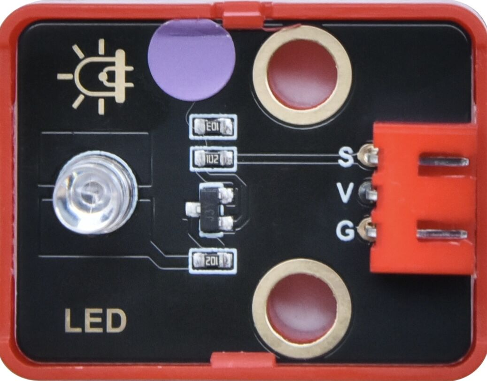
.. |image3| image:: media/KE4074.png
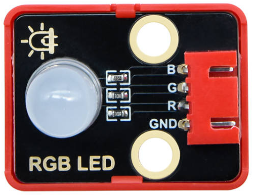
.. |image5| image:: media/KE4008.png
.. |image6| image:: media/KE4008S.png
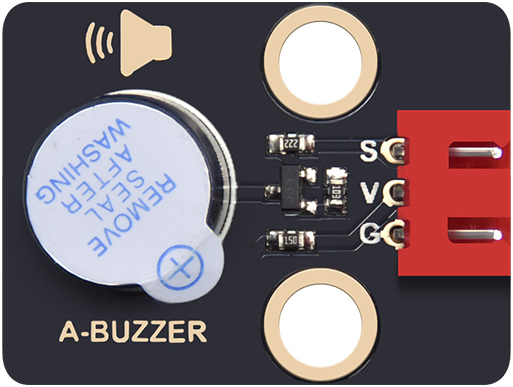
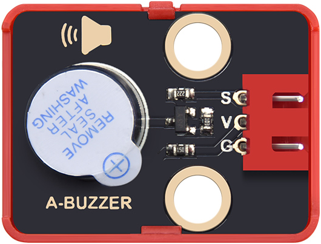
.. |image9| image:: media/KE4067.png
.. |image10| image:: media/KE4067S.png
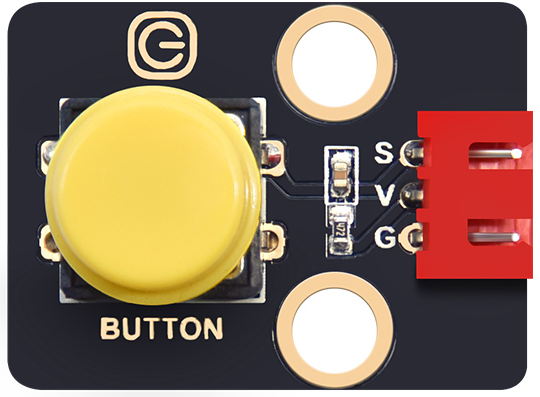
.. |image12| image:: media/KE4012S.png
.. |image13| image:: media/KE4017.png
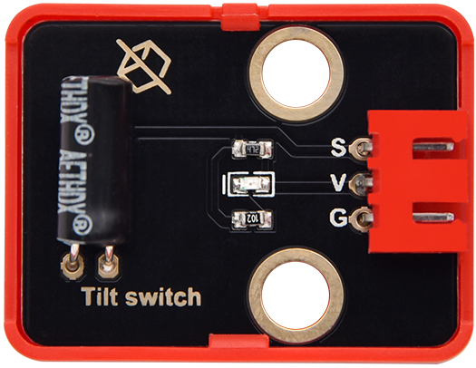
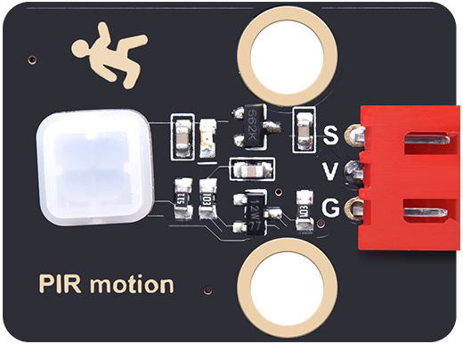
.. |image16| image:: media/KE4018S.png
.. |image17| image:: media/KE4019.png
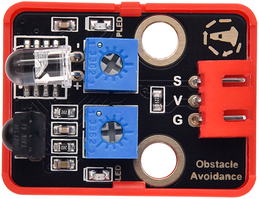
.. |image19| image:: media/KE4009.png
.. |image20| image:: media/KE4009S.png
.. |image21| image:: media/KE4025.png
.. |image22| image:: media/KE4025S.png
.. |image23| image:: media/KE4026.png
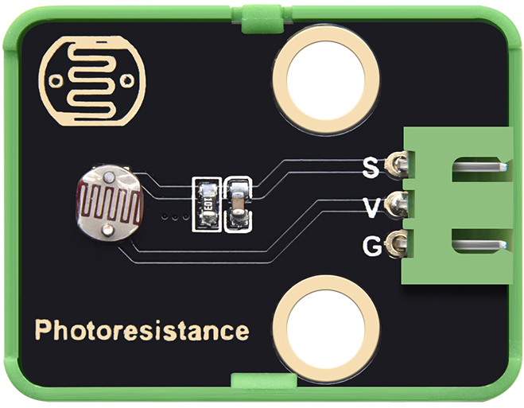
.. |image25| image:: media/KE4027.png
.. |image26| image:: media/KE4027S.png
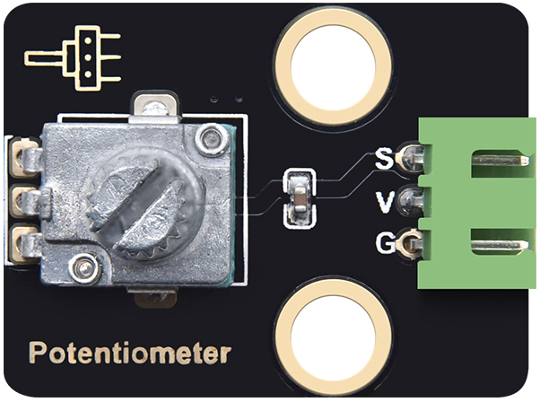
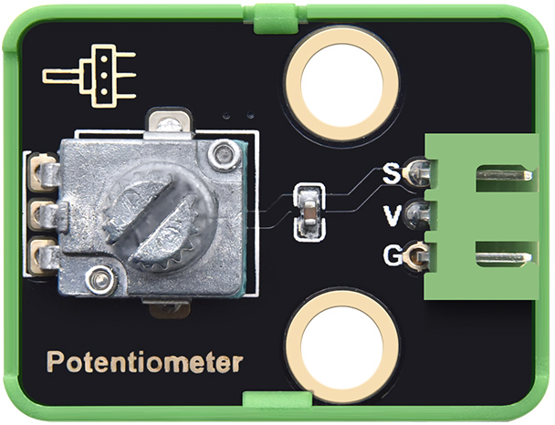
.. |image29| image:: media/KE4036.png
.. |image30| image:: media/KE4036S.png
.. |image31| image:: media/KE4015.png
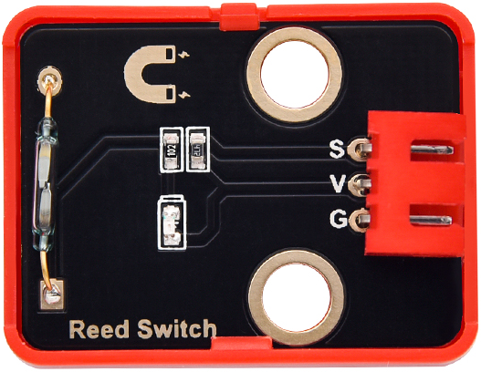
.. |image33| image:: media/KE4049.png
.. |image34| image:: media/KE4049S.png
.. |image35| image:: media/KE4050.png
.. |image36| image:: media/KE4050S.png
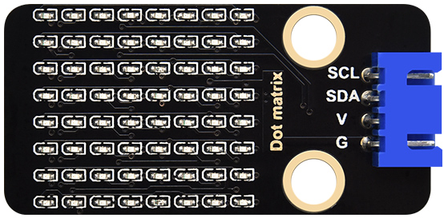
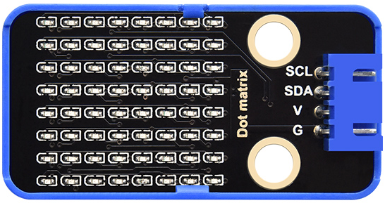
.. |image39| image:: media/KE4060.png
.. |image40| image:: media/KE4060S.png
.. |image41| image:: media/KE4069.png
.. |image42| image:: media/KE4069S.png
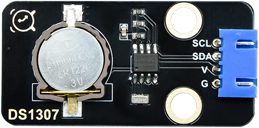
.. |image44| image:: media/KE4072S.png
.. |image45| image:: media/MD0017.png
.. |image46| image:: media/MD0017.png
.. |image47| image:: media/KE4039.png
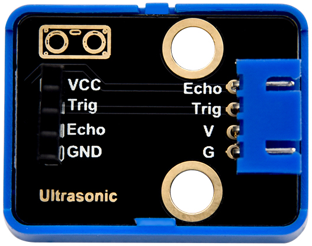
.. |image49| image:: media/KE4013.png
.. |image50| image:: media/KE4013S.png
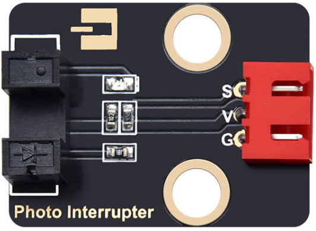
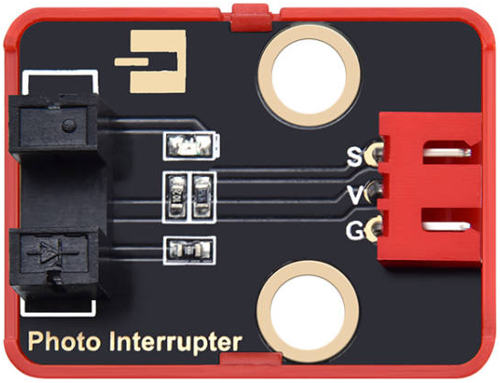
.. |image53| image:: media/KE4016.png
.. |image54| image:: media/KE4016S.png
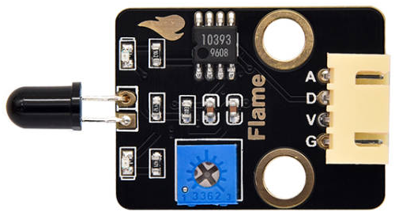
.. |image56| image:: media/KE4020S.png
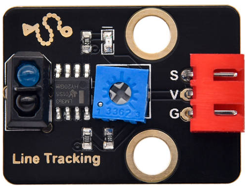
.. |image58| image:: media/KE4024S.png
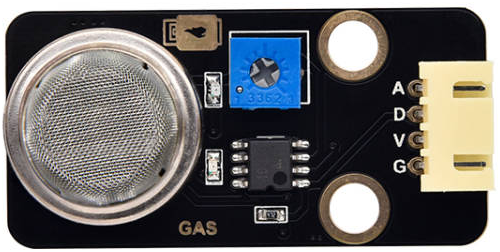
.. |image60| image:: media/KE4029S.png
.. |image61| image:: media/KE4033.png
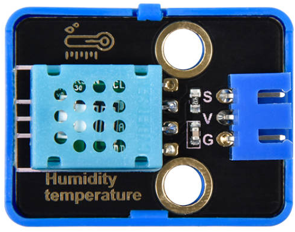
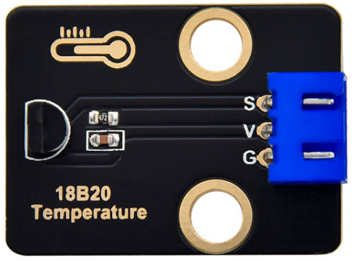
.. |image64| image:: media/KE4034S.png
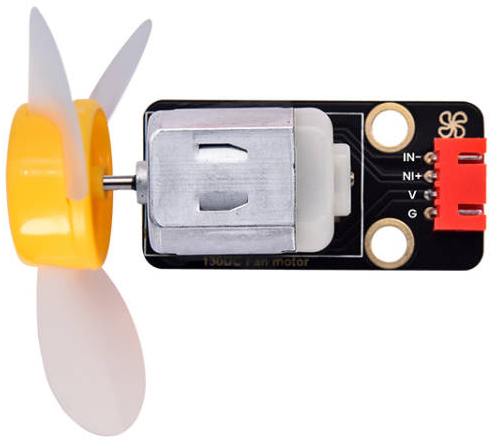
.. |image66| image:: media/KE4038S.png
.. |image67| image:: media/KE4043.png
.. |image68| image:: media/KE4043S.png
.. |image69| image:: media/KE4048.png
.. |image70| image:: media/KE4048S.png
.. |image71| image:: media/KE4062.png
.. |image72| image:: media/KE4062S.png
.. |image73| image:: media/KE4065.png
.. |image74| image:: media/KE4065S.png
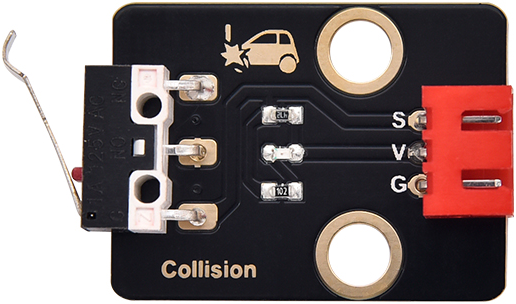
.. |image76| image:: media/KE4023S.png
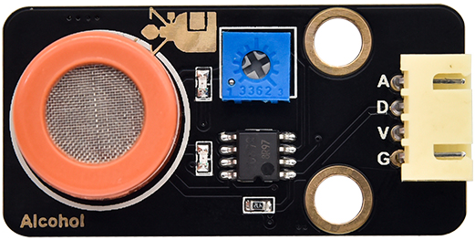
.. |image78| image:: media/KE4028S.png
.. |image79| image:: media/KE4061.png
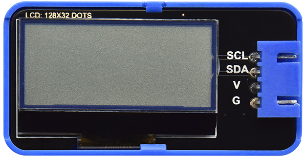
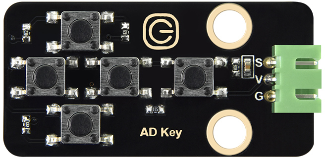
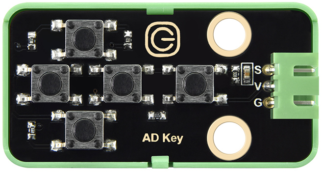
.. |image83| image:: media/KE4073.png
.. |image84| image:: media/KE4073S.png
.. |image85| image:: media/KS5016.png
.. |image86| image:: media/KS5016.png
.. |image87| image:: media/67820089.png
.. |image88| image:: media/67820089.png
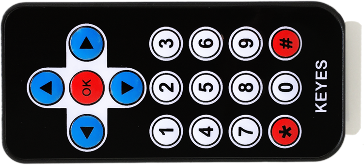

.. |image91| image:: media/69520001.png
.. |image92| image:: media/69520001.png
.. |image93| image:: media/69520002.png
.. |image94| image:: media/69520002.png
.. |image95| image:: media/OR0266.png
.. |image96| image:: media/OR0266.png
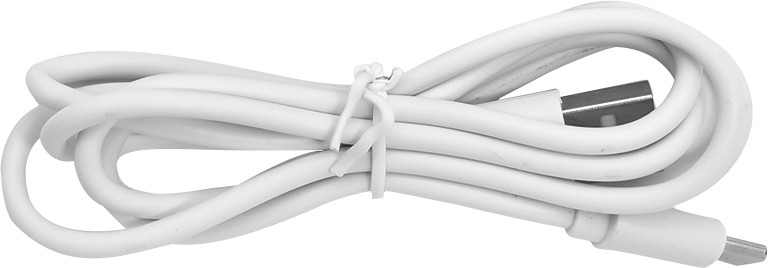

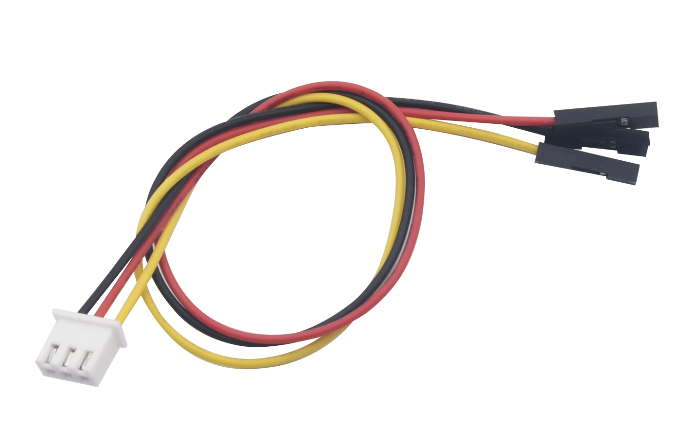

.. |image101| image:: media/19720101.png
.. |image102| image:: media/19720101.png
.. |image103| image:: media/19700212.png
.. |image104| image:: media/19700212.png
.. |image105| image:: media/KE4075.png
.. |image106| image:: media/KE4074.png

.. |image108| image:: media/KE4008.png
.. |image109| image:: media/KE4008S.png

.. |image112| image:: media/KE4067.png
.. |image113| image:: media/KE4067S.png

.. |image115| image:: media/KE4012S.png
.. |image116| image:: media/KE4017.png

.. |image119| image:: media/KE4018S.png
.. |image120| image:: media/KE4019.png

.. |image122| image:: media/KE4009.png
.. |image123| image:: media/KE4009S.png
.. |image124| image:: media/KE4025.png
.. |image125| image:: media/KE4025S.png
.. |image126| image:: media/KE4026.png

.. |image128| image:: media/KE4027.png
.. |image129| image:: media/KE4027S.png

.. |image132| image:: media/KE4036.png
.. |image133| image:: media/KE4036S.png
.. |image134| image:: media/KE4015.png

.. |image136| image:: media/KE4049.png
.. |image137| image:: media/KE4049S.png
.. |image138| image:: media/KE4050.png
.. |image139| image:: media/KE4050S.png

.. |image142| image:: media/KE4060.png
.. |image143| image:: media/KE4060S.png
.. |image144| image:: media/KE4069.png
.. |image145| image:: media/KE4069S.png

.. |image147| image:: media/KE4072S.png
.. |image148| image:: media/MD0017.png
.. |image149| image:: media/MD0017.png
.. |image150| image:: media/KE4039.png

.. |image152| image:: media/KE4013.png
.. |image153| image:: media/KE4013S.png

.. |image156| image:: media/KE4016.png
.. |image157| image:: media/KE4016S.png

.. |image159| image:: media/KE4020S.png

.. |image161| image:: media/KE4024S.png

.. |image163| image:: media/KE4029S.png
.. |image164| image:: media/KE4033.png

.. |image167| image:: media/KE4034S.png

.. |image169| image:: media/KE4038S.png
.. |image170| image:: media/KE4043.png
.. |image171| image:: media/KE4043S.png
.. |image172| image:: media/KE4048.png
.. |image173| image:: media/KE4048S.png
.. |image174| image:: media/KE4062.png
.. |image175| image:: media/KE4062S.png
.. |image176| image:: media/KE4065.png
.. |image177| image:: media/KE4065S.png

.. |image179| image:: media/KE4023S.png

.. |image181| image:: media/KE4028S.png
.. |image182| image:: media/KE4061.png

.. |image186| image:: media/KE4073.png
.. |image187| image:: media/KE4073S.png
.. |image188| image:: media/KS5016.png
.. |image189| image:: media/KS5016.png
.. |image190| image:: media/67820089.png
.. |image191| image:: media/67820089.png

.. |image194| image:: media/69520001.png
.. |image195| image:: media/69520001.png
.. |image196| image:: media/69520002.png
.. |image197| image:: media/69520002.png
.. |image198| image:: media/OR0266.png
.. |image199| image:: media/OR0266.png

.. |image204| image:: media/19720101.png
.. |image205| image:: media/19720101.png
.. |image206| image:: media/19700212.png
.. |image207| image:: media/19700212.png
.. |image208| image:: media/KE4075.png
.. |image209| image:: media/KE4074.png

.. |image211| image:: media/KE4008.png
.. |image212| image:: media/KE4008S.png

.. |image215| image:: media/KE4067.png
.. |image216| image:: media/KE4067S.png

.. |image218| image:: media/KE4012S.png
.. |image219| image:: media/KE4017.png

.. |image222| image:: media/KE4018S.png
.. |image223| image:: media/KE4019.png

.. |image225| image:: media/KE4009.png
.. |image226| image:: media/KE4009S.png
.. |image227| image:: media/KE4025.png
.. |image228| image:: media/KE4025S.png
.. |image229| image:: media/KE4026.png

.. |image231| image:: media/KE4027.png
.. |image232| image:: media/KE4027S.png

.. |image235| image:: media/KE4036.png
.. |image236| image:: media/KE4036S.png
.. |image237| image:: media/KE4015.png

.. |image239| image:: media/KE4049.png
.. |image240| image:: media/KE4049S.png
.. |image241| image:: media/KE4050.png
.. |image242| image:: media/KE4050S.png

.. |image245| image:: media/KE4060.png
.. |image246| image:: media/KE4060S.png
.. |image247| image:: media/KE4069.png
.. |image248| image:: media/KE4069S.png

.. |image250| image:: media/KE4072S.png
.. |image251| image:: media/MD0017.png
.. |image252| image:: media/MD0017.png
.. |image253| image:: media/KE4039.png

.. |image255| image:: media/KE4013.png
.. |image256| image:: media/KE4013S.png

.. |image259| image:: media/KE4016.png
.. |image260| image:: media/KE4016S.png

.. |image262| image:: media/KE4020S.png

.. |image264| image:: media/KE4024S.png

.. |image266| image:: media/KE4029S.png
.. |image267| image:: media/KE4033.png

.. |image270| image:: media/KE4034S.png

.. |image272| image:: media/KE4038S.png
.. |image273| image:: media/KE4043.png
.. |image274| image:: media/KE4043S.png
.. |image275| image:: media/KE4048.png
.. |image276| image:: media/KE4048S.png
.. |image277| image:: media/KE4062.png
.. |image278| image:: media/KE4062S.png
.. |image279| image:: media/KE4065.png
.. |image280| image:: media/KE4065S.png

.. |image282| image:: media/KE4023S.png

.. |image284| image:: media/KE4028S.png
.. |image285| image:: media/KE4061.png

.. |image289| image:: media/KE4073.png
.. |image290| image:: media/KE4073S.png
.. |image291| image:: media/KS5016.png
.. |image292| image:: media/KS5016.png
.. |image293| image:: media/67820089.png
.. |image294| image:: media/67820089.png

.. |image297| image:: media/69520001.png
.. |image298| image:: media/69520001.png
.. |image299| image:: media/69520002.png
.. |image300| image:: media/69520002.png
.. |image301| image:: media/OR0266.png
.. |image302| image:: media/OR0266.png

.. |image307| image:: media/19720101.png
.. |image308| image:: media/19720101.png
.. |image309| image:: media/19700212.png
.. |image310| image:: media/19700212.png
