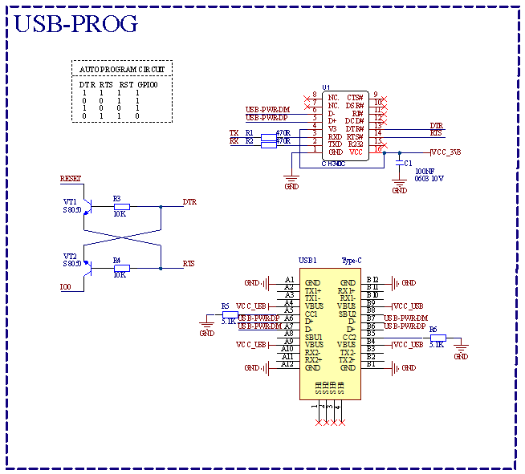
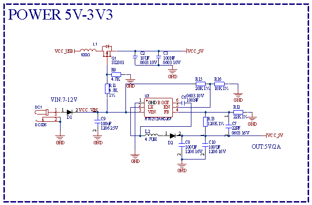
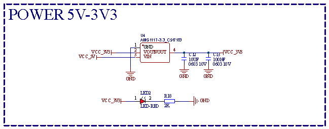

# KEYES ESP32 PLUS开发板

## 一、简介

这是一款基于ESP32开发板，集成了ESP32-WOROOM-32模组，是一款通用型的WIFI加蓝牙开发板，引脚兼容Arduino。有丰富的外设，包括霍尔传感器，高速SDIO/SPI、UART、I2S和I2C等，适用于搭配传感器模块进行学习。并且可以搭载freeRTOS操作系统，非常适用于物联网、智能家居方案。

---

## 二、参数

|   输出电压   |   3.3V-5V    |
| :----------: | :----------: |
|   输出电流   |  MAX：1.2A   |
|   最大功率   | 最大输出10W  |
| 工作温度范围 | -10~50摄氏度 |
|     尺寸     | 69\*54\*14.5mm |
|     重量     |    25.5g     |
|  定位孔直径  |    3.2mm     |
|   环保属性   |     ROHS     |

---

## 三、接口图

---

## 四、原理图

