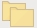
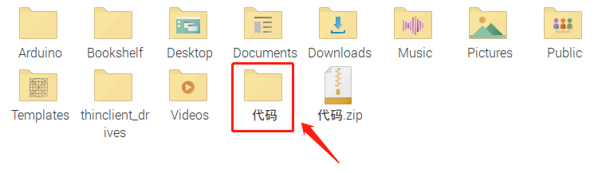

# 开发环境配置

## 一、下载安装Arduino IDE

### 1.1 Windows系统

（1）首先，进入arduino官方网站：https://www.arduino.cc/ ，点击“  <u>**SOFTWARE**</u> ”进入下载页面。


注意：最新的2.0.4版本（见上图）只支持win10以上的64位系统。如果您的电脑系统低于win10或者操作系统是32位的，请下载1.8.X版本（见下图）。


根据你的操作系统选择并下载相应的安装程序。如果你是Windows用户，请选择Windows安装程序下载正确的安装驱动程序。选择点击“**<u>Windows Win7 and newer</u>**”下载Arduino 1.8.19版本的安装程序，需要手动安装。而当点击“**<u>Windows ZIP file</u>**”时，Arduino 1.8.19版本的zip文件将被直接下载，只需要解压它就可以完成安装。


一般情况下，点击“**<u>JUST DOWNLOAD</u>**”就可以下载了，当然如果你愿意，你可以选择小小的赞助，以帮助伟大的Arduino开源事业。

（2）下载完成后，双击打开“**<u>arduino-1.8.19-windows.exe</u>**”进行安装。首先单击“**<u>I Agree</u>**”“择要安装的组件，再单击“**<u>Next</u>**”。


选择安装目录，建议保持默认目录，然后单击“**<u>Install</u>**”。


安装完成后，单击“<u>**Close**</u>”结束安装。桌面上会生成一个Arduino IDE的快捷方式。


---

## 1.2 Mac系统

在MAC系统下安装Arduino IDE的步骤和1.1章节类似。但不同的系统需要下载的Arduino IDE版本不同，在MAC系统下载Arduino IDE选择如下图所示的版本。


---

## 1.3 Raspberry Pi系统

### 1.3.1 准备需要用到的硬件

1. 树莓派4B/3B/2B

2. **16G以上的TFT内存卡 **

3. 读卡器

4. 常用的电脑及配件

---

### 1.3.2 需要在电脑上安装的软件工具

#### （1）putty

下载链接：https://www.chiark.greenend.org.uk/~sgtatham/putty/

① 点击下载


② 根据电脑配置选择相应的版本


③ 下载putty驱动文件完成后，鼠标左键双击putty驱动文件，再点击“<u>**Next**</u>”。


④ 选择安装地址，注意：默认安装到C盘，建议不要安装至其他地址，容易造成后续其他步骤出错，点击“**<u>NEXT</u>**”。


⑤ 选中“**<u>Install Putty files</u>**”，点击“<u>**Install**</u>”，等待安装。


⑥ 几秒钟之后安装完成，点击“<u>**Finish**</u>”结束安装。


---

#### （2）SSH远程登录软件 WinSCP

下载链接：https://winscp.net/eng/download.php

① 按步骤下载


② 下载好WinSCP软件文件后，鼠标左键双击WinSCP软件文件，再左键单击选择安装模式。


③ 点击“**<u>接受</u>**”，然后点击“**<u>下一步</u>**”，最后点击“**<u>安装</u>**”。


④ 几秒钟之后安装完成，点击“**<u>完成</u>**”结束安装。


---

#### (3)格式化TFT卡工具 SD Card Formatter

下载链接：
http://www.canadiancontent.net/tech/download/SD_Card_Formatter.html

①按步骤下载


② 解压下载好的压缩包，双击解压后文件夹里的SD Card Formatter文件运行。


③ 点击“**<u>Next</u>**”，选择“”并点击“**<u>Next</u>**”。


④ 点击“**<u>Next</u>**”，然后再点击“**<u>Install</u>**”。


⑤ 几秒钟之后安装完成，点击“**<u>Finish</u>**”结束安装。

---

#### (4) 烧录镜像系统软件工具 Win32DiskImager

下载链接：https://sourceforge.net/projects/win32diskimager/

① 按步骤下载


② 下载好Win32DiskImager软件文件之后，鼠标左键双击Win32DiskImager软件文件，然后点击“**<u>Run</u>**”。


③ 选择之后，再点击“**<u>Next</u>**”。


④ 设置Win32DiskImager程序的安装地址，图中为默认地址，再点击“**<u>Next</u>**”。


⑤ 设置Win32DiskImager程序快捷方式的地址，图中为默认地址，再点击“**<u>Next</u>**”。


⑥ 选中后点击“**<u>Next</u>**”，然后再点击“**<u>Install</u>**”。


⑦ 几秒钟之后安装完成，点击“**<u>Finish</u>**”结束安装。


---

#### (5)扫描查找ip地址软件工具WNetWatcher

下载链接：http://www.nirsoft.net/utils/wnetwatcher.zip

---

#### (6)树莓派的镜像系统

最新版本系统下载链接：https://www.raspberrypi.org/downloads/raspberry-pi-os/

旧版本系统下载链接：
Raspbian：https://downloads.raspberrypi.org/raspbian/images/
Raspbian full：https://downloads.raspberrypi.org/raspbian_full/images/
Raspbian lite：https://downloads.raspberrypi.org/raspbian_lite/images/

本教程使用2020.05.28版本系统：（由于树莓派官方版本升级，可能导致部分系统功能与此教程使用有些冲突，所以我们这里推荐使用本教程版本）。

2020.05.28版本系统下载链接：
https://downloads.raspberrypi.org/raspios_full_armhf/images/raspios_full_armhf-2021-05-28/


---

### 1.3.3 树莓派安装Raspberry Pi OS系统

#### （1）TFT内存卡插到读卡器上，读卡器插到电脑的USB端口

---

#### （2）使用SD Card Formatter软件工具将TFT内存卡格式化


---

#### （3）烧录系统

① 使用Win32DiskImager 软件，将树莓派官方的系统（Raspberry Pi OS）镜像烧录到TFT内存卡上。

a.  双击打开Win32DiskImager 软件，选择下载并解压好的镜像系统文件，然后点击“**<u>写入</u>**”写入系统。确认覆盖，点击“**<u>Yes</u>**”。


b. 等待写入完成，完成后点击“**OK**”。


② 镜像系统烧录完成后，先不要把读卡器拔出，新建一个文本文档，**<u>命名为SSH，删掉后缀 .txt</u>**，然后复制到TFT卡的boot目录下，这样就可以打开SSH登录功能了。


③ 拔出读卡器。

---

#### （4）登录系统

**==以下操作要求raspberry与PC电脑在同一局域网内==**

① 将烧录好的TFT内存卡插到树莓派，接好网线，接好电源并打开电源。如果有屏幕和树莓派的HDMI线，连接好屏幕，就可以看到Raspberry Pi OS系统的开机画面。

如果没有树莓派的HDMI线，可以使用软件WinSCP来进行SSH远程登录，也可以使用xrdp登录树莓派系统的桌面。

② 使用WNetWatcher软件查找树莓派的IP地址。


如果打开后跟上图一样没有IP地址，需要按照下列步骤设置。


设置完成后，记录下树莓派的IP地址和MAC地址。根据下图红框所示，树莓派的MAC地址为：dc:a6:32:17:5b:cb，ip地址为：192.168.0.57。**<u>记录下你的树莓派的地址</u>**，后面使用WinSCP远程登录树莓派和使用xrdp远程登录树莓派系统桌面时都会使用到ip地址。


如果不知道树莓派的mac地址，也不知道查询出来的哪个才是树莓派的ip地址，那就先把树莓派的网线拔掉，打开WNetWatcher查询，界面右边会有检测次数。再接上树莓派网线，使用WNetWatcher查询一次，那么树莓派地址被检测到的次数比其它地址要少一次。接着把树莓派的ip地址和mac地址记录下来。

③ 使用WinSCP远程登录树莓派

双击打开WinSCP软件，通过**<u>树莓派系统的默认名称、默认用户名、和上一步记录下的树莓派IP填写登陆信息</u>**，注意：要求同一个网络里只能接入一个树莓派。填写完后点击“**<u>登陆</u>**”。然后再次输入默认密码 "**<u>raspberry</u>**"。


登陆成功后，打开终端。


打开终端之后，还需要再次输入密码：**<u>raspberry</u>**，注意：**==这里输入密码后不会显示==**，直接输入正确的密码然后按下“**<u>Enter</u>**”键。


登录成功后，终端界面打开。输入“**<u>ip a</u>** ''然后按下“**<u>Enter</u>**”键，也可以查看ip和mac地址，如下图。


④ 固定树莓派的ip地址

由于ip地址是会变动的，第二天很可能ip地址就不一样了，就需要再次查看ip地址，所以为了更方便使用，需要固定树莓派的ip地址。操作步骤如下：

a. 切换到root用户。
如果还没设置root的用户密码需要先设置密码，在终端里输入“<u>**sudo passwd root**</u> ”。
接着设置密码，本教程设置密码为：123456，你可以设置你想要的密码。


b. 切换到root用户，终端里输入“**su root**”。

c. 固定ip地址的配置文件，先将配置文件里的ip地址（“**address 192.168.0.57**”）修改为你自己的地址。

配置文件：

```shell
echo -e '
auto eth0
iface eth0 inet static
    #Change IP address
    address 192.168.0.57
    netmask 255.255.255.0
    gateway 192.168.1.1
    network   192.168.1.0
    broadcast 192.168.1.255
    dns-domain 119.29.29.29
    dns-nameservers 119.29.29.29
    metric 0  
mtu 1492
'>/etc/network/interfaces.d/eth0
```

操作示例图如下：


d. 重启系统，使配置文件生效，终端输入重启命令“**<u>sudo reboot</u>**”。接着输入密码：123456。之后就可以使用树莓派的固定ip来登陆了。

e. 再次查看ip，确保已经固定好ip地址了。


⑤ 无线登陆树莓派系统的桌面

如果我们没有连接显示屏的HDMI高清线，能不能在windows桌面上无线登录树莓派系统的桌面呢？是可以的，方法较多，目前比较常用的是使用VNC和Xrdp。接下来学习如何使用Xrdp在windows桌面上无线登录树莓派系统的桌面。

a. 在终端里安装Xrdp服务。
切换到root用户“**<u>su root</u>**"
安装命令"**<u>apt-get install xrdp</u>**"
根据提示，输入"**<u>y</u>**" ，再按“**<u>ENTER</u>**”键。


b. 打开Windows的远程桌面连接 。

按下“**<u>WIN+R</u>**键”， 然后输入"**<u>mstsc.exe</u>**"。


接着输入树莓派的ip地址，注意：<u>**192.168.0.57**</u>需要修改为你的树莓派ip，输入完成后点击“**<u>连接</u>**”。


接着会出现下图提示，点击 “**<u>是</u>**”。


接着输入用户名"**<u>pi</u>**" ，默认密码"**<u>raspberry</u>**"，如下图所示：


点击“**<u>OK</u>**”或者按下“**<u>Enter</u>**”键，就会出现树莓派系统Raspberry Pi OS的桌面，如下图所示：


在开始使用之前，树莓派会提醒你已启用SSH，且“pi”用户的默认密码未修改，具有风险。如需修改请登录并运行树莓派配置来设置新密码。点击“OK”确认修改，再点击“Next”开始修改。不需修改点击右上角的“x”，跳过以下修改步骤。


默认的“pi”用户帐号当前的密码是“raspberry"。强烈建议您将此更改为只有您知道的密码。设置完成后点击“Next”。


设置界面，如果你的屏幕边缘有黑色边框，勾选下面的方框。点击“Next”保存设置，修改将在重启树莓派后生效。


设置无线网络，有需要的话连接，设置完成后点击“Next”。


更新软件，操作系统和应用程序将在必要时进行检查和更新。需要下载的内容较多，耗时较久。点击“Next”检查和更新软件，或点击“Skip”跳过，继续进行下一步。


更新软件完成。


树莓派现在已经设置好了，可以开始使用了。点击“**<u>Restart</u>**”重新启动树莓派以加载新设置，或点击“**<u>Later</u>**”关闭此窗口，稍后手动重新启动。

现在，我们完成了树莓派系统Raspberry Pi OS的基本配置。

---

### 1.3.4 下载安装Arduino IDE

（1）首先，点击Raspberry Pi的浏览器。


---

（2）在浏览器中粘贴arduino官方网站网址：[www.arduino.cc/en/software](http://www.arduino.cc/en/software) ，点击进入arduino官方网站。


---

（3）根据你的操作系统选择并下载相应的安装程序，选择“**<u>Linux ARM 32 bits</u>**”。


一般情况下，点击“**<u>JUST DOWNLOAD</u>**”就可以下载了。当然如果你愿意，你可以选择小小的赞助，以帮助伟大的Arduino开源事业。


点击浏览器右上角，点击“**<u>Downloads</u>**”打开下载页面，可以查看下载的实时情况。等待安装，Arduino IDE（Arduino 1.8.19版本)的zip文件将被直接下载。下载完成后关闭浏览器。


---

（4）点击，接着在pi文件夹中找到并双击Downloads文件夹。在Downloads文件夹中可以看到刚刚下载的“**<u>arduino-1.8.19-linuxarm.tar.xz</u>**”压缩包文件。然后右键单击“**<u>arduino-1.8.19-linuxarm.tar.xz</u>**”压缩包文件选择“**<u>Extract Here</u>**”解压到此处。等待压缩文件解压完成。


---

（5）先双击，接着找到“**<u>install.sh</u>**”文件并双击它，在出现的对话框中单击“**<u>Execute</u>**”开始安装Arduino IDE软件。安装完成后，桌面上会生成一个Arduino IDE软件的快捷方式。


---

（6）先点击，接着选择找到并点击就可以打开Arduino IDE。或者直接双击桌面的也可以打开。


---

## 二、安装驱动

### 2.1 Windows系统

在使用ESP32主板之前，必须安装驱动程序，否则ESP32主板将无法与计算机通信。win10系统会自动安装所有可识别的驱动，系统中也集成网卡驱动。如果你是win10用户，通常只需要将ESP32主板通过USB线连接到计算机，计算机识别到硬件，WINDOWS系统就会自动安装驱动。如果是其他系统电脑，如Windows7系统电脑，需要手动安装驱动。

与Arduino UNO R3的USB系列芯片(ATMEGA8U2)不同，ESP32主板采用了USB系列CH340C芯片，我们需要安装其的驱动，驱动为usb_ch341_3.1.2009.06。我们提供的驱动文件路径在下图，你可以将它移动到你想要的位置，记住路径，后面的步骤需要。


右键单击“**<u>此电脑</u>**”，选择“<u>**属性**</u>”，再选择“<u>**设备管理器**</u>”，如下图所示。


.png)

右键单击”**<u>USB Serial</u>**“后，点击“<u>**更新驱动程序**</u>”，开始安装驱动，如下图。

.png)

进入下图，选择'**'<u>浏览我的电脑以查找驱动程序</u>**’。

.png)

单击“**浏览...**”，找到驱动文件 **usb_ch341_3.1.2009.06** 的文件夹，选中然后点击”**<u>下一步</u>**“。

.png)

安装驱动完成，出现下图点击''**<u>关闭</u>**“。

.png)

驱动安装完成，可以看到串口号了。

.png)

---

### 2.2 Mac系统

请参考以下链接:
https://wiki.keyestudio.com/Download_CH340_Driver_on_MAC_System

-1.png)

---

# 三、 安装ESP32开发环境

## 3.1 Windows系统

### 3.1.1 更改编辑器语言

为了使用方便，我们先将Arduino IDE的编辑器语言设置为中文。先点击“**<u>File</u>**” →“**<u>Preferences</u>**”。


在“<u>**Editor language**</u>”的菜单框找到并选中“**<u>简体中文(Chinese(China))</u>**”，单击“**<u>OK</u>**”。注意：语言更改后需要**==重启==**Arduino IDE软件才能使用。


重启后，编辑器语言更改成功。


---

### 3.1.2 安装ESP32开发环境

接下来在Arduino IDE上安装ESP32开发环境，请执行以下步骤：

**==特别注意：需要Arduino IDE 1.8.5或更高版本才能在其上安装ESP32。==**

（1）点击“**<u>文件</u>**” →“**<u>首选项</u>**”，在“**<u>附加开发板管理器地址</u>**”框中粘贴此地址：
https://dl.espressif.com/dl/package_esp32_index.json，然后点击“<u>**好**</u>”。


（2）单击“**工具**”，选择“**开发板**”，再选择“**开发板管理器**”进入开发板管理器页面，在搜索栏中输入“**esp32**”，选择最新版本进行安装，安装包不大。点击“**安装**”开始安装相关安装包。安装完成后点击“关闭”关掉开发板管理器页面。


Arduino IDE上ESP32的开发环境安装完成。

---

## 3.2 MAC系统

MAC系统安装ESP32开发环境与章节3.1步骤相同，请参考章节3.1。

---

## 3.3 Raspberry Pi系统

### 3.3.1 更改编辑器语言

为了使用方便，我们先将Arduino IDE的编辑器语言设置为中文。先点击“**<u>File</u>**” →“**<u>Preferences</u>**”。


在“<u>**Editor language**</u>”的菜单框找到并选中“**<u>简体中文(Chinese(China))</u>**”，然后单击“**<u>OK</u>**”。注意：语言更改后需要**==重启==**Arduino IDE软件才能使用。


重启后，编辑器语言更改成功。


---

### 3.3.2 安装ESP32开发环境

接下来在Arduino IDE上安装ESP32开发环境，请执行以下步骤：

**==特别注意：需要Arduino IDE 1.8.5或更高版本才能在其上安装ESP32。==**

（1）点击“**<u>文件</u>**” →“**<u>首选项</u>**”，在“**<u>附加开发板管理器地址</u>**”框中粘贴此地址：
https://dl.espressif.com/dl/package_esp32_index.json，然后点击“<u>**好**</u>”。


（2）单击“**工具**”→“**开发板**”，再选择“**开发板管理器**”进入开发板管理器页面，在搜索栏中输入“**esp32**”，选择最新版本进行安装，安装包不大。点击“**安装**”开始安装相关安装包。安装完成后点击“关闭”关掉开发板管理器页面。


Arduino IDE上ESP32的开发环境安装完成。

---

### 3.3.3 复制示例代码文件夹到树莓派系统文件下

把我们已经编写好的示例代码存放到树莓派系统的pi用户文件目录下，方便实验操作。

实验需要用到的代码保存在文件夹“<u>**3. Arduino教程\3. Raspberry Pi 系统\1. 项目课程\代码**</u>”中，只要将此路径下的代码文件压缩包（默认是ZIP文件）复制粘贴到pi用户下再解压就可以了。

（1）先粘贴，然后单击文件夹。


（2）在任意空白处单击鼠标右键，选择“**<u>Paste</u>**”。


代码文件压缩包"代码.zip"粘贴成功。


（3）右键单击"代码.zip"，选择“**<u>Extract Here</u>**”。


示例代码解压成功。



（4）鼠标左键双击”代码“文件夹，能看到我们编写好的所有示例代码的文件夹。


---

# 四、Arduino IDE设置和工具栏介绍

## 4.1 在Windows系统电脑详细使用方法

（1）ESP32主板通过USB线连接到计算机后开始上传代码。为了避免将代码上传至ESP32主板时出现错误，必须选择与计算机连接正确的控制板和串行端口。
点击“**<u>工具</u>**”→“**<u>开发板</u>**”，可以查看到各种不同型号ESP32开发板，选择对应的ESP32开发板型号。


点击“<u>**工具**</u>”→“**<u>端口</u>**”，选择对应的串行端口。

**==注意：将ESP32主板通过USB线连接到计算机后才能看到对应的串行端口==**。


---

## 4.2 在Mac系统电脑详细使用方法

在 Arduino IDE设置时，方法和章节4.1类似，只是设置串行端口时不同，如下图。

-1.png)

---

## 4.3 在Raspberry Pi系统电脑详细使用方法

（1）ESP32主板通过USB线连接到计算机后开始上传代码。为了避免将代码上传至ESP32主板时出现错误，必须选择与计算机连接正确的控制板和串行端口。
点击“**<u>工具</u>**”→“**<u>开发板</u>**”，可以查看到各种不同型号ESP32开发板，选择对应的ESP32开发板型号。


点击“<u>**工具**</u>”→“**<u>端口</u>**”，选择对应的串行端口。

**==注意：将ESP32主板通过USB线连接到计算机后才能看到对应的串行端口==**。


---

## 4.4 Arduino IDE工具栏介绍

在程序上传到ESP32主板之前，必须了解清楚Arduino IDE工具栏中每个按钮的功能。


|                             按钮                             |    功能    |             介绍             |
| :----------------------------------------------------------: | :--------: | :--------------------------: |
|  |    验证    |    检查代码是否存在错误。    |
|  |    上传    |     将程序上传到控制板。     |
|  |    新建    |   生成一个新的空白编辑窗口   |
|  |    打开    |  打开程序库中已有的示例程序  |
|  |    保存    |         保存当前程序         |
|  | 串口监视器 | 进行发送与接收的串口调试窗口 |

---

# 五、导入库文件

## 5.1 Windows系统

我们资料里面提供的库文件路径：

 

这里我们介绍最简单的添加库的方法。首先，点击“**<u>项目</u>**”，选择“**<u>加载库</u>**”，最后选择“**<u>添加.ZIP库</u>**”。


选择库文件的路径，选中库文件夹中需要的库压缩包.zip格式，点击“**<u>打开</u>**”即可添加成功。


---

## 5.2 Raspberry Pi系统

（1）先点击文件夹，接着“**<u>Downloads</u>**”文件夹，再点击“**<u>arduino-1.8.19</u>**”文件夹，在“**<u>arduino-1.8.19</u>**”文件夹中找到并点击“**<u>libraries</u>**”文件夹。


（2）将我们资料里面提供的库文件压缩包（默认是ZIP文件）复制粘贴到上一步我们打开的"**<u>libraries</u>**"文件夹内，
路径：/home/pi/Downloads/arduino-1.8.19/libraries。


（3）将上一步我们复制进libraries文件夹内的压缩包分别解压。例如：鼠标右键单击“**<u>Adafruit_NeoPixel.zip</u>**”文件，选择点击“**<u>Extract Here</u>**”就解压好了。以此类推，依次将全部压缩包解压。


