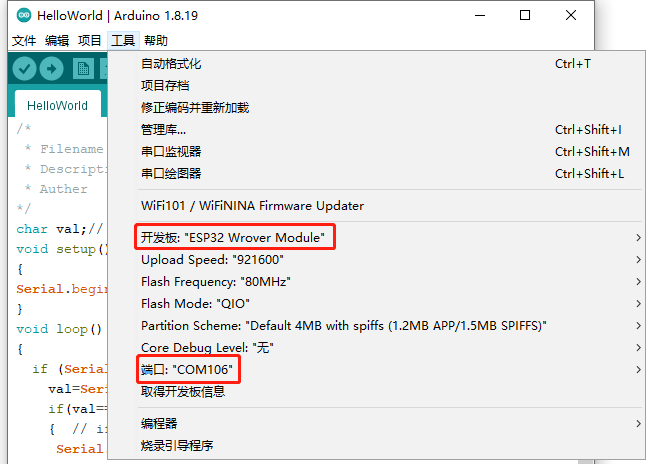
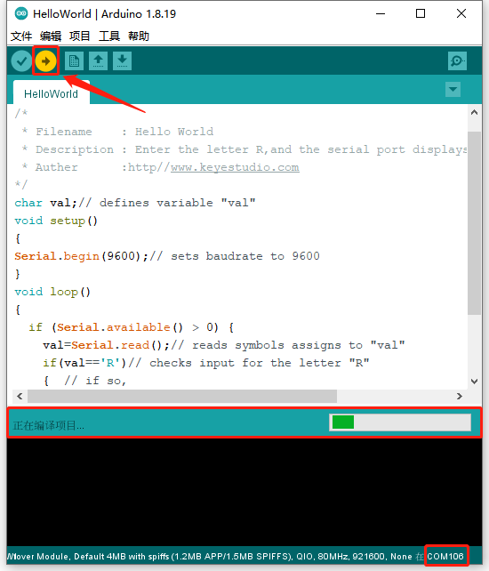
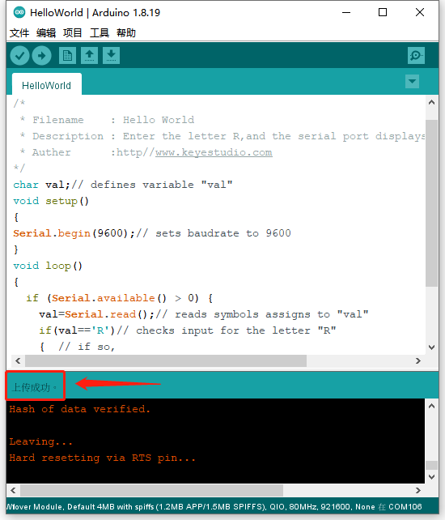
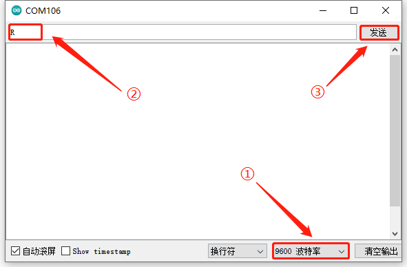
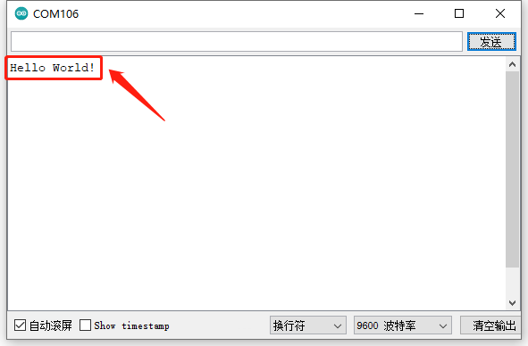

# 第一课 Hello World

## 1.1 项目介绍

对于ESP32的初学者，先从一些简单的开始学习吧！在这个项目中，你只需要一个ESP32主板，USB线和计算机就可以完成“Hello World!”项目。它不仅是ESP32主板和计算机的通信测试，也是ESP32的初级项目。这也是一个入门实验，让你进入计算机的编程世界。

---

## 1.2 实验组件

|  |  |
| :----------------------: | :-------------------: |
|    ESP32 Plus主板 x1     |       USB线 x1        |

---

## 1.3 实验接线图


---

## 1.4 实验代码

本项目中使用的代码保存在文件夹“<u>**3. Arduino教程\2. Windows 系统\1. 项目课程\代码**</u>”中，我们可以在此路径下打开代码文件''<u>**HelloWorld.ino**</u>"。

```c++
/*
 * 名称   : Hello World
 * 功能   : 输入字母R，串口显示“Hello World”。
 * 作者   : http://www.keyes-robot.com/
*/
char val;     // 定义变量val 
void setup()
{
Serial.begin(9600);     // 设置波特率为9600
}
void loop()
{
  if (Serial.available() > 0) {
    val=Serial.read();     // 读取赋值给"val"的值
    if(val=='R')     // 检查输入的字母“R”
    {  // if so,    
     Serial.println("Hello World!");      //显示“Hello World !”
    }
  }
}
```

ESP32主板通过USB线连接到计算机后开始上传代码。为了避免将代码上传至ESP32主板时出现错误，必须选择与计算机连接正确的控制板和串行端口。

点击“**<u>工具</u>**”→“**<u>开发板</u>**”，可以查看到各种不同型号ESP32开发板，选择对应的ESP32开发板型号。

点击“<u>**工具**</u>”→“**<u>端口</u>**”，选择对应的串行端口。

**<span style="background:#ff0;color:#000">
注意：将ESP32主板通过USB线连接到计算机后才能看到对应的串行端口。 </span>**



单击将代码上传到ESP32主控板。



代码上传成功。



---

## 1.5 实验结果

代码上传成功后，单击串口监视器图标进入串口监视器，设置波特率为**<u>9600</u>**，接着在文本框输入字母“**<u>R</u>**”，单击“**<u>发送</u>**”，能看到串口监视器打印“**<u>Hello World!</u>**”。





---

## 1.6 代码说明

| 代码                | 说明                                                         |
| ------------------- | ------------------------------------------------------------ |
| char val            | 定义一个变量val                                              |
| Serial.begin(9600)  | 设置波特率为9600                                             |
| Serial.available( ) | 获取串口上可读取的数据的字节数，该数据已经到达并存储在接收缓存（共有64字节）中。Serial.available() > 0表示串口接收到了数据，可以读取。 |
| Serial.read( )      | 读取写入的串行数据。                                         |
| if( ){ }            | 如果“（ ）”里的条件满足，则执行“{ }”里的程序。               |
| Serial.println( )   | 换行输出数据。从串行端口输出数据，跟随一个回车和一个换行符。 |

 
