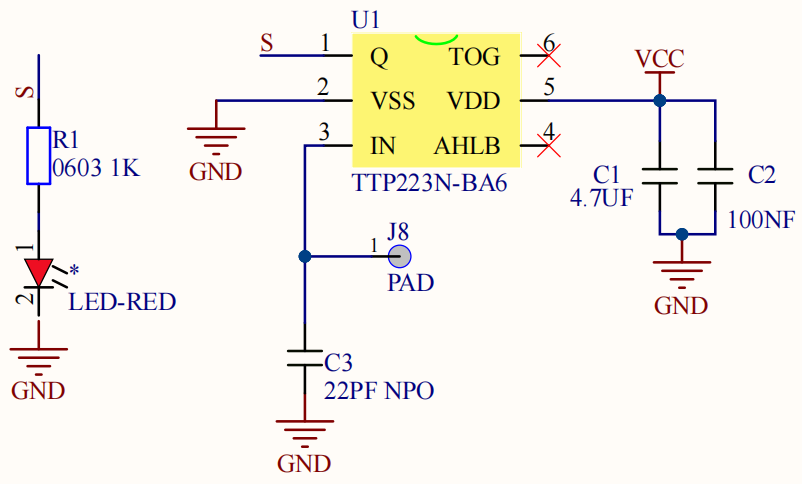

# 第八课 电容触摸传感器检测实验

## 1.1 项目介绍

在这个套件中，有一个Keyes 电容触摸模块，它主要由1个触摸检测芯片 TTP223-BA6 构成。模块上提供一个触摸按键，功能是用可变面积的按键取代传统按键。当我们上电之后，传感器需要约0.5秒的稳定时间，此时间段内不要触摸按键，此时所有功能都被禁止，始终进行自校准，校准周期约为4秒。

---

## 1.2 模块参数

工作电压 ：DC 3.3 ~ 5V

最大功率 ：0.3 W

工作温度 ：-10°C ~ +50°C

输出信号 ：数字信号

尺寸 ：32 x 23.8 x 9 mm

定位孔大小 ：直径为 4.8 mm

接口 ：间距为2.54 mm 3pin防反接口

---

## 1.3 模块原理图



TTP223N-BA6 的输出通过 AHLB（4）引脚选择高电平或低电平有效。通过 TOG（6）引脚选择直接模式或触发模式。

| TOG  | AHLB | 引脚Q的功能           |
| ---- | ---- | --------------------- |
| 0    | 0    | 直接模式，高电平有效  |
| 0    | 1    | 直接模式，低电平有效  |
| 1    | 0    | 触发模式，上电状态为0 |
| 1    | 1    | 触发模式，上电状态为1 |

从原理图我们可以知道 TOG 脚和 AHLB 脚是悬空的，此时输出为直接模式，高电平有效。

当我们用手指触摸模块上的感应区时，信号端 S 输出高电平（上一课学习的按键模块与之相反，当按键感应到按下输出低电平），板载红色LED点亮，我们通过读取模块上 S 端的高低电平，判断电容触摸模块上的感应区是否感应到触摸。

---

## 1.4 实验组件

|  |  |        |  |
| ------------------------ | ------------------------ | ---------------------------- | --------------------- |
| ESP32 Plus主板 x1        | Keyes 电容触摸模块 x1    | XH2.54-3P 转杜邦线母单线  x1 | USB线  x1             |

---

## 1.5 模块接线图


---

## 1.6 实验代码

本项目中使用的代码保存在文件夹“<u>**3. Arduino教程\2. Windows 系统\1. 项目课程\代码**</u>”中，我们可以在此路径下打开代码文件''**Touch_sensor.ino**"。

**注意：为了避免上传代码不成功，请不要在上传代码前连接模块。代码上传成功后，拔下USB线断电，按照接线图正确接好模块后再用USB线连接到计算机上电，观察实验结果。**

```c++
/*
 * 名称   : Touch sensor
 * 功能   : Reading touch value
 * 作者   : http://www.keyes-robot.com/
*/
int val = 0;
int touch = 5;            //定义触摸引脚 
void setup() {
  Serial.begin(9600);     //波特率为9600
  pinMode(touch, INPUT);  //设置触摸引脚为输入模式
}

void loop() {
  val = digitalRead(touch); //读取触摸引脚的值
  Serial.print(val);        //打印触摸引脚的值
  if (val == 1) {  //按下为高电平
    Serial.print("        ");
    Serial.println("Press the button");
    delay(100);
  }
  else {          //释放为低电平
    Serial.print("        ");
    Serial.println("Loosen the button");
    delay(100);
  }
}
```

ESP32主板通过USB线连接到计算机后开始上传代码。为了避免将代码上传至ESP32主板时出现错误，必须选择与计算机连接正确的控制板和串行端口。

点击“**<u>工具</u>**”→“**<u>开发板</u>**”，可以查看到各种不同型号ESP32开发板，选择对应的ESP32开发板型号。

点击“<u>**工具**</u>”→“**<u>端口</u>**”，选择对应的串行端口。

**注意：将ESP32主板通过USB线连接到计算机后才能看到对应的串行端口**。

单击将代码上传到ESP32主控板。

---

## 1.7 实验结果

代码上传成功后，拔下USB线断电，按照接线图正确接好模块后再用USB线连接到计算机上电，打开串口监视器，设置波特率为**<u>9600</u>**。

当触摸模块上的感应区感应到触摸时，板载红色LED点亮，value 值为 1，串口监视器打印出“**Press the button**”；当没有感应到触摸时，板载红色LED熄灭，value 值为 0，串口监视器打印出“**Loosen the button**”。


---

## 1.8 代码说明

此课程代码与第七课代码类似，这里就不多做介绍了。
