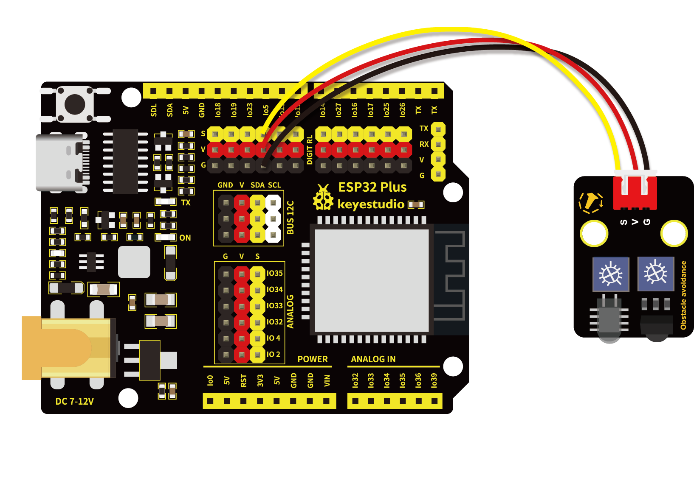

# 第九课 避障传感器检测障碍物

## 1.1 项目介绍

在这个套件中，有一个Keyes 避障传感器，它主要由一对红外线发射与接收管元件组成。实验中，我们通过读取传感器上S端高低电平，判断是否存在障碍物。

---

## 1.2 模块参数

工作电压 : DC 5V 

电流 : 50 mA

最大功率 : 0.3 W

工作温度 ：-10°C ~ +50°C

输出信号 : 数字信号

感应距离 : 2 ~ 40 cm

尺寸 ：32 x 23.8 x 11 mm

定位孔大小：直径为 4.8 mm

接口 ：间距为2.54 mm 3pin防反接口

---

## 1.3 模块原理图


NE555时基电路提供给发射管TX发射出一定频率的红外信号，红外信号会随着传送距离的加大逐渐衰减，如果遇到障碍物，就会形成红外反射。当检测方向RX遇到反射回来的信号比较弱时，接收检测引脚输出高电平，说明障碍物比较远；当反射回来的信号比较强，接收检测引脚输出低电平，说明障碍物比较近，此时指示灯亮起。传感器上有两个电位器，一个用于调节发送功率，一个用于调节接收频率，通过调节两个电位器，我们可以调节它的有效距离。

---

## 1.4 实验组件

|  |  |        |  |
| ------------------------ | ------------------------ | ---------------------------- | --------------------- |
| ESP32 Plus主板 x1        | Keyes 避障传感器 x1      | XH2.54-3P 转杜邦线母单线  x1 | USB线  x1             |

---

## 1.5 模块接线图



---

## 1.6 实验代码

本项目中使用的代码保存在文件夹“<u>**3. Arduino教程\2. Windows 系统\1. 项目课程\代码**</u>”中，我们可以在此路径下打开代码
文件''**obstacle_avoidance_sensor.ino**"。

**注意：为了避免上传代码不成功，请上传代码前不要连接模块。代码上传成功后，拔下USB线断电，按照接线图正确接好模块后再用USB线连接到计算机上电，观察实验结果。**

```c++
/*
 * 名称   : obstacle avoidance sensor
 * 功能   : 读取避障值
 * 作者   : http://www.keyes-robot.com/
*/
int val = 0;
void setup() {
  Serial.begin(9600);   //设置波特率为9600
  pinMode(5, INPUT);    //设置引脚GPIO5为输入模式
}

void loop() {
  val = digitalRead(5);  //读取数字电平
  Serial.print(val);     //打印读取的电平信号
  if (val == 0) {  //障碍物检测
    Serial.print("        ");
    Serial.println("There are obstacles");
    delay(100);
  }
  else {  //未发现障碍物
    Serial.print("        ");
    Serial.println("All going well");
    delay(100);
  }
}
```

ESP32主板通过USB线连接到计算机后开始上传代码。为了避免将代码上传至ESP32主板时出现错误，必须选择与计算机连接正确的控制板和串行端口。

点击“**<u>工具</u>**”→“**<u>开发板</u>**”，可以查看到各种不同型号ESP32开发板，选择对应的ESP32开发板型号。

点击“<u>**工具**</u>”→“**<u>端口</u>**”，选择对应的串行端口。

**注意：将ESP32主板通过USB线连接到计算机后才能看到对应的串行端口**。

单击将代码上传到ESP32主控板，等待代码上传成功后查看实验结果。

---

## 1.7 实验结果

代码上传成功后，拔下USB线断电，按照接线图正确接好模块后再用USB线连接到计算机上电，接着开始调节传感器模块上的两个电位器感应距离。避障传感器上有两个电位器，分别是接收频率调节电位器和发射功率调节电位器，如下图所示。


先调节发射功率调节电位器，先将电位器顺时针拧到尽头，然后逆时针慢慢往回调，当调节到SLED灯亮起时，微调使传感器上SLED灯介于亮与不亮之间的**不亮**状态。

接着设置接收频率调节电位器，同样将电位器顺时针拧到尽头，然后逆时针慢慢往回调，当SLED灯亮起时，微调使传感器上SLED灯介于亮与不亮之间的**不亮**状态，此时能检测障碍物的距离最长。

打开串口监视器，设置波特率为**<u>9600</u>**。当传感器检测到障碍物时，value 值为 **0**，SLED 灯亮，串口监视器打印出 “**0    There are obstacles**” ；没有检测到障碍物时，value 值为 **1**，SLED 灯灭，串口监视器打印出 “**1    All going well**” 。


---

## 1.8 代码说明

此课程代码与第七课代码类似，这里就不多做介绍了。 
