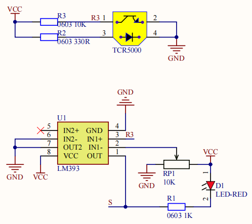
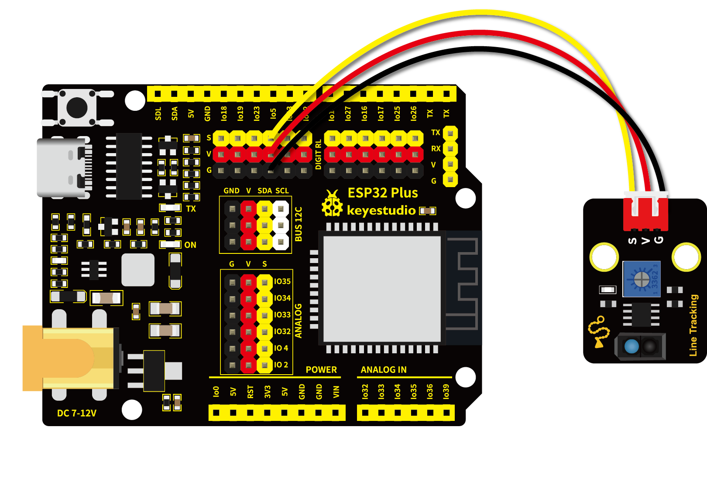

# 第十课 循迹传感器检测黑白线

## 1.1 项目介绍

在这个套件中，有一个Keyes 单路循线传感器，它主要由1个TCRT5000 反射型黑白线识别传感器元件组成。

---

## 1.2 模块参数

工作电压 ：DC 3.3 ~ 5V

工作温度 ：-10°C ~ +50°C

输入信号 ：PWM信号

尺寸 ：32 x 23.8 x 9.4 mm

定位孔大小 ：直径为 4.8 mm

接口 ：间距为2.54 mm 3pin防反接口

---

## 1.3 模块原理图



上一课我们学习了避障传感器的原理，而巡线传感器的原理也是相类似的。TCRT5000 反射型传感器包含了一个红外发射器和光电探测器，彼此相邻。巡线传感器的红外发射器持续发出红外线，红外线经过反射后被接收。接收后会产生电流，这个电流随着红外线光增强而变大。接收后利用电压比较器 LM393 ，将接收到红外线后 LM393 的 3 脚的电压值与可调电位器给 LM393 的 2 脚设置的阈值电压进行比较。

当发射出的红外线没有被反射回来或被反射回来但强度不够大时，红外接收管一直处于关闭状态，此时 R3 处的电压接近VCC，即 LM393 的 3 脚电压接近 VCC。而LM393 的 2 脚电压小于 VCC，通过 LM393 比较器后比较 1 脚输出高电平，LED不导通。随着反射回来的红外线光增强，电流也随之变大。此时 3 脚的电压值等于 VCC - I*R3，随着电流的增大，3 脚的电压就会越来越小。当电压小到比 2 脚的电压还小的时候，接收检测引脚 1 脚输出低电平，LED导通，被点亮。

当红外信号发送到黑色轨道时，由于黑色吸光能力比较强，红外信号发送出去后就会被吸收掉，反射部分很微弱。而白色反射率高，所以白色轨道就会把大部分红外信号反射回来。即检测到黑色或没检测到物体时，信号端为高电平；检测到白色物体时，信号端为低电平。它的检测高度为 0—3cm。我们可以通过旋转传感器上电位器，调节灵敏度，即调节检测高度。当旋转电位器，使传感器上红色 LED介于不亮与亮之间的临界点时，灵敏度最好。

---

## 1.4 实验组件

|  |  |        |  |
| ------------------------ | ------------------------ | ---------------------------- | --------------------- |
| ESP32 Plus主板 x1        | Keyes 单路循线传感器x1   | XH2.54-3P 转杜邦线母单线  x1 | USB线  x1             |

---

## 1.5 模块接线图



---

## 1.6 实验代码

本项目中使用的代码保存在文件夹“<u>**3. Arduino教程\2. Windows 系统\1. 项目课程\代码**</u>”中，我们可以在此路径下打开代码文件''**Line_tracking.ino**"。

**注意：为了避免上传代码不成功，请不要在上传代码前连接模块。代码上传成功后，拔下USB线断电，按照接线图正确接好模块后再用USB线连接到计算机上电，观察实验结果。**

```c++
/*
 * 名称   : line tracking
 * 功能   : 读取循迹传感器值
 * 作者   : http://www.keyes-robot.com/
*/
int val = 0;
void setup() {
  Serial.begin(9600); //设置波特率为9600
  pinMode(5, INPUT);  //将传感器引脚设置为输入模式
}

void loop() {
  val = digitalRead(5);   //读取循迹传感器的数字电平输出
  Serial.print(val);      //打印循迹传感器的读取到的数字电平的值
  if (val == 0) {  //检测到白色值为0
    Serial.print("        ");
    Serial.println("White");
    delay(100);
  }
  else {  //检测到黑色值为1
    Serial.print("        ");
    Serial.println("Black");
    delay(100);
  }
}
```

ESP32主板通过USB线连接到计算机后开始上传代码。为了避免将代码上传至ESP32主板时出现错误，必须选择与计算机连接正确的控制板和串行端口。

点击“**<u>工具</u>**”→“**<u>开发板</u>**”，可以查看到各种不同型号ESP32开发板，选择对应的ESP32开发板型号。

点击“<u>**工具**</u>”→“**<u>端口</u>**”，选择对应的串行端口。

**注意：将ESP32主板通过USB线连接到计算机后才能看到对应的串行端口**。

单击将代码上传到ESP32主控板。

---

## 1.7 实验结果

代码上传成功后，拔下USB线断电，按照接线图正确接好模块后再用USB线连接到计算机上电，打开串口监视器，设置波特率为**<u>9600</u>**。

串口监视器打印出对应的数据和字符。当传感器检测到黑色物体货检测距离太远时，value值为 1 ，LED不亮，串口监视器打印出“**1 Black**”；检测到白色物体（能够反光）时，value值为 0 ，LED亮，串口监视器打印出“**0 White**”。


---

## 1.8 代码说明

此课程代码与第七课代码类似，这里就不多做介绍了。
