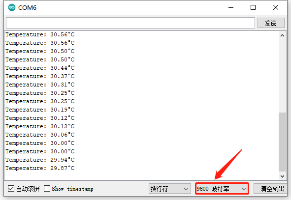

# 第三十七课 DS18B20温度传感器检测温度

## 1.1 项目介绍

在这个套件中，有一个Keyes DS18B20温度传感器，DS18B20 是美国DALLAS公司的一款温度传感器，单片机可以通过 1-Wire 协议与 DS18B20 进行通信，最终将温度读出。测试结果为℃,范围为-55℃到+125℃。

---

## 1.2 模块参数

工作电压 : DC 5V 

电流 : 20 mA

最大功率 : 0.1 W

工作温度 ：-10°C ~ +50°C

测量精度 ：±0.5℃（-10℃至+85℃范围内）

输出信号 : 数字信号

尺寸 ：32 x 23.8 x 9.35 mm

定位孔大小：直径为 4.8 mm

接口 ：间距为2.54 mm 3pin防反接口

---

## 1.3 模块原理图


1-Wire 总线的硬件接口很简单，只需要把 DS18B20 的数据引脚和单片机的一个 IO 口接上就可以了。硬件简单，随之而来的，就是软件时序的复杂。1-Wire总线的时序比较复杂，很多同学在这里独立看时序图都看不明白，我们在库里面已经把复杂的时序操作封装好了，直接使用库函数就可以。我们来看一下 DS18B20 的硬件原理图，如图所示。
DS18B20 通过编程，可以实现最高 12 位的温度存储值，在寄存器中，以补码的格式存储，如下图所示。

---

## 1.4 实验组件

|  |  |        |  |
| ------------------------ | ------------------------ | ---------------------------- | --------------------- |
| ESP32 Plus主板 x1        | DS18B20温度传感器 x1     | XH2.54-3P 转杜邦线母单线  x1 | USB线  x1             |

---

## 1.5 模块接线图


---

## 1.6 实验代码

本项目中使用的代码保存在文件夹“<u>**3. Arduino教程\2. Windows 系统\1. 项目课程\代码**</u>”中，我们可以在此路径下打开代码文件''**DS18B20.ino**"。

**注意：为了避免上传代码不成功，请上传代码前不要连接模块。代码上传成功后，拔下USB线断电，按照接线图正确接好模块后再用USB线连接到计算机上电，观察实验结果。**

```c++
/*  
 * 名称   : DS18B20
 * 功能   : 读取DS18B20的温度
 * 作者   : http://www.keyes-robot.com/ 
*/
#include <DS18B20.h>

//DS18B20引脚为13
DS18B20 ds18b20(13);

void setup() {
  Serial.begin(9600);
}

void loop() {
  double temp = ds18b20.GetTemp();//读取温度
  temp *= 0.0625;//转换精度为0.0625/LSB
  Serial.print("Temperature: ");
  Serial.print(temp);
  Serial.println("C");
  delay(1000);
}
```

ESP32主板通过USB线连接到计算机后开始上传代码。为了避免将代码上传至ESP32主板时出现错误，必须选择与计算机连接正确的控制板和串行端口。

点击“**<u>工具</u>**”→“**<u>开发板</u>**”，可以查看到各种不同型号ESP32开发板，选择对应的ESP32开发板型号。

点击“<u>**工具**</u>”→“**<u>端口</u>**”，选择对应的串行端口。

**注意：将ESP32主板通过USB线连接到计算机后才能看到对应的串行端口**。

单击将代码上传到ESP32主控板，等待代码上传成功后查看实验结果。

---

## 1.7 实验结果

若代码上传不成功，提示“**DS18B20.h: No such file or directory**”，请添加库文件。先点击“**<u>项目</u>**”，选择“**<u>加载库</u>**”，最后选择“**<u>添加.ZIP库</u>**”。

根据库文件的路径打开库文件夹，选中”**DS18B20.zip**“库压缩包，然后单击“**打开**”，库文件成功加入。

再次上传代码，代码上传成功后，拔下USB线断电，按照接线图正确接好模块后再用USB线连接到计算机上电，打开串口监视器，设置波特率为**<u>9600</u>**。

串口监视器打印出当前环境的温度值。



---

## 1.8 代码说明

| 代码                                    | 说明                                                   |
| --------------------------------------- | ------------------------------------------------------ |
| DS18B20 ds18b20(13);                    | 获取温度的管脚设置为GPIO13，获取温度的单位为℃。        |
| double temp = ds18b20.GetTemp();        | 设置一个double小数变量，为temp，将所测结果赋值给temp。 |
| float temp = 1/(1/T2+log(Rt/R)/B)-K+0.5 | 计算当前环境的温度，数据类型为单精度浮点型。           |

 
