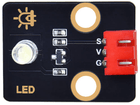
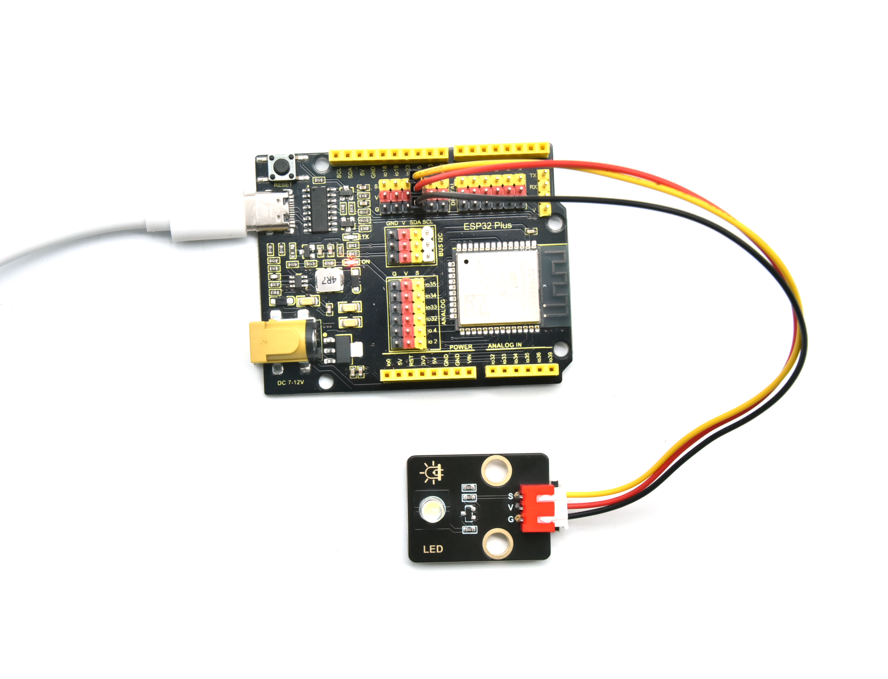

# 第二课 LED

## 1.1 项目介绍

LED，即发光二极管的简称。由含镓（Ga）、砷（As）、磷（P）、氮（N）等的[化合物](https://baike.baidu.com/item/化合物/1142931)制成。当电子与[空穴](https://baike.baidu.com/item/空穴/3517781)复合时能辐射出可见光，因而可以用来制成发光二极管。在电路及仪器中作为指示灯，或者组成文字或数字显示。砷化镓二极管发红光，磷化镓二极管发绿光，碳化硅二极管发黄光，氮化镓二极管发蓝光。因化学性质又分有机发光二极管OLED和无机发光二极管LED。

为了实验的方便，我们将紫色LED发光二极管做成了一个紫色LED模块。它的控制方法非常简单，只要让LED两端有一定的电压就可以点亮LED。在这个项目中，我们用一个最基本的测试代码来控制LED，亮一秒钟，灭一秒钟，来实现闪烁的效果。你可以改变代码中LED灯亮灭的时间，实现不同的闪烁效果。我们通过编程控制信号端S的高低电平，从而控制LED的亮灭。LED模块信号端S为高电平时LED亮起，S为低电平时LED熄灭。

---

## 1.2 模块参数

工作电压：DC 3.3-5V

控制信号：数字信号

尺寸：32 x 23.5 x 12 mm

定位孔大小：直径为 4.8 mm

接口：间距为2.54 mm 3pin防反接口

---

## 1.3 模块原理图


这是一个常用的LED模块，它采用F5-白发紫LED（外观白色，显示紫光）元件。同时，模块上自带一个间距为 2.54mm 的 3pin 防反插红色端子。控制时，模块上GND VCC供电后，信号端S为高电平时，模块上LED亮起。

模块兼容各种单片机控制板，如arduino系列单片机。   

---

## 1.4 实验组件

|  |  |        |  |
| ------------------------ | ------------------------ | ---------------------------- | --------------------- |
| ESP32 Plus主板 x1        | Keyes 紫色LED模块 x1     | XH2.54-3P 转杜邦线母单线  x1 | USB线 x1              |

---

## 1.5 模块接线图


---

## 1.6 实验代码

本项目中使用的代码保存在文件夹“<u>**/home/pi/代码**</u>”中，我们可以在此路径下打开代码文件''**blink.ino**"。

**注意：为了避免上传代码不成功，请上传代码前不要连接模块。代码上传成功后，拔下USB线断电，按照接线图正确接好模块后再用USB线连接到树莓派上电，观察实验结果。**

```c++
/*
 * 名称   : Blink
 * 功能   : led 闪烁 1s
 * 作者   : http://www.keyes-robot.com/
*/
int ledPin = 5;       //定义LED引脚连接到GPIO5
void setup() {
  pinMode(ledPin, OUTPUT);      //设置输出模式
}

void loop() {
  digitalWrite(ledPin, HIGH);       //输出高电平，打开led
  delay(1000);//延时 1000 ms
  digitalWrite(ledPin, LOW);        //输出低电平，关闭led
  delay(1000);//延时 1000 ms
}
```

ESP32主板通过USB线连接到树莓派后开始上传代码。为了避免将代码上传至ESP32主板时出现错误，必须选择与树莓派连接正确的控制板和串行端口。

点击“**<u>工具</u>**”→“**<u>开发板</u>**”，可以查看到各种不同型号ESP32开发板，选择对应的ESP32开发板型号。

点击“<u>**工具**</u>”→“**<u>端口</u>**”，选择对应的串行端口；点击“<u>**工具**</u>”→“**<u>Upload Speed</u>**”，选择对应的上传速率。

**注意：将ESP32主板通过USB线连接到树莓派后才能看到对应的串行端口**。

单击将代码上传到ESP32主控板，等待代码上传成功后查看实验结果。

---

## 1.7 实验结果

代码上传成功后，拔下USB线断电，按照接线图正确接好模块后再用USB线连接到树莓派上电，你会看到模块上的紫色LED一亮一灭，循环闪烁。




---

## 1.8 代码说明

| 代码                       | 说明                                                       |
| -------------------------- | ---------------------------------------------------------- |
| pinMode(ledPin, OUTPUT)    | 设置引脚的模式。OUTPUT为输出模式；INPUT为输入模式          |
| digitalWrite(ledPin, HIGH) | 设置引脚的输出电压为高\低电平。HIGH为高电平，LOW为低电平。 |
| delay(1000)                | 将程序的执行暂停一段时间,也就是延时。单位是毫秒。          |

 
