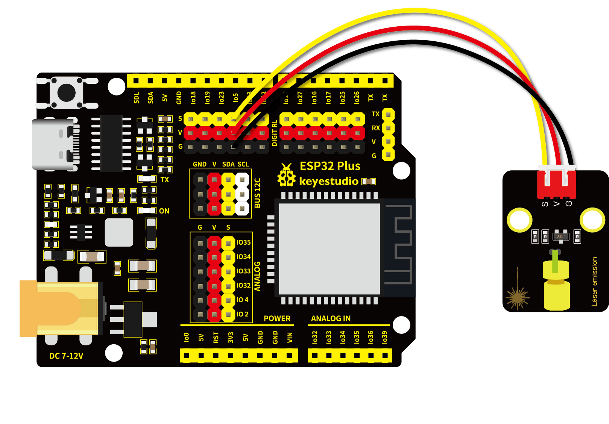

# 第四课 激光头传感器模块发出激光

## 1.1 项目介绍

在这个套件中，有一个Keyes 激光头传感器，激光与常见的光不同。一方面，激光的单色性好。另一方面，激光发射器内部特定的结构，使得激光能够被聚集成单束光，朝着同一方向射出，亮度高，方向性好。

正是由于这些特性，激光被广泛用于对特定材料进行切割、焊接、表面处理等等。激光的能量非常高，玩具激光笔照射人眼可能导致眩光，长时间可能导致视网膜损害，我国也禁止用激光照射航行的飞机。因此，**请注意不要用激光发射器对准人眼。**

---

## 1.2 模块参数

工作电压 ：DC 5V

工作温度 ：-10°C ~ +50°C

输入信号 ：数字信号

尺寸 ：32 x 23.8 x 10 mm

定位孔大小 ：直径为 4.8 mm

接口 ：间距为2.54 mm 3pin防反接口

---

## 1.3 模块原理图


激光头传感器主要由激光头组成，激光头由发光管芯、聚光透镜、铜可调套筒三部分组成。

从激光模块的电路原理图我们可以知道，它是用三极管驱动的。激光头的 1 脚始终上拉到VCC，在信号端 S 处输入一个高电平数字信号，NPN三极管Q1导通，激光头的 2 脚被下拉到GND，此时传感器开始工作。在信号端 S 处输入低电平时NPN三极管Q1不导通，传感器停止工作。

---

## 1.4 实验组件

|  |  |        |  |
| ------------------------ | ------------------------ | ---------------------------- | --------------------- |
| ESP32 Plus主板 x1        | Keyes 激光模块 x1        | XH2.54-3P 转杜邦线母单线  x1 | USB线  x1             |

---

## 1.5 模块接线图



---

## 1.6 实验代码

本项目中使用的代码保存在文件夹“<u>**/home/pi/代码**</u>”中，我们可以在此路径下打开代码文件''**Laser.ino**"。

**注意：为了避免上传代码不成功，请不要在上传代码前连接模块。代码上传成功后，拔下USB线断电，按照接线图正确接好模块后再用USB线连接到树莓派上电，观察实验结果。**

```c++
/*
 * 名称   : Laser sensor
 * 功能   : 激光灯闪光
 * 作者   : http://www.keyes-robot.com/
*/
int laserPin = 5;                //定义激光引脚为GPIO5
void setup() {
  pinMode(laserPin, OUTPUT);     //将激光引脚定义为输出模式
}

void loop() {
  digitalWrite(laserPin, HIGH);     //打开激光
  delay(2000);                      //延迟2秒
  digitalWrite(laserPin, LOW);      //关闭激光
  delay(2000);                      //延迟2秒
}
```

ESP32主板通过USB线连接到树莓派后开始上传代码。为了避免将代码上传至ESP32主板时出现错误，必须选择与树莓派连接正确的控制板和串行端口。

点击“**<u>工具</u>**”→“**<u>开发板</u>**”，可以查看到各种不同型号ESP32开发板，选择对应的ESP32开发板型号。

点击“<u>**工具**</u>”→“**<u>端口</u>**”，选择对应的串行端口；点击“<u>**工具**</u>”→“**<u>Upload Speed</u>**”，选择对应的上传速率。

**注意：将ESP32主板通过USB线连接到树莓派后才能看到对应的串行端口**。

单击将代码上传到ESP32主控板。

---

## 1.7 实验结果

代码上传成功后，拔下USB线断电，按照接线图正确接好模块后再用USB线连接到树莓派上电，能看到模块上激光管发射红色激光信号2秒，然后关闭发射2秒，循环交替。


---

## 1.8 代码说明

此课程代码与第二课代码类似，这里就不多做介绍了。 
