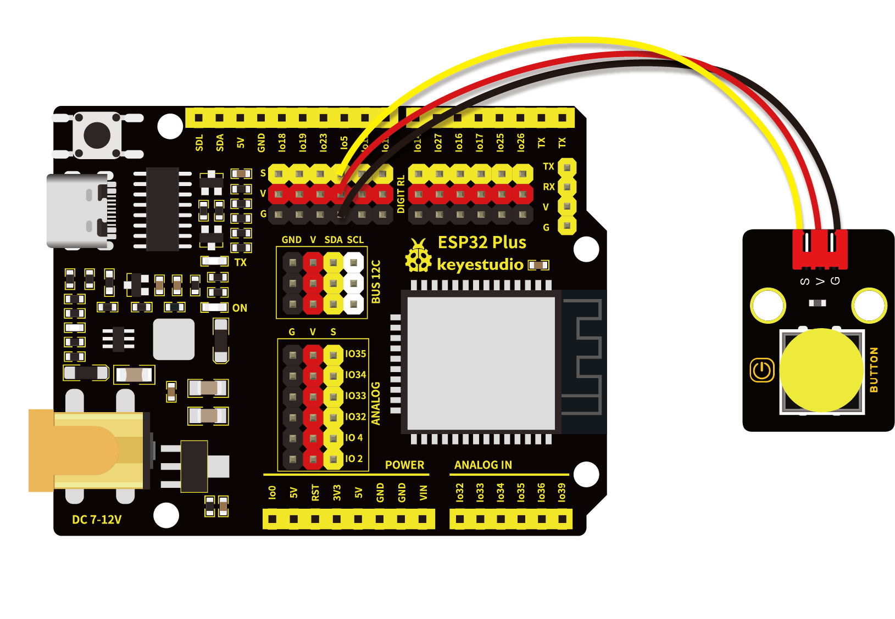
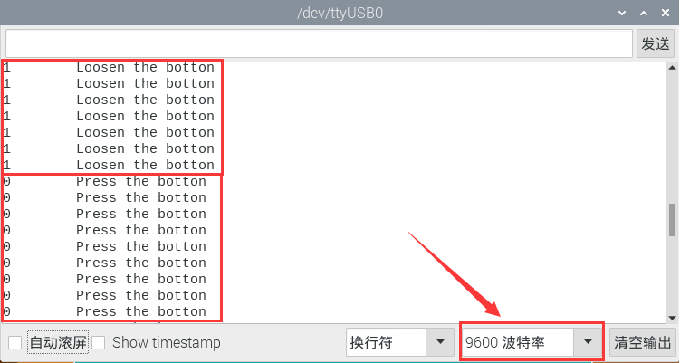

# 第七课 按键传感器检测实验

## 1.1 项目介绍

在这个套件中，有一个Keyes单路按键模块，它主要由1个轻触开关组成，自带1个黄色按键帽。第二课我们学习了怎么让单片机的引脚输出一个高电平或者低电平，这节课程我们就来学习怎么读取引脚的电平。

按键模块的按键按下，单片机读取到低电平，松开按键读取到高电平。通过读取传感器上S端的高低电平，判断按键是否按下，并且在串口监视器上显示测试结果。

---

## 1.2 模块参数

工作电压 : DC 3.3 ~ 5V 

工作温度 ：-10°C ~ +50°C

控制信号 : 数字信号

尺寸 ：32 x 23.8 x 15.6 mm

定位孔大小：直径为 4.8 mm

接口 ：间距为2.54 mm 3pin防反接口

---

## 1.3 模块原理图


按键有四个引脚，其中1与3相连，2与4相连。按键未被按下时，13与24是断开的。信号端S读取的电平是被4.7K的上拉电阻R1所拉高的高电平。而当按键被按下时，13和24连通，原本上拉的13脚被24脚接的GND下拉至低电平，此时信号端S读取到低电平。即按下按键，传感器信号端S为低电平；松开按键时，信号端S为高电平。

---

## 1.4 实验组件

|  |  |        |  |
| ------------------------ | ------------------------ | ---------------------------- | --------------------- |
| ESP32 Plus主板 x1        | Keyes 单路按键模块 x1    | XH2.54-3P 转杜邦线母单线  x1 | USB线  x1             |

---

## 1.5 模块接线图



---

## 1.6 实验代码

本项目中使用的代码保存在文件夹“<u>**/home/pi/代码**</u>”中，我们可以在此路径下打开代码文件''**button.ino**"。

**注意：为了避免上传代码不成功，请上传代码前不要连接模块。代码上传成功后，拔下USB线断电，按照接线图正确接好模块后再用USB线连接到树莓派上电，观察实验结果。**

```c++
/*
 * 名称   : button
 * 功能   : 读键值
 * 作者   : http://www.keyes-robot.com/
*/
int val = 0;            //用于存储键值
int button = 5;         //将按钮的引脚连接到GPIO5
void setup() {
  Serial.begin(9600);      //启动串口监视器，设置波特率为9600
  pinMode(button, INPUT);  //设置按钮引脚为输入模式
}

void loop() {
  val = digitalRead(button);  //读取按钮的值并将其赋值给变量val
  Serial.print(val);          //打印变量vald的值
  if (val == 0) {             //按下按钮时读取到低电平，并打印出相关的信息
    Serial.print("        ");
    Serial.println("Press the botton");
    delay(100);
  }

  else {               //打印按钮的释放信息
    Serial.print("        ");
    Serial.println("Loosen the botton");
    delay(100);
  }
}
```

ESP32主板通过USB线连接到树莓派后开始上传代码。为了避免将代码上传至ESP32主板时出现错误，必须选择与树莓派连接正确的控制板和串行端口。

单击将代码上传到ESP32主控板，等待代码上传成功后查看实验结果。

---

## 1.7 实验结果

代码上传成功后，拔下USB线断电，按照接线图正确接好模块后再用USB线连接到树莓派上电，打开串口监视器，设置波特率为**<u>9600</u>**。

当按下传感器模块上的按键时，按键值value为0，串口监视器打印出“**0     Press the button**”；松开按键时，按键值value为1，串口监视器打印出“**1     Loosen the button**”字符。



---

## 1.8 代码说明

| 代码                   | 说明                                                         |
| ---------------------- | ------------------------------------------------------------ |
| pinMode(button, INPUT) | 由“ int button = 5; ”知道，定义按键管脚为GPIO5。“INPUT”设置为输入模式。通过pinMode()配置为INPUT必须使用上拉或下拉电阻（我们的模块已经使用上拉电阻R1）。该电阻的目的是在开关断开时将引脚拉至已知状态。通常选择一个4.7K/10 K欧姆的电阻，因为它的阻值足够低，可以可靠地防止输入悬空。同时，该阻值也要足够高，以使开关闭合时不会消耗太多电流。如果使用下拉电阻，则当开关断开时，输入引脚将为低电平；当开关闭合时，输入引脚将为高电平。如果使用上拉电阻，则当开关断开时，输入引脚将为高电平；当开关闭合时，输入引脚将为低电平。 |
| if( ){ } else{ }       | 如果（ ）里的表达式为真，则执行 if { }块内的代码。如果（ ）里表达式为假 ，则执行 else { }块内的代码。 |
| digitalRead(button)    | 读取按键的数字电平，高HIGH或者低LOW。如果该引脚未连接任何东西，则digitalRead( )可以返回HIGH或LOW（并且可以随机更改）。 |
| Serial.begin(9600)     | 初始化串口通信，并设置波特率为9600。                         |

