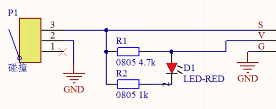
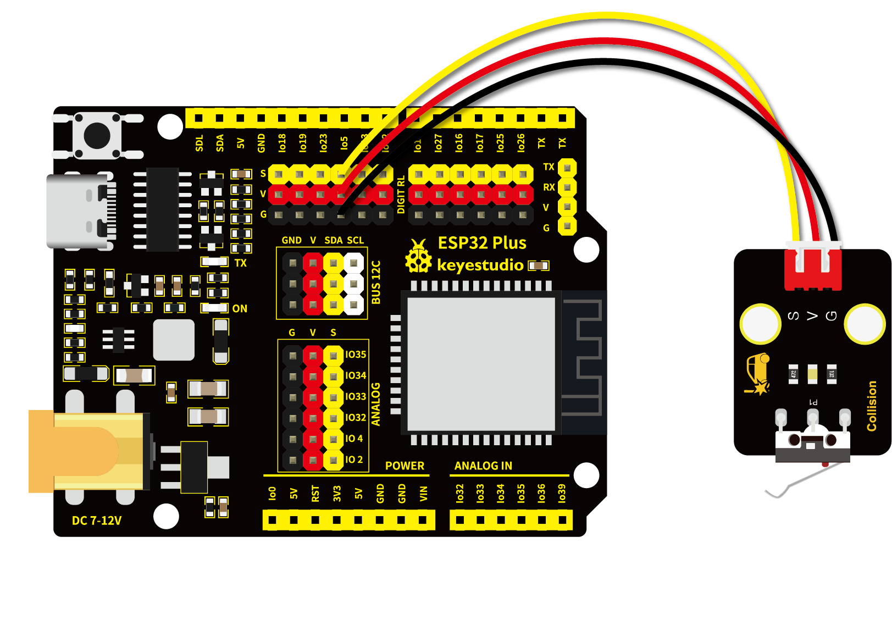

# 第十三课 碰撞传感器的原理

## 1.1 项目介绍

在这个套件中，有一个Keyes 碰撞传感器。上一课我们学习的倾斜模块用的是滚珠开关，这一课我们学习的碰撞传感器用的是轻触开关。碰撞传感器常用于3D打印机内做限位开关。

---

## 1.2 模块参数

工作电压：DC 3.3-5V

控制信号：数字信号

尺寸：39.5 x 23.5 x 9.2 mm

定位孔大小：直径为 4.8 mm

接口：间距为2.54 mm 3pin防反接口

---

## 1.3 模块原理图



碰撞传感器主要由 1 个轻触开关组成。当物体碰到轻触开关弹片，下压时，2 脚和 3 脚导通，传感器信号端 S 被下拉为低电平，模块上自带的红色 LED 点亮；当没有物体碰撞轻触开关时，2 脚和 3 脚不导通，3 脚被 4.7 K的电阻 R1 上拉为高电平，即传感器信号端S为高电平，此时自带红色 LED 熄灭。碰撞传感器的原理与倾斜模块的电路原理几乎一样，不同之处在于导通方式。

---

## 1.4 实验组件

|  |  |        |  |
| --------------------- | --------------------- | ---------------------------- | --------------------- |
| ESP32 Plus主板 x1     | Keyes 碰撞传感器 x1   | XH2.54-3P 转杜邦线母单线  x1 | USB线 x1              |

---

## 1.5 模块接线图



---

## 1.6 实验代码

本项目中使用的代码保存在文件夹“<u>**/home/pi/代码**</u>”中，我们可以在此路径下打开代码文件''**collision_sensor.ino**"。

**<span style="background:#ff0;color:#000">
注意：为了避免上传代码不成功，请上传代码前不要连接模块。代码上传成功后，拔下USB线断电，按照接线图正确接好模块后再用USB线连接到树莓派上电，观察实验结果。 </span>**

```c++
/*
 * 名称   : collision sensor
 * 功能   : 读取碰撞传感器的值
 * 作者   : http://www.keyes-robot.com/
*/
int val = 0;
void setup() {
  Serial.begin(9600);  //波特率设置为9600
  pinMode(5, INPUT);   //设置碰撞传感器的引脚GPIO5为输入模式
}

void loop() {
  val = digitalRead(5);  //读取碰撞传感器的值
  Serial.print(val);      //打印碰撞传感器的值
  if (val == 0) {   //碰撞时的值为0
    Serial.print("        ");
    Serial.println("The end of his!");
    delay(100);
  }
  else {    //无碰撞时的值为1
    Serial.print("        ");
    Serial.println("All going well");
    delay(100);
  }
}
```

ESP32主板通过USB线连接到树莓派后开始上传代码。为了避免将代码上传至ESP32主板时出现错误，必须选择与树莓派连接正确的控制板和串行端口。

单击将代码上传到ESP32主控板。

---

## 1.7 实验结果

代码上传成功后，拔下USB线断电，按照接线图正确接好模块后再用USB线连接到树莓派上电，打开串口监视器，设置波特率为**<u>9600</u>**。

将传感器的上弹片下压时，value值为0，模块上LED点亮，串口监视器打印出“**0  The end of his!**” ；当松开弹片时，value值为1，模块上LED熄灭，串口监视器打印出“**1  All going well!**”。


---

## 1.8 代码说明

 此课程代码与第十二课代码类似，这里就不多做介绍了。
