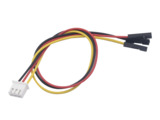

# 第十四课 霍尔传感器检测南极磁场

## 1.1 项目介绍

在这个套件中，有一个Keyes 霍尔传感器，它主要由 A3144 线性霍尔元件组成。该元件是由电压调整器、霍尔电压发生器、差分放大器、史密特触发器，温度补偿电路和集电极开路的输出级组成的磁敏传感电路，其输入为磁感应强度，输出是一个数字电压讯号。


霍尔效应传感器有两种主要类型，一种提供模拟输出，另一种提供数字输出。 A3144 是数字输出霍尔传感器。

---

## 1.2 模块参数

工作电压：DC 3.3-5V

控制信号：数字信号

尺寸：32 x 23.5 x 9.2 mm

定位孔大小：直径为 4.8 mm

接口：间距为2.54 mm 3pin防反接口

---

## 1.3 模块原理图


传感器感应到无磁场或北极磁场时，信号端为高电平；感应到南极磁场时，信号端为低电平。当感应磁场强度越强时，感应距离越长。

---

## 1.4 实验组件

|  |  |        |  |
| ------------------------ | --------------------- | ---------------------------- | --------------------- |
| ESP32 Plus主板 x1        | Keyes 霍尔传感器 x1   | XH2.54-3P 转杜邦线母单线  x1 | USB线 x1              |

---

## 1.5 模块接线图


---

## 1.6 实验代码

本项目中使用的代码保存在文件夹“<u>**3. Arduino教程\2. Windows 系统\1. 项目课程\代码**</u>”中，我们可以在此路径下打开代码文件''**Hall magnetic.ino**"。

**<span style="background:#ff0;color:#000">
注意：为了避免上传代码不成功，请上传代码前不要连接模块。代码上传成功后，拔下USB线断电，按照接线图正确接好模块后再用USB线连接到树莓派上电，观察实验结果。 </span>**

```c++
/*
 * 名称   : Hall magnetic
 * 功能   : 读取霍尔磁传感器的值
 * 作者   : http://www.keyes-robot.com/
*/
int val = 0;
int hallPin = 5;  //霍尔传感器引脚连接GPIO15
void setup() {
  Serial.begin(9600);  //波特率设置为9600
  pinMode(hallPin, INPUT);  //设置引脚为输入模式
}

void loop() {
  val = digitalRead(hallPin);  //读取霍尔传感器的值
  Serial.print(val);  //打印霍尔传感器的值
  if (val == 0) {  //感应到南极磁场
    Serial.println("      The magnetic field at the South Pole!");
  }
  else {  //没有感应到南极磁场
    Serial.println("      Just be all normal!");
  }
}
```

ESP32主板通过USB线连接到树莓派后开始上传代码。为了避免将代码上传至ESP32主板时出现错误，必须选择与树莓派连接正确的控制板和串行端口。

单击将代码上传到ESP32主控板。

---

## 1.7 实验结果

代码上传成功后，拔下USB线断电，按照接线图正确接好模块后再用USB线连接到树莓派上电，打开串口监视器，设置波特率为**<u>9600</u>**。

当传感器感应到北极磁场或无磁场感应时，串口监视器打印出“**1  Just be all normal!**”，且传感器上的LED处于熄灭状态；当传感器感应到南极磁场时，串口监视器打印出“**0  The magnetic field at the South Pole!**”，且模块上的LED被点亮。


---

## 1.8 代码说明

 此课程代码与第七课代码类似，这里就不多做介绍了。
