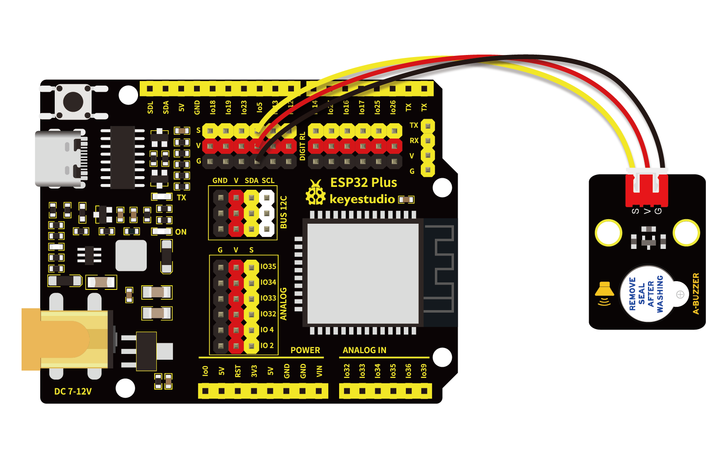

# 第十七课 有源蜂鸣器模块播放声音

## 1.1 项目介绍

在这个套件中，有一个有源蜂鸣器模块，还有一个功放模块（原理相当于无源蜂鸣器）。在这个实验中，我们来学习尝试控制有源蜂鸣器发出声音。有源蜂鸣器元件内部自带震荡电路，使用时，我们只需要给蜂鸣器元件足够的电压，蜂鸣器就会自动响起。

---

## 1.2 模块参数

工作电压 : DC 3.3 ~ 5V 

工作温度 ：-10°C ~ +50°C

输入信号 : 数字信号

尺寸 ：32 x 23.8 x 12.3 mm

定位孔大小：直径为 4.8 mm

接口 ：间距为2.54 mm 3pin防反接口

---

## 1.3 模块原理图


从原理图我们可以得知，蜂鸣器的1脚通过串联一个电阻R2连接到电压正极；蜂鸣器的2脚连接到NPN三极管Q1的C极，集电极；Q1的B极，也就是基极通过串联一个电阻R1连接到S信号端；发射集接到GND。

当三极管Q1导通时，蜂鸣器的2脚连通GND，有源蜂鸣器便会工作。那么如何让三极管Q1导通呢？**NPN三极管的导通条件是基极（B）电压比发射极（E）电压高 0.3V 以上，**只需要基极（B）被上拉至高电平即可。虽然三极管Q1的基极（B）有一个下拉电阻R3导致其不导通，但是R3电阻的阻值大，使其为弱下拉电阻。三极管Q1的基极（B）还连接了一个阻值小的强上拉电阻R1，只要我们用单片机IO口给S信号端输入高电平，强上拉电阻R1会将三极管Q1的基极（B）强上拉为高电平，三极管Q1就会导通，有源蜂鸣器就会工作。

---

## 1.4 实验组件

|  |  |        |  |
| ------------------------ | ------------------------ | ---------------------------- | --------------------- |
| ESP32 Plus主板 x1        | Keyes 有源蜂鸣器模块 x1  | XH2.54-3P 转杜邦线母单线  x1 | USB线  x1             |

---

## 1.5 模块接线图



---

## 1.6 实验代码

本项目中使用的代码保存在文件夹“<u>**/home/pi/代码**</u>”中，我们可以在此路径下打开代码文件''**Active_buzzer.ino**"。

**注意：为了避免上传代码不成功，请上传代码前不要连接模块。代码上传成功后，拔下USB线断电，按照接线图正确接好模块后再用USB线连接到树莓派上电，观察实验结果。**

```c++
/*
 * 名称   : Active buzzer
 * 功能   : 有源蜂鸣器产生声音
 * 作者   : http://www.keyes-robot.com/
*/
int buzzer = 5;   //定义蜂鸣器接收器引脚为GPIO5
void setup() {
  pinMode(buzzer, OUTPUT);    //设置输出模式
}

void loop() {
  digitalWrite(buzzer, HIGH); //发声
  delay(1000);
  digitalWrite(buzzer, LOW);  //停止发声
  delay(1000);
}
```

ESP32主板通过USB线连接到树莓派后开始上传代码。为了避免将代码上传至ESP32主板时出现错误，必须选择与树莓派连接正确的控制板和串行端口。

单击将代码上传到ESP32主控板，等待代码上传成功后查看实验结果。

---

## 1.7 实验结果

代码上传成功后，拔下USB线断电，按照接线图正确接好模块后再用USB线连接到树莓派上电，模块上有源蜂鸣器响起1秒，停1秒，循环交替。

---

## 1.8 代码说明

| 代码                       | 说明              |
| -------------------------- | ----------------- |
| digitalWrite(buzzer, HIGH) | GPIO5口输出高电平 |
| digitalWrite(buzzer, LOW)  | GPIO5口输出低电平 |

 

