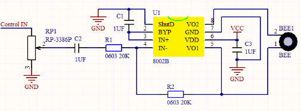

# 第十八课 8002b功放 喇叭模块

## 1.1 项目介绍

在这个套件中，有一个Keyes 8002b功放 喇叭模块，这个模块主要由一个可调电位器、一个喇叭和一个音频放大芯片组成。上一课我们学习了有源蜂鸣器模块的使用方法，这一课我们来学习套件中的8002b功放 喇叭模块的使用方法。这个模块主要功能是：可以对输出的小音频信号进行放大，大概放大倍数为8.5倍，并且可以通过自带的小功率喇叭播放出来，也可以用来播放音乐，作为一些音乐播放设备的外接扩音设备。

---

## 1.2 模块参数

工作电压 : DC 5V 

工作电流 : ≥100 mA

最大功率 : 2.5 W

喇叭功率 : 0.15 W

喇叭声音 : 80 db

放大芯片 : SC8002B

工作温度 ：-10°C ~ +50°C

尺寸 ：47.6 x 23.8 x 10 mm

定位孔大小：直径为 4.8 mm

接口 ：间距为2.54 mm 3pin防反接口

---

## 1.3 模块原理图



其实这个喇叭就类似于于一个无源蜂鸣器，上一课我们介绍过，有源蜂鸣器自带振荡源，只要我们给它足够的电压就能响起来，而无源蜂鸣器元件内部不带震荡电路，需要在元件正极（也就是1脚）输入不同频率的方波，负极（也就是2脚）接地，从而控制蜂鸣器响起不同频率的声音。

---

## 1.4 实验组件

|  |     |        |  |
| ------------------------ | --------------------------- | ---------------------------- | --------------------- |
| ESP32 Plus主板 x1        | Keyes 8002b功放 喇叭模块 x1 | XH2.54-3P 转杜邦线母单线  x1 | USB线  x1             |

---

## 1.5 模块接线图


---

## 1.6 实验代码

本项目中使用的代码保存在文件夹“<u>**/home/pi/代码**</u>”中，我们可以在此路径下打开代码文件''**Passive_buzzer.ino**"。

**注意：为了避免上传代码不成功，请上传代码前不要连接模块。代码上传成功后，拔下USB线断电，按照接线图正确接好模块后再用USB线连接到树莓派上电，观察实验结果。**

```c++
/*
 * 名称   : Passive Buzzer
 * 功能   : 喇叭播放音乐
 * 作者   : http://www.keyes-robot.com/
*/
#define LEDC_CHANNEL_0 0

// led定时器使用13位精度

#define LEDC_TIMER_13_BIT  13

// 定义I/O端口

#define BUZZER_PIN  4

//创建一个音乐旋律列表，超级马里奥

int melody[] = {330, 330, 330, 262, 330, 392, 196, 262, 196, 165, 220, 247, 233, 220, 196, 330, 392, 440, 349, 392, 330, 262, 294, 247, 262, 196, 165, 220, 247, 233, 220, 196, 330, 392,440, 349, 392, 330, 262, 294, 247, 392, 370, 330, 311, 330, 208, 220, 262, 220, 262,

294, 392, 370, 330, 311, 330, 523, 523, 523, 392, 370, 330, 311, 330, 208, 220, 262,220, 262, 294, 311, 294, 262, 262, 262, 262, 262, 294, 330, 262, 220, 196, 262, 262,262, 262, 294, 330, 262, 262, 262, 262, 294, 330, 262, 220, 196};

//创建音调持续时间列表

int noteDurations[] = {8,4,4,8,4,2,2,3,3,3,4,4,8,4,8,8,8,4,8,4,3,8,8,3,3,3,3,4,4,8,4,8,8,8,4,8,4,3,8,8,2,8,8,8,4,4,8,8,4,8,8,3,8,8,8,4,4,4,8,2,8,8,8,4,4,8,8,4,8,8,3,3,3,1,8,4,4,8,4,8,4,8,2,8,4,4,8,4,1,8,4,4,8,4,8,4,8,2};
void setup() {
pinMode(BUZZER_PIN, OUTPUT);  //设置蜂鸣器为输出模式
}

void loop() {

  int noteDuration;  //创建一个变量noteDuration

  for (int i = 0; i < sizeof(noteDurations); ++i)

  {
      noteDuration = 800/noteDurations[i];

      ledcSetup(LEDC_CHANNEL_0, melody[i]*2, LEDC_TIMER_13_BIT);

      ledcAttachPin(BUZZER_PIN, LEDC_CHANNEL_0);

      ledcWrite(LEDC_CHANNEL_0, 50);

      delay(noteDuration * 1.30); //延迟
  }
}
```

ESP32主板通过USB线连接到树莓派后开始上传代码。为了避免将代码上传至ESP32主板时出现错误，必须选择与树莓派连接正确的控制板和串行端口。

单击将代码上传到ESP32主控板，等待代码上传成功后查看实验结果。

---

## 1.7 实验结果

代码上传成功后，拔下USB线断电，按照接线图正确接好模块后再用USB线连接到树莓派上电，功放喇叭模块循环播放音乐。如果觉得喇叭声音太大或太小，可以使用十字螺丝刀调节模块上的电位器以调整音量大小。

---

## 1.8 代码说明

| 代码                                                      | 说明                                                         |
| --------------------------------------------------------- | ------------------------------------------------------------ |
| #define LEDC_TIMER_13_BIT  13                             | 使用13位精度的LEDC定时器。                                   |
| int melody[]                                              | 创建音乐旋律列表。                                           |
| int noteDurations[]                                       | 创建音调持续时间列表。                                       |
| ledcSetup(LEDC_CHANNEL_0, melody[i]*2, LEDC_TIMER_13_BIT) | 设置 LEDC 通道0对应的频率和计数位数（占空比分辨率）。        |
| ledcAttachPin(BUZZER_PIN, LEDC_CHANNEL_0)                 | 将 LEDC 通道0绑定到指定 IO 口上以实现输出。                  |
| ledcWrite(LEDC_CHANNEL_0, 50)                             | 指定通道0输出一定占空比波形                                  |
| sizeof(noteDurations)                                     | sizeof是一个操作符（operator）。其作用是返回一个对象或类型所占的内存字节数。 |

 
