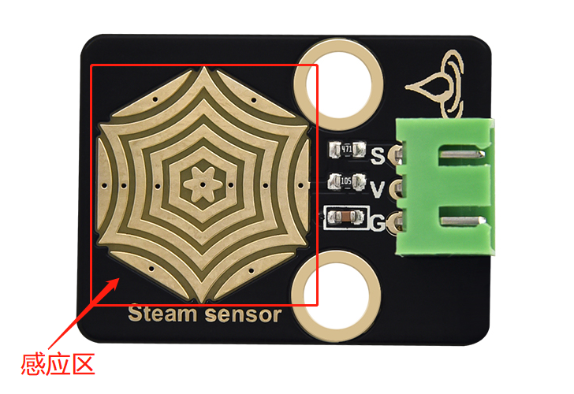
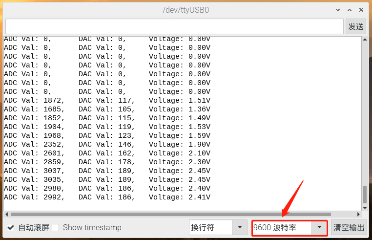

# 第二十一课 水滴水蒸气传感器

## 1.1 项目介绍

在这个套件中，有一个Keyes 水滴传感器，它是一个模拟（数字）输入模块，也叫雨水、雨量传感器。可用于各种天气状况的监测，检测是否下雨及雨量的大小，转成数字信号（DO）和模拟信号（AO）输出，并广泛应用于Arduino 机器人套件，雨滴，下雨传感器，可用于各种天气状况的监测，并转成数定信号和 AO 输出，也可用于汽车自动刮水系统、智能灯光系统和智能天窗系统等。

---

## 1.2 模块参数

工作电压 : DC 5V 

电流 : 30 mA

最大功率 : 0.15 W

工作温度 ：-10°C ~ +50°C

控制信号 : 模拟信号

尺寸 ：32 x 23.8 x 9.3 mm

定位孔大小：直径为 4.8 mm

接口 ：间距为2.54 mm 3pin防反接口

---

## 1.3 模块原理图


Keyes 水滴传感器通过电路板上裸露的印刷平行线检测水量的大小。水量越多，就会有更多的导线被联通，随着导电的接触面积增大，雨滴感应区 2 脚输出的电压就会逐步上升。信号端 S 检测到的模拟值就越大。除了可以检测水量的大小，它还可以检测空气中的水蒸气。


---

## 1.4 实验组件

|  |  |        |  |
| ------------------------ | ------------------------ | ---------------------------- | --------------------- |
| ESP32 Plus主板 x1        | Keyes 水滴传感器 x1      | XH2.54-3P 转杜邦线母单线  x1 | USB线  x1             |

---

## 1.5 模块接线图


---

## 1.6 实验代码

本项目中使用的代码保存在文件夹“<u>**/home/pi/代码**</u>”中，我们可以在此路径下打开代码文件''**Steam_sensor.ino**"。

**注意：为了避免上传代码不成功，请上传代码前不要连接模块。代码上传成功后，拔下USB线断电，按照接线图正确接好模块后再用USB线连接到树莓派上电，观察实验结果。**

```c++
/*  
 * 名称   : Steam sensor
 * 功能   : 读取水滴传感器的值，将其转化为ADC、DAC和电压值
 * 作者   : http://www.keyes-robot.com/
*/
#define PIN_ANALOG_IN  34  //蒸汽传感器的引脚

void setup() {
  Serial.begin(9600);
}

//在loop()中，使用analogRead()函数获取ADC值，
//然后使用map()函数将该值转换为8位精度DAC值。
//输入输出电压按下面公式计算，
//打印信息。
void loop() {
  int adcVal = analogRead(PIN_ANALOG_IN);
  int dacVal = map(adcVal, 0, 4095, 0, 255);
  double voltage = adcVal / 4095.0 * 3.3;
  Serial.printf("ADC Val: %d, \t DAC Val: %d, \t Voltage: %.2fV\n", adcVal, dacVal, voltage);
  delay(200);
}
```

ESP32主板通过USB线连接到树莓派后开始上传代码。为了避免将代码上传至ESP32主板时出现错误，必须选择与树莓派连接正确的控制板和串行端口。

单击将代码上传到ESP32主控板，等待代码上传成功后查看实验结果。

---

## 1.7 实验结果

代码上传成功后，拔下USB线断电，按照接线图正确接好模块后再用USB线连接到树莓派上电，打开串口监视器，设置波特率为**<u>9600</u>**。



在水滴传感器的感应区滴几滴水（**小心用水，注意不要滴到感应区以外的其他任何地方，包括ESP32主板**），串口监视器打印出此时水滴传感器的ADC值、DAC值和电压的值。水量变化，ADC值、DAC值和电压值也会发生变化。水量越多，输出的ADC值，DAC值和电压值越大。



---

## 1.8 代码说明

 此课程代码与第二十课代码类似，这里就不多做介绍了。  
