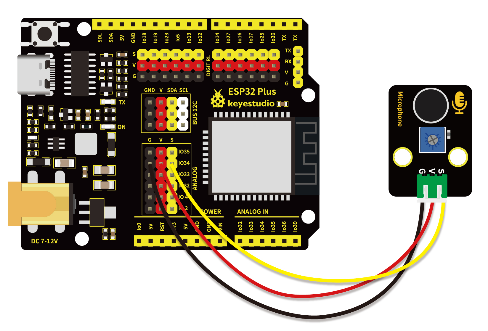
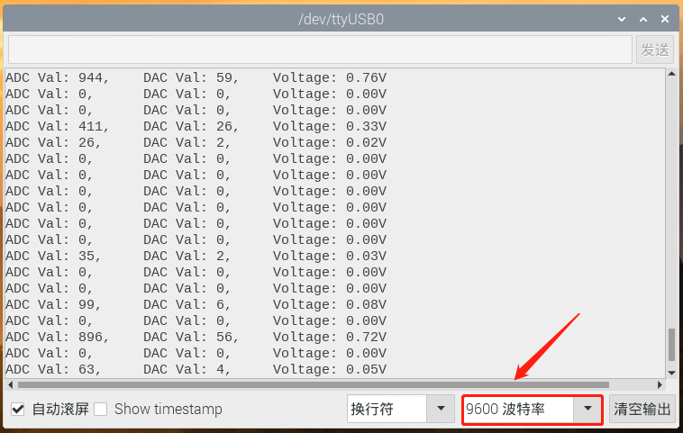

# 第二十二课 声音传感器检测声量

## 1.1 项目介绍

在这个套件中，有一个Keyes 声音传感器。实验中，我们利用这个传感器测试当前环境中的声音对应的ADC值、DAC值和输出的电压值。声音越大，ADC值、DAC值和电压值越大；并在串口监视器上显示测试结果。

---

## 1.2 模块参数

工作电压 : DC 3.3 ~ 5V 

工作电流 : 100 mA

最大功率 : 0.5 W

工作温度 ：-10°C ~ +50°C

输出信号 : 模拟信号

尺寸 ：32 x 23.8 x 10.3 mm

定位孔大小：直径为 4.8 mm

接口 ：间距为2.54 mm 3pin防反接口

---

## 1.3 模块原理图


Keyes 声音传感器主要由一个高感度麦克风元件和LM386音频功率放大器芯片组成。高感度麦克风元件用于检测外界的声音。利用LM386音频功率放大器芯片设计对高感度麦克风检测到的声音进行放大的电路，最大倍数为200倍。使用时我们可以通过旋转传感器上电位器，调节声音的放大倍数。顺时针调节电位器到尽头，放大倍数最大。

---

## 1.4 实验组件

|  |  |        |  |
| ------------------------ | ------------------------ | ---------------------------- | --------------------- |
| ESP32 Plus主板 x1        | Keyes 声音传感器 x1      | XH2.54-3P 转杜邦线母单线  x1 | USB线  x1             |

---

## 1.5 模块接线图



---

## 1.6 实验代码

本项目中使用的代码保存在文件夹“<u>**/home/pi/代码**</u>”中，我们可以在此路径下打开代码文件''**MicroPhone.ino**"。

**注意：为了避免上传代码不成功，请上传代码前不要连接模块。代码上传成功后，拔下USB线断电，按照接线图正确接好模块后再用USB线连接到计算机上电，观察实验结果。**

```c++
/*  
 * 名称   : MicroPhone
 * 功能   : 将接收到的声音转化为对应的ADC值、DAC值和电压值
 * 作者   : http://www.keyes-robot.com/
*/
#define PIN_ANALOG_IN  34  //声音传感器的引脚

void setup() {
  Serial.begin(9600);
}

//在loop()中，使用analogRead()函数获取ADC值，
//然后使用map()函数将该值转换为8位精度DAC值。
//输入输出电压按下面公式计算，
//打印信息
void loop() {
  int adcVal = analogRead(PIN_ANALOG_IN);
  int dacVal = map(adcVal, 0, 4095, 0, 255);
  double voltage = adcVal / 4095.0 * 3.3;
  Serial.printf("ADC Val: %d, \t DAC Val: %d, \t Voltage: %.2fV\n", adcVal, dacVal, voltage);
  delay(200);
}
```

ESP32主板通过USB线连接到计算机后开始上传代码。为了避免将代码上传至ESP32主板时出现错误，必须选择与计算机连接正确的控制板和串行端口。

单击将代码上传到ESP32主控板，等待代码上传成功后查看实验结果。

---

## 1.7 实验结果

代码上传成功后，拔下USB线断电，按照接线图正确接好模块后再用USB线连接到计算机上电，打开串口监视器，设置波特率为**<u>9600</u>**。

串口监视器打印出声音传感器接收到的声音对应的ADC值、DAC值和电压值。对准MIC头大声说话，可以看到接收到的声音对应的ADC值、DAC值和电压值变大。



---

## 1.8 代码说明

此课程代码与第二十课代码类似，这里就不多做介绍了。 
