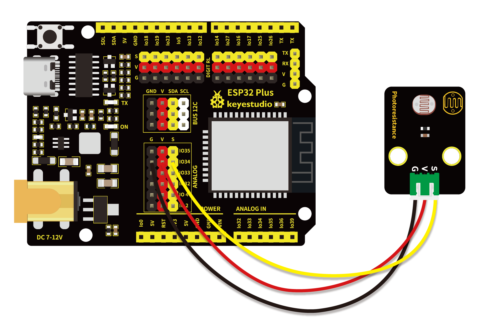
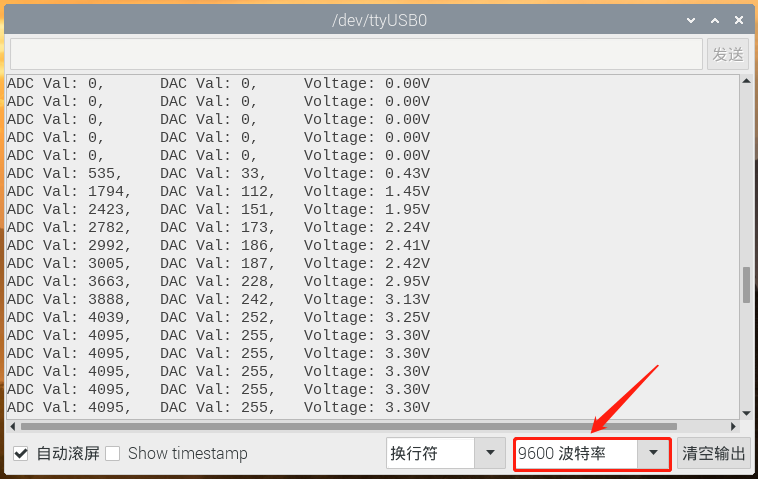

# 第二十三课 光敏电阻传感器

## 1.1 项目介绍

在这个套件中，有一个Keyes 光敏电阻传感器，这是一个常用的光敏电阻传感器，它主要由一个光敏电阻元件组成。光敏电阻元件的阻值随着光照强度的变化而变化，此传感器就是利用光敏电阻元件这一特性，设计电路将阻值变化转换为电压变化。光敏电阻传感器可以模拟人对环境光线的强度的判断，方便做出与人友好互动的应用。

---

## 1.2 模块参数

工作电压 : DC 3.3 ~ 5V 

电流 : 20 mA

最大功率 : 0.1 W

工作温度 ：-10°C ~ +50°C

输出信号 : 模拟信号

尺寸 ：32 x 23.8 x 7.4 mm

定位孔大小：直径为 4.8 mm

接口 ：间距为2.54 mm 3pin防反接口

---

## 1.3 模块原理图


当没有光照射时，电阻大小为0.2 MΩ，光敏电阻的信号端（2脚）检测的电压接近0。随着光照强度增大，光线传感器的电阻值越来越小，所以信号端能检测到的电压越来越大。

---

## 1.4 实验组件

|  |  |        |  |
| ------------------------ | ------------------------ | ---------------------------- | --------------------- |
| ESP32 Plus主板 x1        | Keyes 光敏电阻传感器 x1  | XH2.54-3P 转杜邦线母单线  x1 | USB线  x1             |

---

## 1.5 模块接线图



---

## 1.6 实验代码

本项目中使用的代码保存在文件夹“<u>**/home/pi/代码**</u>”中，我们可以在此路径下打开代码文件''**Photoresistance.ino**"。

**注意：为了避免上传代码不成功，请上传代码前不要连接模块。代码上传成功后，拔下USB线断电，按照接线图正确接好模块后再用USB线连接到树莓派上电，观察实验结果。**

```c++
/*  
 * 名称   : Photoresistance
 * 功能   : 将光敏电阻的阻值转换成ADC,DAC和电压值
 * 作者   : http://www.keyes-robot.com/
*/
#define PIN_ANALOG_IN  34  //光敏电阻的引脚

void setup() {
  Serial.begin(9600);
}

//在loop()中，使用analogRead()函数获取ADC值，
//然后使用map()函数将该值转换为8位精度DAC值。
//输入输出电压按下面公式计算，
//将信息打印出来
void loop() {
  int adcVal = analogRead(PIN_ANALOG_IN);
  int dacVal = map(adcVal, 0, 4095, 0, 255);
  double voltage = adcVal / 4095.0 * 3.3;
  Serial.printf("ADC Val: %d, \t DAC Val: %d, \t Voltage: %.2fV\n", adcVal, dacVal, voltage);
  delay(200);
}
```

ESP32主板通过USB线连接到树莓派后开始上传代码。为了避免将代码上传至ESP32主板时出现错误，必须选择与树莓派连接正确的控制板和串行端口。

单击将代码上传到ESP32主控板，等待代码上传成功后查看实验结果。

---

## 1.7 实验结果

代码上传成功后，拔下USB线断电，按照接线图正确接好模块后再用USB线连接到树莓派上电，打开串口监视器，设置波特率为**<u>9600</u>**。

串口监视器打印出光敏传感器的ADC值、DAC值和电压值。光照越强，可以看到ADC值，DAC值和电压值越大。



---

## 1.8 代码说明

此课程代码与第二十课代码类似，这里就不多做介绍了。  
