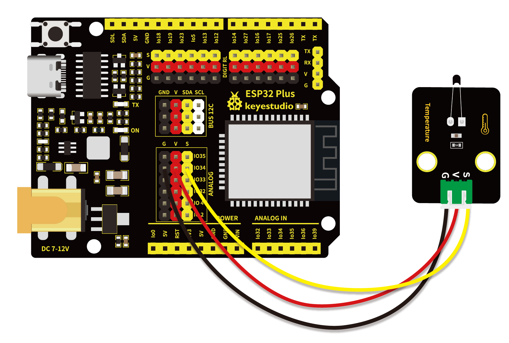

# 第二十四课 NTC-MF52AT模拟温度传感器

## 1.1 项目介绍

在这个套件中，有一个Keyes NTC-MF52AT模拟温度传感器，它的原理与光敏电阻传感器类似，只是感应的器件不同。将传感器信号端接到ESP32主板模拟口，可以读出对应的ADC值，电压值和温度值。我们可以利用ADC值，输出电压值，通过特定公式，计算出当前环境的温度。

---

## 1.2 模块参数

工作电压 : DC 3.3 ~ 5V 

电流 : 20 mA

最大功率 : 0.1 W

工作温度 ：-10°C ~ +50°C

输出信号 : 模拟信号

尺寸 ：32 x 23.8 x 7.4 mm

定位孔大小：直径为 4.8 mm

接口 ：间距为2.54 mm 3pin防反接口

---

## 1.3 模块原理图


Keyes NTC-MF52AT模拟温度传感器主要由NTC-MF52AT热敏电阻元件组成。NTC-MF52AT热敏电阻元件能够感知周边环境温度的变化，随着温度的升高，热敏电阻的阻值降低，4.7K电阻两端的电压上升，从而引起信号端S的电压变化。

**NTC 热敏电阻温度计算公式：Rt = R * EXP( B * (1/T1-1/T2) ) 。**

其中，T1和T2指的是K度，即开尔文温度。K度=273.15(绝对温度)+摄氏度。

Rt 是热敏电阻在周围温度为T1（当前温度）时的电阻值。

R是热敏电阻在周围温度为T2常温（常温取25℃）时的标称阻值。参考规格书可知我们用的NTC-MF52AT模拟温度传感器在 25℃ 下热敏电阻的零功率电阻值为10KΩ ± 5%（即R=10K），T2=(273.15+25) 。

B值是热敏电阻的重要参数，为材料常数，在25℃下测得。参考规格书可知B值为 3950±1%。

EXP() 是e^()，e的n次方。

通过转换可以得到温度T1与电阻Rt的关系：T1=1 / (ln(Rt/R) /B+1/T2) ，这里可以将ln换算成log，即T1=1/ ( log(Rt/R)/B + 1/T2 ) 。

那么我们唯一需要知道的就是Rt的值。回到上面的原理图，设热敏电阻两端电压为VRt，固定的 R1电阻两端的电压为VR，由电阻分压知识VR/VRt = R1/Rt可以知道：Rt = R1 *(3.3-VR)/VR 。而我们实际得到的VR是转换后的ADC值，需要转换成电压值，即VR = adcValue / 4095.0 * 3.3。

**注意**：计算出来的温度是开尔文温度，因此需要减去K值，对应的摄氏温度 t = T1 - 273.15，同时加上0.5的误差矫正。

---

## 1.4 实验组件

|  |     |        |  |
| ------------------------ | --------------------------- | ---------------------------- | --------------------- |
| ESP32 Plus主板 x1        | NTC-MF52AT模拟温度传感器 x1 | XH2.54-3P 转杜邦线母单线  x1 | USB线  x1             |

---

## 1.5 模块接线图



---

## 1.6 实验代码

本项目中使用的代码保存在文件夹“<u>**/home/pi/代码**</u>”中，我们可以在此路径下打开代码文件''**Temperature_sensor.ino**"。

**注意：为了避免上传代码不成功，请上传代码前不要连接模块。代码上传成功后，拔下USB线断电，按照接线图正确接好模块后再用USB线连接到树莓派上电，观察实验结果。**

```c++
/*  
 * 名称   : Temperature sensor
 * 功能   : 用热敏电阻制作温度计
 * 作者   : http://www.keyes-robot.com/
*/
#define PIN_ANALOG_IN   34
void setup() {
  Serial.begin(9600);
}

void loop() {
  int adcValue = analogRead(PIN_ANALOG_IN);    //读ADC引脚
   float Rt=0;      //NTC 热敏电阻
   float R=10000;   //具有固定电阻值的10K电阻
   float T2=273.15+25; //转换成开尔文温度
   float B=3950;    //B值是热敏电阻的一个重要参数
   float K=273.15;  //开氏度 (K°)
   float VR=0;
   VR = (float)(adcValue / 4095.0 * 3.3);  //转换成电压值
   Rt = (3.3 - VR) / VR * 4700;    //计算NTC热敏电阻
   float temp = 1/(1/T2+log(Rt/R)/B)-K+0.5;//计算温度
  Serial.printf("ADC value : %d,\tVoltage : %.2fV, \tTemperature : %.2fC\n", adcValue, VR, temp);
  delay(1000);
}
```

ESP32主板通过USB线连接到树莓派后开始上传代码。为了避免将代码上传至ESP32主板时出现错误，必须选择与树莓派连接正确的控制板和串行端口。

单击将代码上传到ESP32主控板，等待代码上传成功后查看实验结果。

---

## 1.7 实验结果

代码上传成功后，拔下USB线断电，按照接线图正确接好模块后再用USB线连接到树莓派上电，打开串口监视器，设置波特率为**<u>9600</u>**。

串口监视器打印出热敏传感器当前所处环境下的ADC值、电压值和温度值。


---

## 1.8 代码说明

| 代码                                    | 说明                                                         |
| --------------------------------------- | ------------------------------------------------------------ |
| VR = (float)(adcValue / 4095.0 * 3.3)   | 将R1电阻两端转换后的ADC值转换成电压值，数据类型为单精度浮点型。 |
| Rt = (3.3 - VR) / VR * 4700             | 计算热敏电阻在当前温度下的电阻值。                           |
| float temp = 1/(1/T2+log(Rt/R)/B)-K+0.5 | 计算当前环境的温度，数据类型为单精度浮点型。                 |

 
