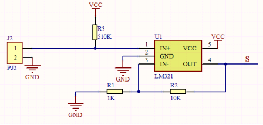
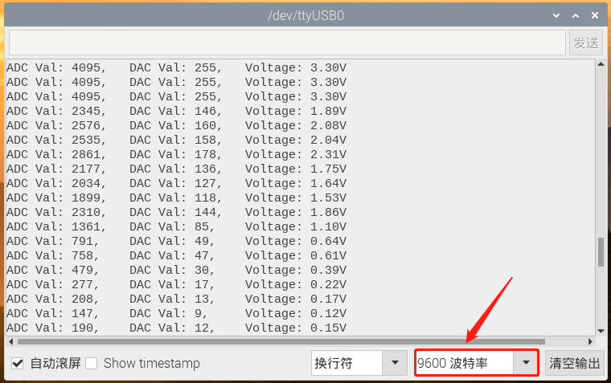

# 第二十五课 薄膜压力传感器

## 1.1 项目介绍

在这个套件中，有一个Keyes 薄膜压力传感器，薄膜压力传感器是基于新型纳米压敏材料辅以舒适杨式模量的超薄薄膜衬底一次性贴片而成，兼具防水和压敏双重功能。

通过采集模块上S端模拟信号，判断压力大小。ADC值、DAC值和电压值越小，压力越大；并在串口监视器上显示测试结果。

---

## 1.2 模块参数

工作电压 : DC 3.3 ~ 5V

电流 : 20 mA

最大功率 : 0.1W

量程 : 0-5KG

响应点 : 150g

重复性 : ＜±9.7%（60%负载）

一致性 : ±10%

耐久性 : ＞100万次

初始电阻 : 大于10MΩ(无负载)

响应时间 : ＜1ms

恢复时间 : ＜15ms

工作温度 ：-10°C ~ +50°C

输出信号 : 模拟信号

尺寸 ：32 x 23.8 x 7.4 mm

定位孔大小：直径为 4.8 mm

接口 ：间距为2.54 mm 3pin防反接口

---

## 1.3 模块原理图



当传感器感知到外界压力时，传感器的电阻值发生变化。Keyes 薄膜压力传感器使用LM321运算放大器芯片将传感器感知到的压力变化的压力信号转换成相应变化强度的电信号输出。这样就可以通过检测电压信号变化得知压力变化情况。

---

## 1.4 实验组件

|  |  |        |  |
| ------------------------ | ------------------------ | ---------------------------- | --------------------- |
| ESP32 Plus主板 x1        | Keyes 薄膜压力传感器 x1  | XH2.54-3P 转杜邦线母单线  x1 | USB线  x1             |

---

## 1.5 模块接线图


---

## 1.6 实验代码

本项目中使用的代码保存在文件夹“<u>**/home/pi/代码**</u>”中，我们可以在此路径下打开代码文件''**Film_pressure_sensor.ino**"。

**注意：为了避免上传代码不成功，请上传代码前不要连接模块。代码上传成功后，拔下USB线断电，按照接线图正确接好模块后再用USB线连接到树莓派上电，观察实验结果。**

```c++
/*  
 * 名称   : Film pressure sensor
 * 功能   : 将薄膜压力传感器感受到的压力值转换为ADC,DAC和电压
 * 作者   : http://www.keyes-robot.com/
*/
#define PIN_ANALOG_IN  34  //薄膜压力传感器的引脚
void setup() {
  Serial.begin(9600);
}

//在loop()中，使用analogRead()函数获取ADC值，
//然后使用map()函数将该值转换为8位精度DAC值。
//输入输出电压按上式计算，
//最后将信息打印出来。
void loop() {
  int adcVal = analogRead(PIN_ANALOG_IN);
  int dacVal = map(adcVal, 0, 4095, 0, 255);
  double voltage = adcVal / 4095.0 * 3.3;
  Serial.printf("ADC Val: %d, \t DAC Val: %d, \t Voltage: %.2fV\n", adcVal, dacVal, voltage);
  delay(200);
}
```

ESP32主板通过USB线连接到树莓派后开始上传代码。为了避免将代码上传至ESP32主板时出现错误，必须选择与树莓派连接正确的控制板和串行端口。

单击将代码上传到ESP32主控板，等待代码上传成功后查看实验结果。

---

## 1.7 实验结果

代码上传成功后，拔下USB线断电，按照接线图正确接好模块后再用USB线连接到树莓派上电，打开串口监视器，设置波特率为**<u>9600</u>**。为了使实验数据最精准，请将薄膜压力传感器尽量平放。

串口监视器打印出薄膜压力传感器的ADC值、DAC值和电压值。用手按压薄膜时，随着力量的增大，可以看到ADC值，DAC值和电压值逐渐变小。



---

## 1.8 代码说明

 此课程代码与第二十课代码类似，这里就不多做介绍了。  

