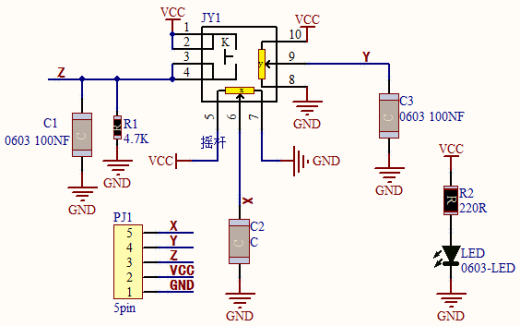
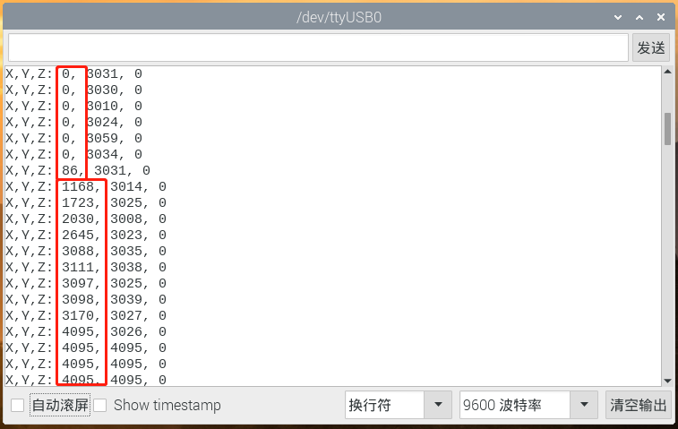
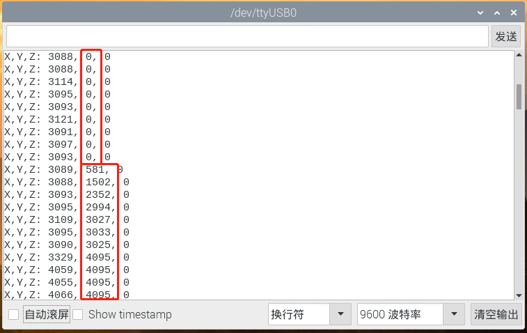
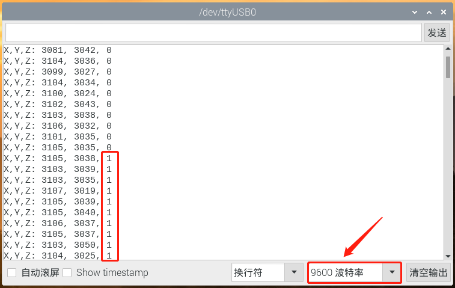

# 第三十课 摇杆模块

## 1.1 项目介绍

你看过游戏手柄吗？游戏手柄上有按键，还有摇杆。摇杆是什么工作原理呢？在我们这个套件中，就有一个Keyes 摇杆模块，它的主要元件是PS2手柄摇杆。控制时，我们需要将模块的X端口和Y端口连接至单片机的模拟口。B端口连接至单片机数字口，V端口接至单片机电源输出端（3.3-5V），GND接单片机GND。通过读取两个模拟值和一个数字口的高低电平情况，可以判断模块上摇杆的工作状态。

---

## 1.2 模块参数

工作电压 : DC 3.3 ~ 5V 

电流 : 50 mA

最大功率 : 0.25 W

输出信号 : 信号端X、Y 模拟电压输出

信号端B  : 数字电平输出 

工作温度 ：-10°C ~ +50°C

控制信号 : 数字信号

尺寸 ：47.6 x 23.8 x 34.5 mm

定位孔大小：直径为 4.8 mm

接口 ：间距为2.54 mm 5pin防反接口

---

## 1.3 模块原理图



其实它的原理非常简单，内部相当于两个可调电位器（左右和上下）和一个按键。按键没有按下时被R1下拉为低电平，按下时接通VCC即为高电平，与我们前面学习过的按键模块的电平值是相反的。摇动摇杆时内部的电位器就会根据摇杆的摇动调节，从而输出不同的电压，可以读取到模拟值。

---

## 1.4 实验组件

|  |  |        |  |
| ------------------------ | ------------------------ | ---------------------------- | --------------------- |
| ESP32 Plus主板 x1        | Keyes 摇杆模块 x1        | XH2.54-5P 转杜邦线母单线  x1 | USB线  x1             |

---

## 1.5 模块接线图


---

## 1.6 实验代码

本项目中使用的代码保存在文件夹“<u>**/home/pi/代码**</u>”中，我们可以在此路径下打开代码文件''**Joystick.ino**"。

**注意：为了避免上传代码不成功，请上传代码前不要连接模块。代码上传成功后，拔下USB线断电，按照接线图正确接好模块后再用USB线连接到树莓派上电，观察实验结果。**

```c++
/*  
 * Filename    : Joystick
 * Description : 从摇杆读取数据
 * Auther      : http://www.keyes-robot.com/
*/
int xyzPins[] = {34, 35, 13};   //x,y,z pins
void setup() {
  Serial.begin(9600);
  pinMode(xyzPins[0], INPUT); //x axis. 
  pinMode(xyzPins[1], INPUT); //y axis. 
  pinMode(xyzPins[2], INPUT_PULLUP);   //z axis is a button.
}

// In loop(), use analogRead () to read the value of axes X and Y 
//and use digitalRead () to read the value of axis Z, then display them.
void loop() {
  int xVal = analogRead(xyzPins[0]);
  int yVal = analogRead(xyzPins[1]);
  int zVal = digitalRead(xyzPins[2]);
  Serial.println("X,Y,Z: " + String(xVal) + ", " +  String(yVal) + ", " + String(zVal));
  delay(500);
}
```

ESP32主板通过USB线连接到树莓派后开始上传代码。为了避免将代码上传至ESP32主板时出现错误，必须选择与树莓派连接正确的控制板和串行端口。

单击将代码上传到ESP32主控板，等待代码上传成功后查看实验结果。

---

## 1.7 实验结果

代码上传成功后，拔下USB线断电，按照接线图正确接好模块后再用USB线连接到树莓派上电，打开串口监视器，设置波特率为**<u>9600</u>**。

串口监视器窗口将打印出当前摇杆X轴和Y轴对应的模拟值以及Z轴对应的数字值，移动摇杆或按下它将改变串口监视器中的模拟值和数字值。当按下摇杆时，Z值为1；未按下摇杆时，Z值为0。X值从左到右由0增长到4095。Y值从下到上由0增长到4095。


在X轴上移动摇杆，使数据从小到大。



在Y轴上移动摇杆，使数据从小到大。



按下摇杆。



---

## 1.8 代码说明

| 代码                              | 说明                       |
| --------------------------------- | -------------------------- |
| pinMode(xyzPins[2], INPUT_PULLUP) | 将引脚设置为输入上拉模式。 |

 
