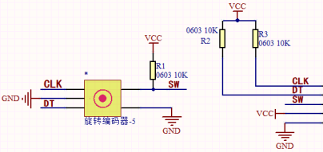

# 第三十三课 旋转编码器模块计数

## 1.1 项目介绍

在这个套件中，有一个Keyes 旋转编码器模块，也叫开关编码器、旋转编码器。此款编码器有20脉冲20定位点、15脉冲30定位点两种。编码器主要用于汽车电子、多媒体音响、仪器仪表、家用电器、智能家居、计算机周边、医疗器械等领域。主要用于频率调节、亮度调节、温度调节、音量调节的参数控制等。

---

## 1.2 模块参数

工作电压 : DC 5V 

电流 : 20 mA

最大功率 : 0.1 W

工作温度 ：-10°C ~ +50°C

控制信号 : 数字信号

尺寸 ：32 x 23.8 x 30.6 mm

定位孔大小：直径为 4.8 mm

接口 ：间距为2.54 mm 5pin防反接口

---

## 1.3 模块原理图



增量式编码器是将位移转换成周期性的电信号，再把这个电信号转变成计数脉冲，用脉冲的个数表明位移的巨细。Keyes 旋转编码器模块采用的是20脉冲旋转编码器元件，它可以通过旋转计数正方向和反方向转动过程中输出脉冲的次数，这种转动计数是没有限制的，复位到初始状态，即从0开始计数。

旋转编码器提供两种交互方式：
- **按钮**   单击旋钮以按下按钮。按下时，按钮将 SW 引脚与 GND 引脚连接，也就是SW引脚的电平为低电平。

- **旋转**   每次旋转旋钮时，会在 DT 和 CLK 引脚上产生一个 LOW 信号。
  

    - 顺时针旋转会导致 CLK 引脚首先变低，然后 DT 引脚也变低。
    
    - 逆时针旋转会导致 DT 引脚先变低，然后 CLK 引脚变低。
    
    两个引脚将在几毫秒内返回高电平。如下图所示：
    
    


---

## 1.4 实验组件

|  |  |        |  |
| ------------------------ | ------------------------ | ---------------------------- | --------------------- |
| ESP32 Plus主板 x1        | Keyes 旋转编码器模块 x1  | XH2.54-5P 转杜邦线母单线  x1 | USB线  x1             |

---

## 1.5 模块接线图


---

## 1.6 实验代码

本项目中使用的代码保存在文件夹“<u>**/home/pi/代码**</u>”中，我们可以在此路径下打开代码文件''**Encoder.ino**"。

**注意：为了避免上传代码不成功，请上传代码前不要连接模块。代码上传成功后，拔下USB线断电，按照接线图正确接好模块后再用USB线连接到树莓派上电，观察实验结果。**

```c++
/*  
 * 名称   : Encoder
 * 功能   : 旋转编码器模块计数
 * 作者   : http://www.keyes-robot.com/
*/

int Encoder_DT  = 27;
int Encoder_CLK  = 14;
int Encoder_Switch = 16;
 
int Encoder_Count;
 
void setup() {
  Serial.begin(9600);
  pinMode (Encoder_DT, INPUT);
  pinMode (Encoder_CLK, INPUT);
  pinMode (Encoder_Switch, INPUT);
}
 
 
int lastClk = HIGH;
 
 
void loop() {
  int newClk = digitalRead(Encoder_CLK);
  if (newClk != lastClk) {
    // 在CLK引脚上有一个变化
    lastClk = newClk;
    int dtValue = digitalRead(Encoder_DT);
    if (newClk == LOW && dtValue == HIGH) {
      Encoder_Count ++;
      Serial.println(Encoder_Count);
    }
    if (newClk == LOW && dtValue == LOW) {
      Encoder_Count--;
      Serial.println(Encoder_Count);
    }
  }

  if (digitalRead(Encoder_Switch) == 0)
  {
    delay(5);
    if (digitalRead(Encoder_Switch) == 0) {
      Serial.println("Switch pressed");
      while (digitalRead(Encoder_Switch) == 0);
    }
  }
}
```

ESP32主板通过USB线连接到树莓派后开始上传代码。为了避免将代码上传至ESP32主板时出现错误，必须选择与树莓派连接正确的控制板和串行端口。

单击将代码上传到ESP32主控板，等待代码上传成功后查看实验结果。

---

## 1.7 实验结果

代码上传成功后，拔下USB线断电，按照接线图正确接好模块后再用USB线连接到树莓派上电，打开串口监视器，设置波特率为**<u>9600</u>**。

顺时针旋转编码器，串口监视器打印出来的数据**<u>增大</u>**；逆时针旋转编码器，串口监视器打印出来的数据**<u>减小</u>**；按下编码器中间按键，串口监视器打印“**<u>Switch pressed</u>**”。


---

## 1.8 代码说明

| 代码                                  | 说明                                                         |
| ------------------------------------- | ------------------------------------------------------------ |
| if (newClk == LOW && dtValue == HIGH) | 如果CLK引脚为低的同时DT引脚为高，也就是CLK引脚先变低，然后DT引脚再变低。顺时针旋转旋钮。 |
| if (newClk == LOW && dtValue == LOW)  | 如果CLK引脚为低的同时DT引脚也为低，也就是DT引脚先变低，然后CLK引脚再变低。逆时针旋转旋钮。 |
| digitalRead(Encoder_Switch) == 0      | 按下旋钮。                                                   |

 
