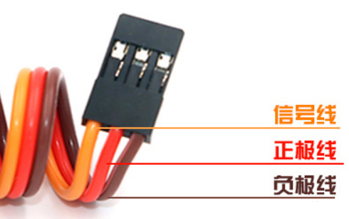

# 第三十四课 舵机的控制原理

## 1.1 项目介绍


舵机是一种位置伺服的驱动器，主要是由外壳、电路板、无核心马达、齿轮与位置检测器所构成。舵机有很多规格，但所有的舵机都有外接三根线。由于舵机品牌不同，颜色也会有所差异，我们实验用到的这款舵机分别用棕、红、橙三种颜色进行区分，棕色为接地线，红色为电源正极，橙色为信号线。



舵机分为360度舵机、180度舵机和90度舵机，我们实验用到的这款舵机为90度舵机，但是它转动的角度范围最大接近180度，所以我们也可把它当做180度舵机使用，控制原理都是一样的。


---

## 1.2 模块参数

工作电压 : DC 3.3 ~ 5V 

工作温度 ：-10°C ~ +50°C

尺寸 ：32.25 x 12.25 x 30.42 mm

接口 ：间距为2.54 mm 3pin接口

---

## 1.3 模块原理图


舵机的控制信号是周期为20ms （50Hz）的PWM（脉冲宽度调制）信号。

舵机的转动的角度是通过调节PWM信号的占空比来实现的，一般在 0.5ms ~ 2.5ms 的范围内去控制，总间隔为 2ms，相对应舵盘的位置为0度 ~ 180度，呈线性变化。当脉冲宽度为 1.5ms 时，舵机旋转至中间角度，大于 1.5ms 时舵机旋转角度增大，小于 1.5ms 时舵机旋转角度减小。

也就是说，舵机的控制需要单片机产生一个周期为20ms的脉冲信号，以0.5ms到2.5ms的高电平来控制舵机转动的角度。具体脉冲参数下图所示：


注意，由于舵机品牌不同，对于同一信号，不同品牌的舵机旋转的角度也会有所不同。

---

## 1.4 实验组件

|  |    |  |
| ------------------------ | ------------------- | --------------------- |
| ESP32 Plus主板 x1        | 9G 180度数字舵机 x1 | USB线  x1             |

---

## 1.5 实验

### 1.5.1 实验①：

#### （1）实验接线图


#### （2）实验代码

本项目中使用的代码保存在文件夹“<u>**/home/pi/代码**</u>”中，我们可以在此路径下打开代码文件''**servo_1.ino**"。

```c++
/*
 * 名称   : Servo_1
 * 功能   : 舵机旋转角度0 -> 90 -> 180，重复
 * 作者   : http://www.keyes-robot.com/
*/
#include <ESP32Servo.h>

Servo myservo;  //创建伺服对象来控制伺服电机

int servoPin = 4;  // 伺服电机引脚

void setup() {
  myservo.setPeriodHertz(50);           //设置伺服电机频率为50Hz
  myservo.attach(servoPin, 500, 2500);  //将servoPin上的值映射到伺服对象上
}

void loop() {
  myservo.write(0); //旋转到0度
  delay(1000); //延迟1s
  myservo.write(90); //旋转到90度
  delay(1000); //延迟1s
  myservo.write(180); //旋转到180度
  delay(1000); //延迟1s
}
```

ESP32主板通过USB线连接到树莓派后开始上传代码。为了避免将代码上传至ESP32主板时出现错误，必须选择与树莓派连接正确的控制板和串行端口。

单击将代码上传到ESP32主控板，等待代码上传成功后查看实验结果。

#### （3）实验结果

若代码上传不成功，提示“**ESP32Servo.h: No such file or directory**”，请添加库文件。具体方法请查看 **开发环境配置** 文件中的 **5.2** 章节。

库文件添加成功后，再次上传代码，代码上传成功后，拔下USB线断电，按照接线图正确接好舵机后再用USB线连接到树莓派上电。舵机由0度转到90度，停顿1秒；再转到180度，停顿1秒；然后回到0度，停顿1秒，循环转动。

---

### 1.5.2 实验②：

#### （1）实验接线图


#### （2）实验代码

本项目中使用的代码保存在文件夹“<u>**/home/pi/代码**</u>”中，我们可以在此路径下打开代码文件''**servo_2.ino**"。

```c++
/*
 * 名称   : Servo_2
 * 功能   : 控制伺服电机进行扫动
 * 作者   : http://www.keyes-robot.com/
*/
#include <ESP32Servo.h>

Servo myservo;  //创建伺服对象来控制伺服电机

int posVal = 0;    // 定义一个变量，存储伺服电机位置
int servoPin = 4;  // 伺服电机引脚

void setup() {
  myservo.setPeriodHertz(50);           //设置伺服电机频率为50Hz
  myservo.attach(servoPin, 500, 2500);  //将servoPin上的值映射到伺服对象上
}
void loop() {

  for (posVal = 0; posVal <= 180; posVal += 1) { // 将servoPin上的伺服附加到伺服对象上
    // 以1度为步
    myservo.write(posVal);       // 告诉伺服电机到变量“pos”的位置
    delay(15);                   // 等待15ms让伺服电机到达位置
  }
  for (posVal = 180; posVal >= 0; posVal -= 1) { // 从180°到0°
    myservo.write(posVal);       // 告诉伺服电机到变量“pos”的位置
    delay(15);                   // 等待15ms让伺服电机到达位置
  }
}
```

#### （3）实验结果

代码上传成功后，拔下USB线断电。按照接线图正确接好舵机后再用USB线连接到树莓派上电。舵机在0度 ~ 180度之间来回转动，每15ms转动一度。

---

## 1.6 代码说明

| 代码                                | 说明                                                         |
| ----------------------------------- | ------------------------------------------------------------ |
| #include <ESP32Servo.h>             | Arduino专门为了esp32推出的servo库，用来操作伺服舵机。        |
| Servo myservo                       | 创建一个伺服对象来控制伺服。                                 |
| myservo.setPeriodHertz(50)          | 设置舵机频率为50Hz。                                         |
| myservo.attach(servoPin, 500, 2500) | 设置控制脉冲范围为500~2500us。                               |
| myservo.write(posVal)               | 向舵机写入一个数值，来直接控制舵机的轴，角度控制。舵机转动到posVal角度值。 |

