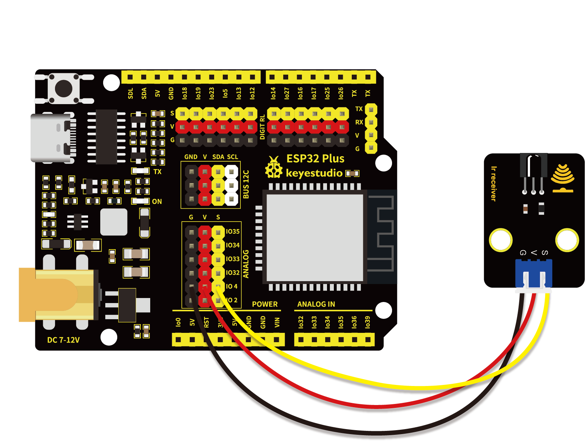
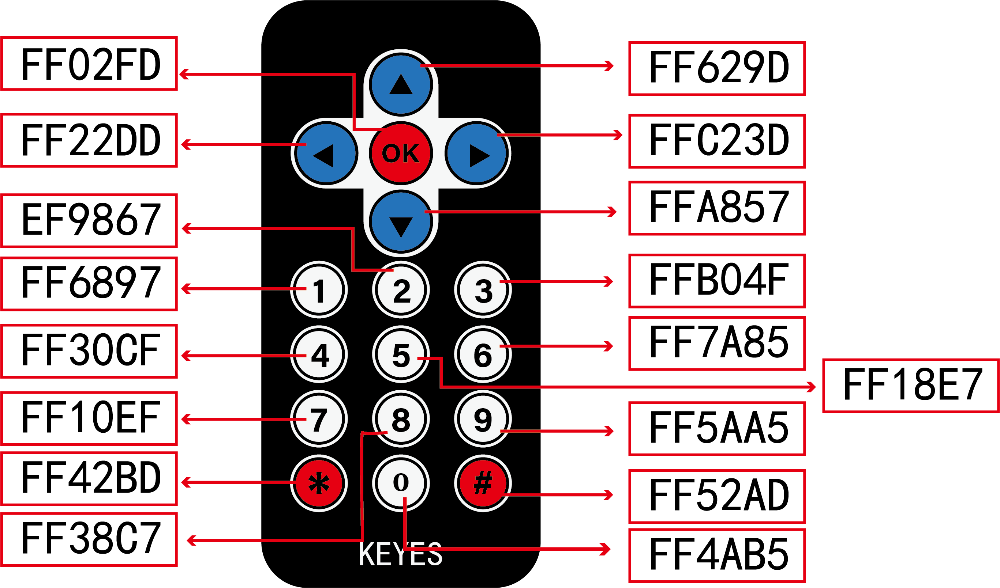
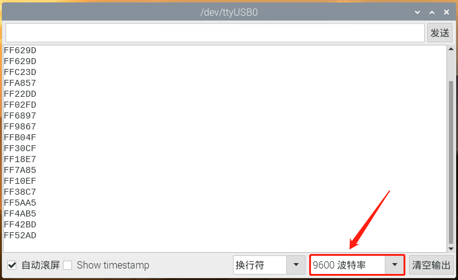

# 第三十六课 红外遥控与接收

## 1.1 项目介绍

红外线遥控是目前使用最广泛的一种通信和遥控手段。因红外线遥控装置具有体积小、功耗低、功能强、成本低等特点，录音机、音响设备、空凋机以及玩具等其它小型电器装置上纷纷采用红外线遥控。红外遥控的发射电路是采用红外发光二极管发出经过调制的红外光波；红外接收电路由红外接收二极管、三极管或硅光电池组成，它们将红外发射器发射的红外光转换为相应的电信号，再送到后置放大器。

Keyes 红外接收模块选择的是VS1838B红外接收传感器元件，该元件是集接收、放大、解调一体的器件，内部IC就已经完成了解调，输出的就是数字信号。它可接收标准38KHz调制的遥控器信号。

---

## 1.2 模块参数

工作电压 : DC 3.3 ~ 5V 

电流 : 50 mA

最大功率 : 0.25 W

工作温度 ：-10°C ~ +50°C

控制信号 : 数字信号

尺寸 ：32 x 23.8 x 10.8 mm

定位孔大小：直径为 4.8 mm

接口 ：间距为2.54 mm 3pin防反接口

---

## 1.3 模块原理图


红外遥控系统的主要部分为调制、发射和接收。红外遥控是以调制的方式发射数据，就是把数据和一定频率的载波进行“与”操作，这样既可以提高发射效率又可以降低电源功耗。调制载波频率一般在30khz到60khz之间，大多数使用的是38kHz，占空比1/3的方波。红外接收的信号端加上了4.7K的上拉电阻R3，工作时，首先等待检测低电平，接收到信号后，信号端立即由高电平转为低电平。

---

## 1.4 实验组件

|  |  |  |        |  |
| ------------------------ | ------------------------ | -------------------------------- | ---------------------------- | --------------------- |
| ESP32 Plus主板 x1        | Keyes 红外接收模块 x1    | Keyes 遥控器 x1                  | XH2.54-3P 转杜邦线母单线  x1 | USB线  x1             |

---

## 1.5 模块接线图



---

## 1.6 实验代码

本项目中使用的代码保存在文件夹“<u>**/home/pi/代码**</u>”中，我们可以在此路径下打开代码文件''**IR_Receiver.ino**"。

**注意：为了避免上传代码不成功，请上传代码前不要连接模块。代码上传成功后，拔下USB线断电，按照接线图正确接好模块后再用USB线连接到树莓派上电，观察实验结果。**

```c++
/*  
 * 名称   : IR Receiver
 * 功能   : 解码红外线遥控器，通过串口打印出来
 * 作者   : http://www.keyes-robot.com/
*/
#include <Arduino.h>
#include <IRremoteESP8266.h>
#include <IRrecv.h>
#include <IRutils.h>

const uint16_t recvPin = 4; // 红外接收引脚
IRrecv irrecv(recvPin);     // 创建一个用于接收类的类对象
decode_results results;     // 创建一个解码结果类对象

void setup() {
  Serial.begin(9600);       // 初始化串口，波特率设置为9600
  irrecv.enableIRIn();      // 启动接收器
  Serial.print("IRrecvDemo is now running and waiting for IR message on Pin ");
  Serial.println(recvPin);  // 打印红外线接收针
}

void loop() {
  if (irrecv.decode(&results)) { // 等待解码
    serialPrintUint64(results.value, HEX);// 输出解码结果
    Serial.println("");
    irrecv.resume();             // 释放IRremote，接收下一个值
  }
  delay(1000);
}
```

ESP32主板通过USB线连接到树莓派后开始上传代码。为了避免将代码上传至ESP32主板时出现错误，必须选择与树莓派连接正确的控制板和串行端口。

单击将代码上传到ESP32主控板，等待代码上传成功后查看实验结果。

---

## 1.7 实验结果

Keyes 遥控器上每一个按键都对应着一个按键值，如下图所示。



若代码上传不成功，提示“**IRremoteESP8266.h: No such file or directory**”，请添加库文件。

库文件添加成功后，再次上传代码，代码上传成功后，拔下USB线断电，按照接线图正确接好模块后再用USB线连接到树莓派上电，打开串口监视器，设置波特率为**<u>9600</u>**。

找到红外遥控器，拔出绝缘片。对准红外接收模块的红外接收传感器的接收头，按下遥控器任意按键，接收到信号后，串口监视器窗口打印出当前接收到的按键值，同时，红外接收传感器上的LED会闪烁。



---

## 1.8 代码说明

| 代码                                  | 说明                               |
| ------------------------------------- | ---------------------------------- |
| irrecv.enableIRIn();                  | 初始化红外遥控。                   |
| irrecv.decode(&results)               | 等待解码。                         |
| serialPrintUint64(results.value, HEX) | 打印出解码结果。                   |
| irrecv.resume();                      | 恢复，等待接收下一个红外遥控信号。 |

 
