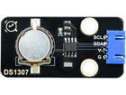
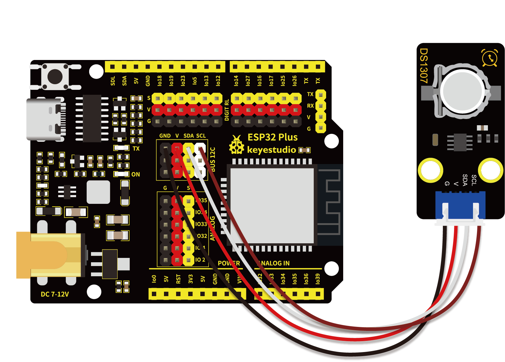

# 第三十九课 DS1307时钟模块

## 1.1 项目介绍

这个模块主要用到的芯片是美国DALLAS公司推出的I2C总线接口实时时钟芯片DS1307，它可独立于CPU工作，不受CPU主晶振及其电容的影响；计时准确，月累积误差一般小于10秒。此芯片还具有主电源掉电情况下的时钟保护电路，DS1307的时钟靠后备电池维持工作，拒绝CPU对其读出和写入访问。同时还具有备用电源自动切换控制电路，因而可在主电源掉电和其它一些恶劣环境场合中保证系统时钟的定时准确性。DS1307具有产生秒、分、时、日、月、年等功能，且具有闰年自动调整功能。同时，DS1307芯片内部还集成有一定容量、具有掉电保护特性的静态RAM，可用于保存一些关键数据。

---

## 1.2 模块参数

中断类型 : 全天时间

存储器容量 : 56 bytes

存储器类型 : RAM

接口类型 : Serial, I2C

时钟频率 : 32.768kHz

特点 : 方波输出

电压, Vcc 最大 : 5V

电源电压 最小 : 4.5V

类型 : RTC

工作温度 ：-10°C ~ +50°C

通讯方式 ：I2C通讯

尺寸 ：47.6 x 23.8 x 9.3 mm

定位孔大小：直径为 4.8 mm

接口 ：间距为2.54 mm 4pin防反接口

---

## 1.3 模块原理图


DS1307 把8 个寄存器和56 字节的RAM 进行了统一编址，记录年、月、日、时、分、秒及星期; AM、PM 分别表示上午和下午; 56 个字节的NVRAM存放数据; 2线串口; 可编程的方波输出;电源故障检测及自动切换电路;电池电流小于500nA。

主要引脚定义如下： 

| DS1307引脚 | 定义                 |
| ---------- | -------------------- |
| X1、X2     | 32.768kHz 晶振接入端 |
| VBAT       | +3V 电池电压输入     |
| VCC        | 电源电压             |
| SQW        | 方波驱动器           |
| SCL        | 串行时钟             |
| SDA        | 串行数据             |

---

## 1.4 实验组件

|  |       |        |  |
| ------------------------ | ----------------------------- | ---------------------------- | --------------------- |
| ESP32 Plus主板 x1        | Keyes DS1307时钟传感器模块 x1 | XH2.54-4P 转杜邦线母单线  x1 | USB线  x1             |

---

## 1.5 模块接线图



---

## 1.6 实验代码

本项目中使用的代码保存在文件夹“<u>**/home/pi/代码**</u>”中，我们可以在此路径下打开代码文件''**DS1307.ino**"。

**注意：为了避免上传代码不成功，请上传代码前不要连接模块。代码上传成功后，拔下USB线断电，按照接线图正确接好模块后再用USB线连接到树莓派上电，观察实验结果。**

```c++
/*  
 * 名称   : DS1307 Real Time Clock
 * 功能   : 读取DS1307时钟模块的年/月/日/时/分/秒/周
 * 作者   : http://www.keyes-robot.com/
*/
#include <Wire.h>
#include "RtcDS1307.h"  //DS1307时钟模块库
RtcDS1307<TwoWire> Rtc(Wire);//I2C接口

void setup(){
  Serial.begin(57600);//波特率设置为57600
  Rtc.Begin();
  Rtc.SetIsRunning(true);

  Rtc.SetDateTime(RtcDateTime(__DATE__, __TIME__));  
}

void loop(){
  // 打印年/月/日/小时/分/ 秒/周
  Serial.print(Rtc.GetDateTime().Year());
  Serial.print("/");
  Serial.print(Rtc.GetDateTime().Month());
  Serial.print("/");
  Serial.print(Rtc.GetDateTime().Day());
  Serial.print("    ");
  Serial.print(Rtc.GetDateTime().Hour());
  Serial.print(":");
  Serial.print(Rtc.GetDateTime().Minute());
  Serial.print(":");
  Serial.print(Rtc.GetDateTime().Second());
  Serial.print("    ");
  Serial.println(Rtc.GetDateTime().DayOfWeek());
  delay(1000);//延迟1秒
}
```

ESP32主板通过USB线连接到树莓派后开始上传代码。为了避免将代码上传至ESP32主板时出现错误，必须选择与树莓派连接正确的控制板和串行端口。

单击将代码上传到ESP32主控板，等待代码上传成功后查看实验结果。

---

## 1.7 实验结果

若代码上传不成功，提示“**RtcDS1307.h: No such file or directory**”，请添加库文件。先点击“**<u>项目</u>**”，选择“**<u>加载库</u>**”，最后选择“**<u>添加.ZIP库</u>**”。

根据库文件的路径打开库文件夹，选中”**Rtc_by_Makuna.zip**“库压缩包，然后单击“**打开**”，库文件成功加入。

再次上传代码，代码上传成功后，拔下USB线断电。

先在模块上安装电池，然后按照接线图正确接好模块后再用USB线连接到树莓派上电，打开串口监视器，设置波特率为**<u>57600</u>**。

串口监视器打印出年、月、日、时、分、秒、周，并每秒刷新一次，显示如下图。


---

## 1.8 代码说明

| 代码                          | 说明                       |
| ----------------------------- | -------------------------- |
| Rtc.Begin()                   | 启动DS1307实时时钟。       |
| Rtc.GetDateTime()             | 获取当前系统的时间和日期。 |
| Rtc.SetDateTime()             | 设置时间。                 |
| Rtc.GetDateTime().Year()      | 返回年份。                 |
| Rtc.GetDateTime().Month()     | 返回月份。                 |
| Rtc.GetDateTime().Day()       | 返回日期。                 |
| Rtc.GetDateTime().Hour()      | 返回小时。                 |
| Rtc.GetDateTime().Minute()    | 返回分钟。                 |
| Rtc.GetDateTime().Second()    | 返回秒数。                 |
| Rtc.GetDateTime().DayOfWeek() | 返回星期。                 |

 
