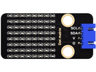

# 第四十二课 HT16K33_8X8点阵模块

## 1.1 项目介绍

点阵，多个LED组成的阵列，他们的集合称为“阵”，其中单个单元称为“点”。8X8点阵共由64个发光二极管组成，且每个发光二极管是放置在行线和列线的交叉点上。

第二课我们学习了一个IO口控制一个led，这节课我们来学习用更少的IO口控制更多的led。

---

## 1.2 模块参数

工作电压 : DC 5V 

电流 : 200 mA

最大功率 : 1 W

工作温度 ：-10°C ~ +50°C

通讯方式 ：I2C通讯

I2C通信地址 ：0X70

点阵屏显示颜色 ：蓝色

尺寸 ：32 x 23.8 x 9.3 mm

定位孔大小：直径为 4.8 mm

接口 ：间距为2.54 mm 4pin防反接口

---

## 1.3 模块原理图


如原理图所示，如果想要点亮第一行第一列的LED灯，只需要将C1置高电平、R1置低电平就可以了。如果我们想让第一行led全部点亮，只需要将R1置为低电平，C1~C8全部置为高电平就可以了。原理非常简单，但是这样设置的话我们总共需要用到16个IO口，非常浪费单片机资源。为了节省IO口不浪费单片机资源，我们特别设计了这个HT16K33_8X8点阵模块，利用HT16K33芯片驱动1个8*8点阵，只需要利用单片机的I2C通信端口就能控制点阵的64个发光二极管。

我们这款Keyes HT16K33_8X8点阵模块已经固定了通信地址，地址为0x70。

---

## 1.4 实验组件

|  |      |        |  |
| ------------------------ | ---------------------------- | ---------------------------- | --------------------- |
| ESP32 Plus主板 x1        | Keyes HT16K33_8X8点阵模块 x1 | XH2.54-4P 转杜邦线母单线  x1 | USB线  x1             |

---

## 1.5 模块接线图


---

## 1.6 实验代码

本项目中使用的代码保存在文件夹“<u>**/home/pi/代码**</u>”中，我们可以在此路径下打开代码文件''**HT16K33_88_dot_matrix.ino**"。

**注意：为了避免上传代码不成功，请上传代码前不要连接模块。代码上传成功后，拔下USB线断电，按照接线图正确接好模块后再用USB线连接到树莓派上电，观察实验结果。**

```c++
 /*
 * 名称   : 8×8 Dot-matrix Display
 * 功能   : 8x8 LED点阵显示“笑脸”图案
 * 作者   : http://www.keyes-robot.com/
*/
#include "HT16K33_Lib_For_ESP32.h"

#define SDA 21
#define SCL 22

ESP32_HT16K33 matrix = ESP32_HT16K33();

//亮度值可设置为1 ~ 15，其中1最暗，15最亮
#define  A  15

byte result[8][8];
byte test1[8] = {0x00,0x42,0x41,0x09,0x09,0x41,0x42,0x00};

void setup()
{
  matrix.init(0x70, SDA, SCL);//初始化矩阵
  matrix.showLedMatrix(test1,0,0);
  matrix.show();
}

void loop()
{
  for (int i = 0; i <= 7; i++)
  {
    matrix.setBrightness(i);
    delay(100);
  }
  for (int i = 7; i > 0; i--)
  {
    matrix.setBrightness(i);
    delay(100);
  }
}
```

ESP32主板通过USB线连接到树莓派后开始上传代码。为了避免将代码上传至ESP32主板时出现错误，必须选择与树莓派连接正确的控制板和串行端口。

单击将代码上传到ESP32主控板，等待代码上传成功后查看实验结果。

---

## 1.7 实验结果

若代码上传不成功，提示“**HT16K33_Lib_For_ESP32.h: No such file or directory**”，请添加库文件。

库文件添加成功后，再次上传代码，代码上传成功后，拔下USB线断电。按照接线图正确接好模块后再用USB线连接到树莓派上电。HT16K33_8X8点阵模块显示“笑脸”图案。


若代码上传成功后点阵屏不显示“笑脸”图案，尝试按一下RESET键。


---

## 1.8 代码说明

点阵上的图案是由一个字节数据类型的数组构成的，我们用下面的表格表示。其中1表示亮，0表示灭，我们可以看到是一个“笑脸”图案。


一列一列来看，可以知道点亮“笑脸”图案的矩阵代码为{0x00,0x42,0x41,0x09,0x09,0x41,0x42,0x00}。
