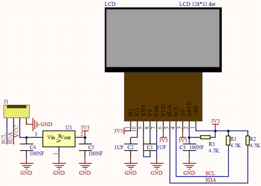
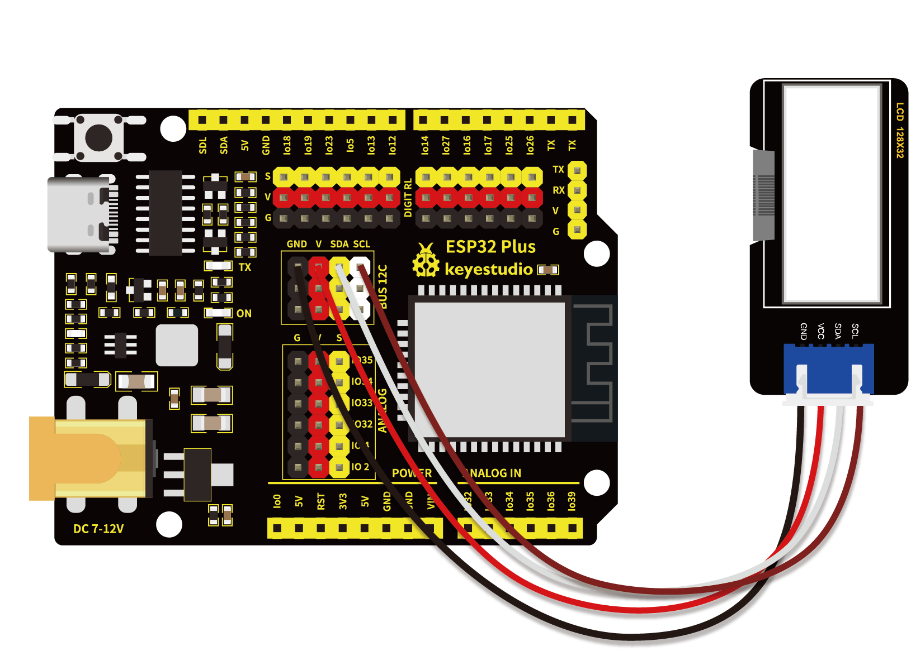

# 第四十三课 LCD_128X32_DOT模块

## 1.1 项目介绍

在这个套件中，有一个Keyes LCD_128X32_DOT模块，它是一个像素为128*32的液晶屏模块，驱动芯片为 ST7567A。此模块使用IIC通信方式。我们提供了包含所有英文字母和常用符号的库，可以直接调用，还能设置大小。为了方便设置图案显示，我们还提供一个取模软件，可将特定的图案转化成控制代码，在测试代码中使用。

---

## 1.2 模块参数

工作电压 ：DC 5V

分辨率 ：128 X 32

电流 ：100 mA

最大功率 ：0.5W

工作温度 ：0°C ~ +40°C

通讯方式 ：IIC/SPI 通信协议

尺寸 ：47.6 x 23.8 x 9.3 mm

定位孔大小：直径为 4.8 mm

接口 ：间距为2.54 mm 4pin防反接口

---

## 1.3 模块原理图



该模块使用IIC通讯原理，底层函数已经封装在库里面，直接调用库函数就可以。如果感兴趣的话可以自行了解底层驱动。

---

## 1.4 实验组件

|  |     |        |  |
| ------------------------ | --------------------------- | ---------------------------- | --------------------- |
| ESP32 Plus主板 x1        | Keyes LCD_128X32_DOT模块 x1 | XH2.54-4P 转杜邦线母单线  x1 | USB线  x1             |

---

## 1.5 模块接线图



---

## 1.6 实验代码

本项目中使用的代码保存在文件夹“<u>**/home/pi/代码**</u>”中，我们可以在此路径下打开代码文件''**lcd128_32.ino**"。

**注意：为了避免上传代码不成功，请上传代码前不要连接模块。代码上传成功后，拔下USB线断电，按照接线图正确接好模块后再用USB线连接到树莓派上电，观察实验结果。**

```c++
/*  
 * 名称   : lcd128*32
 * 功能   : Lcd128 *32 显示字符串
 * 作者   : http://www.keyes-robot.com/
*/
#include "lcd128_32_io.h"

//sda--->21， scl--->22
lcd lcd(21, 22);

void setup() {
  lcd.Init(); //初始化
  lcd.Clear();  //清屏
}

void loop() {
  lcd.Cursor(0, 7); //设置显示位置
  lcd.Display("KEYES"); //设置视图显示
  lcd.Cursor(1, 0);
  lcd.Display("ABCDEFGHIJKLMNOPQR");
  lcd.Cursor(2, 0);
  lcd.Display("123456789+-*/<>=$@");
  lcd.Cursor(3, 0);
  lcd.Display("%^&(){}:;'|?,.~\\[]");
}
```

ESP32主板通过USB线连接到树莓派后开始上传代码。为了避免将代码上传至ESP32主板时出现错误，必须选择与树莓派连接正确的控制板和串行端口。

单击将代码上传到ESP32主控板，等待代码上传成功后查看实验结果。

---

## 1.7 实验结果

若代码上传不成功，提示“**lcd128_32_io.h: No such file or directory**”，请添加库文件。

库文件添加成功后，再次上传代码，代码上传成功后，拔下USB线断电。按照接线图正确接好模块后再用USB线连接到树莓派上电，模块显示屏第一行显示“**KEYES**”、第二行显示“**ABCDEFGHIJKLMNOPQR**”、第三行显示“**123456789+-*/<>=$@**”、第四行显示“**%^&(){}:;'|?,.~\\[]**”。


---

## 1.8 代码说明

| 代码              | 说明           |
| ----------------- | -------------- |
| lcd.Init()        | 初始化显示屏。 |
| lcd.Clear()       | 清除显示。     |
| lcd.Cursor(  ,  ) | 设置显示位置。 |
| lcd.Display("  ") | 设置显示字符。 |

 
