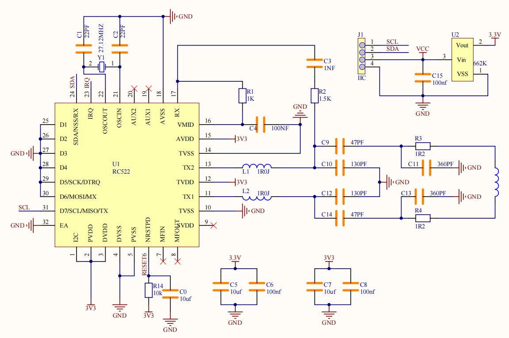
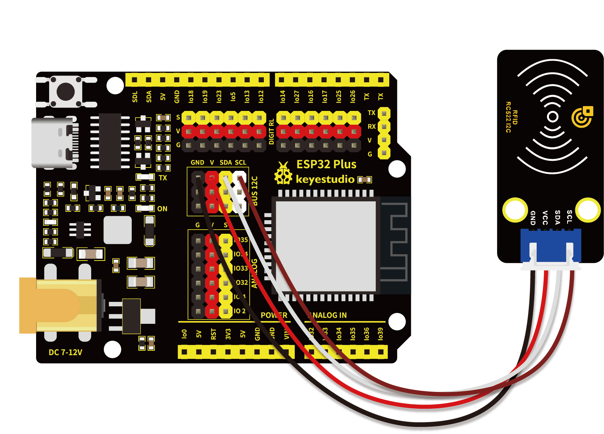

# 第四十四课 RFID刷卡模块

## 1.1 项目介绍

在这个套件中，有一个Keyes RFID刷卡模块。RFIDRFID-RC522射频模块采用Philips MFRC522原装芯片设计读卡电路，使用方便，成本低廉，适用于设备开发、读卡器开发等高级应用的用户，也适用于需要进行射频卡终端设计/生产的用户。本模块可直接装入各种读卡器模具,通过IIC接口简单的2条线就可以直接与用户任何CPU主板或单片机相连接通信。
实验中用刷卡模块读取到的数据是4个16进制数，我们把这四个16进制数串以字符串的形式打印出来。例如本实验中读取到的IC卡的数据为：0xED、0xF7、0x94、0x5A，在串口监视器显示出信息字符串就是ED F7 94 5A；读取钥匙扣的数据为：0x4C、0x09、0x6B、0x6E，在串口监视器打印出来的信息字符串就是4C 09 6B 6E。有时候看到的不是两位数，是因为前面有个0省略了，如0a它显示的就是a。不同的IC卡和钥匙扣，其数据是不一样的。

---

## 1.2 模块参数

工作电压 : DC 5V 

工作电流 : 13 ~ 100 mA /DC 5V 

空闲电流 : 10 ~ 13 mA /DC 5V

休眠电流 : < 80 uA

峰值电流 : < 100 mA

工作频率 : 13.56 MHz

最大功率 : 0.5 W

支持的卡类型：mifare1 S50、mifare1 S70、mifare UltraLight、mifare Pro、mifare Desfire

数据传输速率：最大10Mbit/s

工作温度 ：-10°C ~ +50°C

尺寸 ：47.6 x 23.8 x 9.3 mm

定位孔大小：直径为 4.8 mm

接口 ：间距为2.54 mm 4pin防反接口

---

## 1.3 模块原理图


RFID（Radio Frequency Identification）：无线射频识别，读卡器由频射模块及高平磁场组成。Tag应答器为待感应设备，此设备不包含电池。他只包含微型集成电路芯片及存储数据的介质以及接收和发送信号的天线。读取tag中的数据，首先要放到读卡器的读取范围内。读卡器会产生一个磁场，因为磁能生电由楞次定律，RFID Tag就会供电，从而激活设备。



---

## 1.4 实验组件

|  |  |        |
| ------------------------ | ------------------------ | ---------------------------- |
| ESP32 Plus主板 x1        | Keyes RFID刷卡模块 x1    | XH2.54-4P 转杜邦线母单线  x1 |
|     |     |           |
| USB线  x1                | 钥匙扣  x1               | IC卡  x1                     |

---

## 1.5 模块接线图



---

## 1.6 实验代码

本项目中使用的代码保存在文件夹“<u>**/home/pi/代码**</u>”中，我们可以在此路径下打开代码文件''**RFID.ino**"。

**注意：为了避免上传代码不成功，请上传代码前不要连接模块。代码上传成功后，拔下USB线断电，按照接线图正确接好模块后再用USB线连接到树莓派上电，观察实验结果。**

```c++
/*  
 * 名称   : RFID
 * 功能   : RFID读取器UID
 * 作者   : http://www.keyes-robot.com/
*/
#include <Wire.h>
#include "MFRC522_I2C.h"
// IIC引脚默认为ESP32的GPIO21和GPIO22
// 0x28是SDA的i2c地址，如果不匹配，请与i2c核对你的地址。
MFRC522 mfrc522(0x28);   // 创建MFRC522

void setup() {
  Serial.begin(115200);           
  Wire.begin();        // 初始化I2C
  mfrc522.PCD_Init();  // 初始化MFRC522
  ShowReaderDetails(); // 显示PCD - MFRC522读卡机
  Serial.println(F("Scan PICC to see UID, type, and data blocks..."));
}

void loop() {
  if ( ! mfrc522.PICC_IsNewCardPresent() || ! mfrc522.PICC_ReadCardSerial() ) {
    delay(50);
    return;
  }
  
  // 选择一张门卡，UID和SAK分别为mfrc522.uid  
  // 保存UID
  Serial.print(F("Card UID:"));
  for (byte i = 0; i < mfrc522.uid.size; i++) {
    Serial.print(mfrc522.uid.uidByte[i] < 0x10 ? " 0" : " ");
    Serial.print(mfrc522.uid.uidByte[i], HEX);
  } 
  Serial.println();
}

void ShowReaderDetails() {
  //  获得MFRC522软件
  byte v = mfrc522.PCD_ReadRegister(mfrc522.VersionReg);
  Serial.print(F("MFRC522 Software Version: 0x"));
  Serial.print(v, HEX);
  if (v == 0x91)
    Serial.print(F(" = v1.0"));
  else if (v == 0x92)
    Serial.print(F(" = v2.0"));
  else
    Serial.print(F(" (unknown)"));
  Serial.println("");
  // 返回0x00或0xFF时，可能是通信信号传输失败
  if ((v == 0x00) || (v == 0xFF)) {
    Serial.println(F("WARNING: Communication failure, is the MFRC522 properly connected?"));
  }
}
```

ESP32主板通过USB线连接到树莓派后开始上传代码。为了避免将代码上传至ESP32主板时出现错误，必须选择与树莓派连接正确的控制板和串行端口。

单击将代码上传到ESP32主控板，等待代码上传成功后查看实验结果。

---

## 1.7 实验结果

若代码上传不成功，提示“**MFRC522_I2C.h: No such file or directory**”，请添加库文件。

库文件添加成功后，再次上传代码，代码上传成功后，拔下USB线断电。按照接线图正确接好模块后再用USB线连接到树莓派上电，打开串口监视器，设置波特率为**<u>115200</u>**。

用IC卡和钥匙扣靠近RFID模块，串口监视器打印出RFID刷卡模块读取到的数据信息。


**注意：不同的IC卡和钥匙扣，其数据是不一样的。**<span style="background:#ff0;color:#000">请记录下你的IC卡和钥匙扣的UID码，第59课会用到。</span>

若代码上传成功后串口监视器不打印数据信息，尝试按一下RESET键。


---

## 1.8 代码说明

| 代码                                      | 说明                                 |
| ----------------------------------------- | ------------------------------------ |
| Wire.begin()                              | 进行IIC初始化。                      |
| mfrc522.PCD_Init()                        | MFRC522初始化。                      |
| Serial.print(mfrc522.uid.uidByte[i], HEX) | 将读取到16进制格式的值转为的字符串。 |

 
