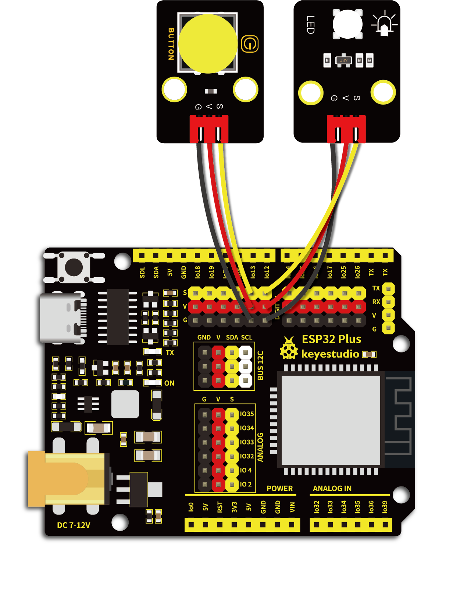

# 第四十五课 按键控制LED灯

## 1.1 项目介绍

从前面的实验课程中我们学习了按键模块，按下按键我们的单片机读取到低电平，松开按键读取到高电平。在这一实验课程中，我们将按键模块和紫色LED模块组合实验，实现按下按键LED点亮，再次按下按键LED熄灭，再次按下再次点亮的效果。

---

## 1.2 实验组件

|  |  |  |        |  |
| ------------------------ | ------------------------ | ------------------------ | ---------------------------- | --------------------- |
| ESP32 Plus主板 x1        | Keyes 单路按键模块 x1    | Keyes 紫色LED模块 x1     | XH2.54-3P 转杜邦线母单线  x2 | USB线  x1             |

---

## 1.3 实验接线图



---

## 1.4 实验代码

本项目中使用的代码保存在文件夹“<u>**/home/pi/代码**</u>”中，我们可以在此路径下打开代码文件''**button_control_LED.ino**"。

**注意：为了避免上传代码不成功，请上传代码前不要连接模块。代码上传成功后，拔下USB线断电，按照接线图正确接好模块后再用USB线连接到树莓派上电，观察实验结果。**

```c++
/* 
 * 名称   : button_control_LED
 * 功能   : 做一盏台灯
 * 作者   : http://www.keyes-robot.com/
*/
#define PIN_LED    12
#define PIN_BUTTON 13
bool ledState = false;

void setup() {
// 初始化数字引脚PIN_LED作为输出
  pinMode(PIN_LED, OUTPUT);
  pinMode(PIN_BUTTON, INPUT);
}

// 循环函数会一直运行下去
void loop() {
  if (digitalRead(PIN_BUTTON) == LOW) {
    delay(20);
    if (digitalRead(PIN_BUTTON) == LOW) {
      reverseGPIO(PIN_LED);
    }
    while (digitalRead(PIN_BUTTON) == LOW);
  }
}

void reverseGPIO(int pin) {
  ledState = !ledState;
  digitalWrite(pin, ledState);
}
```

ESP32主板通过USB线连接到树莓派后开始上传代码。为了避免将代码上传至ESP32主板时出现错误，必须选择与树莓派连接正确的控制板和串行端口。

单击将代码上传到ESP32主控板，等待代码上传成功后查看实验结果。

---

## 1.5 实验结果

代码上传成功后，拔下USB线断电，按照接线图正确接好模块后再用USB线连接到树莓派上电。按下按键，LED点亮，再次按下，LED熄灭。循环进行。


---

## 1.6 代码说明

| 代码                                   | 说明                                                         |
| -------------------------------------- | ------------------------------------------------------------ |
| bool ledState = false                  | 布尔型（bool）变量的值只有真 （true) 和假 （false）。 C++中如果值非零就为True,为零就是False。这里可以知道ledState初始值为0。 |
| ledState = !ledState                   | 将ledState的当前值取反后再赋值给ledState本身。               |
| delay(20)                              | 这里延时的作用是软件方法消抖。按键机械触点断开、闭合时，由于触点的弹性作用，按键开关不会马上稳定接通或一下子断开，在闭合及断开的瞬间均伴随有一连串的抖动，为了不产生这种现象而作的措施就是按键消抖。代码中检测出键闭合后执行一个延时程序，20ms的延时，让前沿抖动消失后再一次检测键的状态，如果仍保持闭合状态电平，则确认为真正有键按下。 |
| while (digitalRead(PIN_BUTTON) == LOW) | 循环PIN_BUTTON) == LOW，直至松开按键跳出while循环。作用是按下按键不松开时LED保持当前状态。若没有while循环，ledState会不断取反，也就是LED灯会不断地快速亮灭。 |

 
