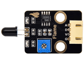
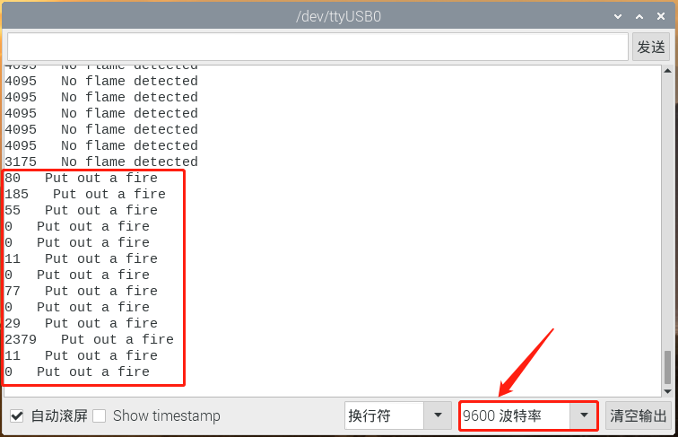

# 第四十八课 模拟灭火机器人

## 1.1 项目介绍

你知道灭火机器人吗？根据国家犯罪记录局（NCRB）的估计，从2010年至2014年，印度发生的火灾事故已造成超过120万死亡。即使为火灾事故采取了许多预防措施，但这些自然/人为灾难却还是时有发生。发生火灾时，为了营救人员和灭火，非常需要消防员等人力资源。随着技术的进步、机器人技术的发展，未来很有可能使用机器人代替消防员灭火。这将提高灭火的效率，也能保障消防员的生命安全。

在这个项目中，我们将学习如何使用ESP32主板构建一个非常简单的机器人。用火焰传感器检测火焰，并启动130电机吹灭火源。

---

## 1.2 实验组件

|  |  |  |           |
| ------------------------ | ------------------------ | ------------------------ | ---------------------------- |
| ESP32 Plus主板 x1        | Keyes 130电机模块 x1     | Keyes 火焰传感器 x1      | XH2.54-4P 转杜邦线母单线  x2 |
|        |     |          |                              |
| USB线  x1                | 6节5号电池盒  x1         | 5号电池**(自备)**  x6    |                              |

---

## 1.3 模块接线图


**注意：130电机模块的GND线一定要接到图示位置，电池盒也必须接上，否则容易造成瞬时电流过大。**

---

## 1.4 实验代码

本项目中使用的代码保存在文件夹“<u>**/home/pi/代码**</u>”中，我们可以在此路径下打开代码文件''**Fire-fighting_robot.ino**"。

**注意：为了避免上传代码不成功，请上传代码前不要连接模块。代码上传成功后，拔下USB线断电，按照接线图正确接好模块后再用USB线连接到树莓派上电，观察实验结果。**

```c++
/*  
 * 名称   : Fire-fighting robot
 * 功能   : 火焰传感器控制130风扇模块
 * 作者   : http://www.keyes-robot.com/
*/
int item = 0;
void setup() {
  Serial.begin(9600);
  pinMode(5, OUTPUT); //INA对应IN+，将GPIO5设置为输出模式
  pinMode(13, OUTPUT);//INB对应IN-，将GPIO13置为输出模式
}

void loop() {
  item = analogRead(34);//将火焰传感器连接到GPIO34上，将模拟值读取到Item
  Serial.print(item); //串口显示模拟值
  if (item < 3000) {//3000以下  
    Serial.print("   "); 
    Serial.println("Put out a fire");
    delay(100);
    digitalWrite(5, LOW);//打开电风扇
    digitalWrite(13, HIGH);
    
  } else {//否则，关闭风扇
    Serial.print("   "); 
    Serial.println("No flame detected");
    delay(100);
    digitalWrite(5, LOW);
    digitalWrite(13, LOW);
    
  } 
}
```

ESP32主板通过USB线连接到树莓派后开始上传代码。为了避免将代码上传至ESP32主板时出现错误，必须选择与树莓派连接正确的控制板和串行端口。

单击将代码上传到ESP32主控板，等待代码上传成功后查看实验结果。

---

## 1.5 实验结果

由于风扇在转动时，所需的电流比其他传感器要大，会引起电路中电压电流波动，特别是风扇进行正反转时，电压电流波动过大，导致ESP32开发板的电压电流过低，会导致复位。

代码上传成功后，拔下USB线断电，按照接线图正确接好模块后再用USB线连接到树莓派上电，打开串口监视器，设置波特率为**<u>9600</u>**。

串口监视器上打印出火焰的ADC值，当ADC值低于3000时打开风扇灭火，串口监视器打印出“**Put out a fire**”；当ADC值高于3000时关闭风扇，串口监视器打印出“**No flame detected**”。这个ADC阈值可以根据实际情况设置。



---

## 1.6 代码说明

在代码中我们设置了阈值为3000（item < 3000），阈值可以根据实际情况更改。当火焰传感器检测到ADC值低于这个阈值时，风扇将自动开启；否则关闭。风扇的驱动方式请查看课程十八。
