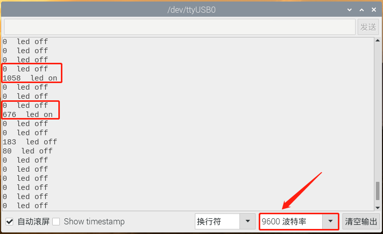

# 第五十二课 声控灯

## 1.1 项目介绍

如今智能家居发展迅速，你使用过智能家居当中的智能声控灯吗？当我们跺跺脚或者拍拍手时，智能声控灯自动亮起；当没有声音时，智能声控灯处于熄灭状态。智能声控灯上安装有声音探测传感器，这些传感器将外界声音的大小，转换成对应数值。智能声控灯设置一个临界点，当声音转换后对应的数值超过该临界点时，灯光亮起一段时间。 

在这一实验课程中，我们将声音传感器和紫色LED模块组合实验，学习制作一个最简单的智能声控灯。

---

## 1.2 实验组件

|  |  |  |        |  |
| ------------------------ | ------------------------ | ------------------------ | ---------------------------- | --------------------- |
| ESP32 Plus主板 x1        | Keyes 声音传感器 x1      | Keyes 紫色LED模块 x1     | XH2.54-3P 转杜邦线母单线  x2 | USB线  x1             |

---

## 1.3 模块接线图


---

## 1.4 实验代码

本项目中使用的代码保存在文件夹“<u>**/home/pi/代码**</u>”中，我们可以在此路径下打开代码文件''**sound-controlled_lights.ino**"。

**注意：为了避免上传代码不成功，请上传代码前不要连接模块。代码上传成功后，拔下USB线断电，按照接线图正确接好模块后再用USB线连接到计算机上电，观察实验结果。**

```c++
/*  
 * 名称   : sound-controlled lights
 * 功能   : 声音传感器控制LED开关
 * 作者   : http://www.keyes-robot.com/
*/
int ledPin = 5;    //LED连接到GPIO5
int microPin = 34; //声音传感器连接到GPIO34
void setup() {
  Serial.begin(9600); //波特率设置为9600
  pinMode(ledPin, OUTPUT); //LED为输出模式
}

void loop() {
  int val = analogRead(microPin); //读取模拟值
  Serial.print(val); // 串口打印
  if(val > 400){ //超过阈值
    digitalWrite(ledPin, HIGH); //LED亮3s，并打印相应信息
    Serial.println("  led on");
    delay(3000);
  }else{ //否则
    digitalWrite(ledPin, LOW); //关闭LED并打印相应信息
    Serial.println("  led off");
  }
  delay(100);
}
```

ESP32主板通过USB线连接到计算机后开始上传代码。为了避免将代码上传至ESP32主板时出现错误，必须选择与计算机连接正确的控制板和串行端口。

单击将代码上传到ESP32主控板，等待代码上传成功后查看实验结果。

---

## 1.5 实验结果

代码上传成功后，拔下USB线断电，按照接线图正确接好模块后再用USB线连接到计算机上电，打开串口监视器，设置波特率为**<u>9600</u>**。

串口监视器打印出声音传感器接收到的声音对应的ADC值，接收到的声音增大时ADC值也增大，当ADC值大于400时，LED模块上LED亮起3秒，然后熄灭。



---

## 1.6 代码说明

| 代码                           | 说明               |
| ------------------------------ | ------------------ |
| int val = analogRead(microPin) | 读取模拟值。       |
| Serial.print(val)              | 串口打印出模拟值。 |

 
