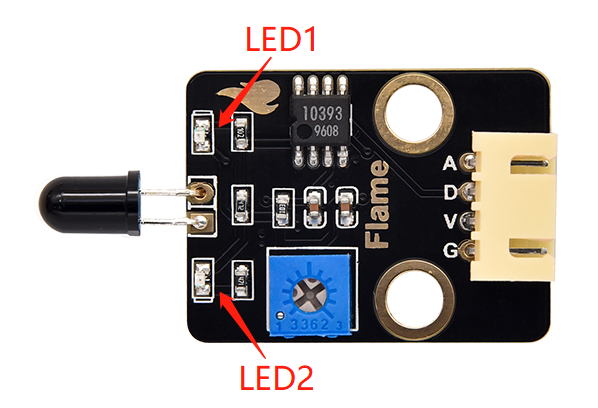

# 第五十三课 火焰报警

## 1.1 项目介绍

生活中，火灾的危害是相当大的。这一课我们来学习制作一个火灾报警系统，它虽然简单，但却是非常具有意义的。原理很简单，利用火焰传感器检测，检测的结果控制一个有源蜂鸣器响起。

---

## 1.2 实验组件

|      |      |  |
| ---------------------------- | ---------------------------- | ------------------------ |
| ESP32 Plus主板 x1            | Keyes 有源蜂鸣器模块 x1      | Keyes 火焰传感器 x1      |
|        |        |     |
| XH2.54-3P 转杜邦线母单线  x1 | XH2.54-4P 转杜邦线母单线  x1 | USB线  x1                |

---

## 1.3 模块接线图


---

## 1.4 实验代码

本项目中使用的代码保存在文件夹“<u>**/home/pi/代码**</u>”中，我们可以在此路径下打开代码文件''**Flame_alarm.ino**"。

**注意：为了避免上传代码不成功，请上传代码前不要连接模块。代码上传成功后，拔下USB线断电，按照接线图正确接好模块后再用USB线连接到树莓派上电，观察实验结果。**

```c++
/*  
 * 名称   : Flame Alarm
 * 功能   : 通过火焰传感器控制蜂鸣器
 * 作者   : http://www.keyes-robot.com/
*/
int item = 0;
void setup() {
  Serial.begin(9600);
  pinMode(13, INPUT);  //火焰传感器数字引脚连接到GPIO13
  pinMode(5, OUTPUT);  //蜂鸣器引脚连接GPIO5
}

void loop() {
  item = digitalRead(13); //读取火焰传感器的数字电平输出
  Serial.println(item);   //换行打印电平信号
  if (item == 0) { //火焰探测
    digitalWrite(5, HIGH); //打开蜂鸣器
  } else { //否则，请关闭蜂鸣器
    digitalWrite(5, LOW);
  }
  delay(100); //延迟100毫秒
}
```

ESP32主板通过USB线连接到树莓派后开始上传代码。为了避免将代码上传至ESP32主板时出现错误，必须选择与树莓派连接正确的控制板和串行端口。

单击将代码上传到ESP32主控板，等待代码上传成功后查看实验结果。

---

## 1.5 实验结果

代码上传成功后，拔下USB线断电，按照接线图正确接好模块后再用USB线连接到树莓派上电。此时火焰传感器上的红色LED2点亮。旋转火焰传感器上的电位器，微调使传感器上红色LED1灯介于亮与不亮之间的**不亮**状态。



当火焰传感器检测到火焰时，有源蜂鸣器响起，否则有源蜂鸣器不响。

---

## 1.6 代码说明

此课程代码与第四十八课代码类似，这里就不多做介绍了。  
