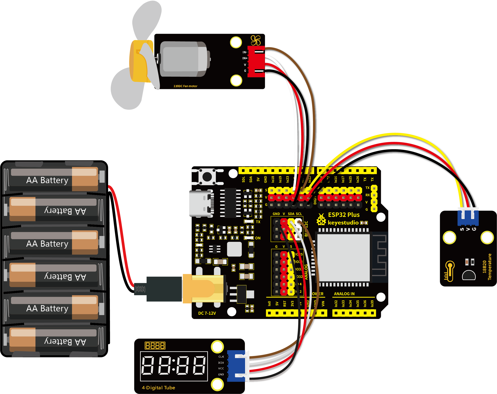

# 第五十八课 模拟温度散热装置

## 1.1 项目介绍

生活中，我们的电脑或者电路板芯片等器件会由于工作时间过长或者功耗过大的问题而发热严重，所以我们常常需要一个散热装置。

在前面的课程我们学习了如何使用温度传感器和电机模块，这一课我们学习把它们结合起来做成一个智能散热装置。当检测到环境温度高于某一个值时的时候，电机开启，从而达到降低环境温度、散热效果。再把此刻的温度值显示在四位数码管中。

---

## 1.2 实验组件

|  |      |       |
| ------------------------ | ---------------------------- | ----------------------------- |
| ESP32 Plus主板 x1        | Keyes 130电机模块 x1         | Keyes TM1650四位数码管模块 x1 |
|  |        |         |
| Keyes 18B20温度传感器 x1 | XH2.54-3P 转杜邦线母单线  x1 | XH2.54-4P 转杜邦线母单线  x2  |
|     |         |               |
| USB线  x1                | 6节5号电池盒  x1             | 5号电池**(自备)**  x6         |

---

## 1.3 模块接线图



---

## 1.4 实验代码

本项目中使用的代码保存在文件夹“<u>**/home/pi/代码**</u>”中，我们可以在此路径下打开代码文件''**heat_abstractor.ino**"。

**注意：为了避免上传代码不成功，请上传代码前不要连接模块。代码上传成功后，拔下USB线断电，按照接线图正确接好模块后再用USB线连接到树莓派上电，观察实验结果。**

```c++
/*  
 * 名称   : heat abstractor
 * 功能   : DS18B20控制一个四位数管和一个电机模拟散热装置
 * 作者   : http://www.keyes-robot.com/
*/
#include <DS18B20.h>
#include "TM1650.h" //导入TM1650库文件
//两个端口分别为GP21和GP22
#define DIO 21
#define CLK 22
TM1650 DigitalTube(CLK,DIO);

//DS18B20引脚为12
DS18B20 ds18b20(12);
void setup() {
  Serial.begin(9600);
  DigitalTube.setBrightness();  //设置亮度，0- 7，默认值:2
  DigitalTube.displayOnOFF();   //显示打开或关闭，0=显示关闭，1=显示打开，默认值:1
  for(char b=1;b<5;b++){
    DigitalTube.clearBit(b);    //DigitalTube.clearBit(0~3);清晰位显示
  }
  // DigitalTube.displayDot(1,true);//Bit0显示点。在displayBit()之前使用。
  DigitalTube.displayBit(1,0);  //DigitalTube.Display(bit,number); bit=0---3  number=0---9
  //电机连接到5 13
  pinMode(5, OUTPUT);
  pinMode(13, OUTPUT);
}

void loop() {
  double temp = ds18b20.GetTemp();//读取温度
  temp *= 0.0625;//转换精度为0.0625/LSB
  Serial.println(temp);
  displayFloatNum(temp);//4位数码管显示温度值
  if (temp > 30) {//当温度超过30℃时，打开风扇
    digitalWrite(5, LOW);
    digitalWrite(13, HIGH);
  } else {//否则，请关闭风扇
    digitalWrite(5, LOW);
    digitalWrite(13, LOW);
  }
  delay(100);
}

void displayFloatNum(float temp){
  if(temp > 9999)
    return;
  int dat = temp*10;
   //DigitalTube.displayDot(2,true); //Bit0显示点  在displayBit()之前使用。
  if(dat/10000 != 0){
    DigitalTube.displayBit(0, dat%100000/10000);  
    DigitalTube.displayBit(1, dat%10000/1000);
    DigitalTube.displayBit(2, dat%1000/100);
    DigitalTube.displayBit(3, dat%100/10);
    return;
  }
  if(dat%10000/1000 != 0){
    DigitalTube.clearBit(0); 
    DigitalTube.displayBit(1, dat%10000/1000); 
    DigitalTube.displayBit(2, dat%1000/100);
    DigitalTube.displayBit(3, dat%100/10);
    return;
  }
  if(dat%1000/100 != 0){
  DigitalTube.clearBit(0); 
  DigitalTube.clearBit(1);
  DigitalTube.displayBit(2, dat%1000/100);
  DigitalTube.displayBit(3, dat%100/10);  
  return;
}
  DigitalTube.clearBit(0); 
  DigitalTube.clearBit(1);
  DigitalTube.clearBit(2);
  DigitalTube.displayBit(3, dat%100/10);
}
```

ESP32主板通过USB线连接到树莓派后开始上传代码。为了避免将代码上传至ESP32主板时出现错误，必须选择与树莓派连接正确的控制板和串行端口。

单击将代码上传到ESP32主控板，等待代码上传成功后查看实验结果。

---

## 1.5 实验结果

按照接线图正确接好模块后再用USB线连接到树莓派，外接电池盒，上传代码。上传成功后可以在四位数码管模块上看到当前温度值，当温度超过代码中设定的30°C时，风扇转动，散热。


---

## 1.6 代码说明

变量的设置与存储检测值，与前面我们学习的一样，也是通过设置一个温度的阈值（阈值30可以根据实际情况重新更改），超过这个阈值进行控制电机转动，四位数码管显示温度值。
