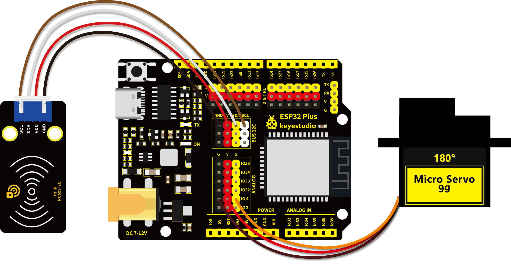

# 第五十九课 智能门禁系统

## 1.1 项目介绍

生活中，很多门禁系统都是使用射频模块进行开锁的，既方便又安全。这一课，学习利用RFID522刷卡模块和舵机设置一个智能门禁系统。

原理很简单，使用RFID522刷卡模块感应，使用IC卡或者钥匙卡来开锁，舵机的作用即门禁锁。

---

## 1.2 实验组件

|  |  |      |  |
| ------------------------ | ------------------------ | ---------------------------- | --------------------- |
| ESP32 Plus主板 x1        | Keyes RFID刷卡模块 x1    | 钥匙扣 x1                    | USB线  x1             |
|       |         |        |                       |
| IC卡  x1                 | 9G 180度数字舵机 x1      | XH2.54-4P 转杜邦线母单线  x1 |                       |

---

## 1.3 模块接线图



---

## 1.4 实验代码

本项目中使用的代码保存在文件夹“<u>**/home/pi/代码**</u>”中，我们可以在此路径下打开代码文件''**Intelligent_access_control.ino**"。

**<span style="background:#ff0;color:#000">特别注意：对于不同的IC卡和钥匙扣，其读取的IC卡和钥匙扣的UID码值可能都不一样。在代码运行前，需要将你自己的IC卡和钥匙扣的UID码值替换程序代码中的UID码（UID码在第44课完成实验可以得知），替换位置如下图所示。</span>**


```c++
/* 
 * 名称   : Intelligent_access_control
 * 功能   : RFID控制舵机模拟开门
 * 作者   : http://www.keyes-robot.com/
*/
#include <Wire.h>
#include "MFRC522_I2C.h"
//IIC引脚默认为ESP32的GPIO21和GPIO22
// 0x28是SDA的i2c地址，如果不匹配，请与i2c核对你的地址
MFRC522 mfrc522(0x28);   //创建MFRC522

#include <ESP32Servo.h>
Servo myservo;  // 创建伺服电机对象来控制伺服电机
int servoPin = 4; // 伺服电机引脚

String rfid_str = "";

void setup() {
  Serial.begin(9600);
  Wire.begin();
  mfrc522.PCD_Init();
  ShowReaderDetails();            // 显示PCD - MFRC522读卡机
  Serial.println(F("Scan PICC to see UID, type, and data blocks..."));
  
  myservo.setPeriodHertz(50);           //标准50赫兹伺服
  myservo.attach(servoPin, 500, 2500);  // 将servoPin上的伺服附加到伺服对象上
  myservo.write(0); 
  delay(500);
}

void loop() {
   if ( ! mfrc522.PICC_IsNewCardPresent() || ! mfrc522.PICC_ReadCardSerial() ) {
    delay(50);
    return;
  }
  
  //选择一张门卡，UID和SAK分别为mfrc522.uid。
  
  // 保存UID
  rfid_str = ""; //字符串清空
  Serial.print(F("Card UID:"));
  for (byte i = 0; i < mfrc522.uid.size; i++) {
    rfid_str = rfid_str + String(mfrc522.uid.uidByte[i], HEX);  //转化字符串到实数
    //Serial.print(mfrc522.uid.uidByte[i] < 0x10 ? " 0" : " ");
    //Serial.print(mfrc522.uid.uidByte[i], HEX);
  } 
  Serial.println(rfid_str);
  
  if (rfid_str == "ce62ce6f" || rfid_str == "fb858372") {
    myservo.write(180);
    delay(500);
    Serial.println("  open the door!");
    }
}

void ShowReaderDetails() {
  //  获得MFRC522软件
  byte v = mfrc522.PCD_ReadRegister(mfrc522.VersionReg);
  Serial.print(F("MFRC522 Software Version: 0x"));
  Serial.print(v, HEX);
  if (v == 0x91)
    Serial.print(F(" = v1.0"));
  else if (v == 0x92)
    Serial.print(F(" = v2.0"));
  else
    Serial.print(F(" (unknown)"));
  Serial.println("");
  // 当返回0x00或0xFF时，可能无法传输通信信号
  if ((v == 0x00) || (v == 0xFF)) {
    Serial.println(F("WARNING: Communication failure, is the MFRC522 properly connected?"));
  }
}
```

ESP32主板通过USB线连接到树莓派后开始上传代码。为了避免将代码上传至ESP32主板时出现错误，必须选择与树莓派连接正确的控制板和串行端口。

单击将代码上传到ESP32主控板，等待代码上传成功后查看实验结果。

---

## 1.5 实验结果

按照接线图正确接好模块后再用USB线连接到树莓派，上传代码。上传成功后打开串口监视器，波特率设置为**<u>9600</u>**。使用正确的IC卡或者钥匙扣刷卡时，串口监视器打印出卡的UID码并提示“**open the door!**”，同时舵机转动到相应的角度模拟开门的效果。


---

## 1.6 代码说明

在前面的课程中，使用RFID刷卡模块已经测试出来了IC卡和钥匙扣的UID码。这一课利用对应的UID码信息来控制舵机转动对应的角度，模拟开门的效果。
