# 第五十四课 Bluetooth

## 1.1 项目介绍

ESP32是一系列低成本，低功耗的单片机微控制器，集成了Wi-Fi和双模蓝牙。ESP32 可作为独立系统运行应用程序或作为主机 MCU 的从设备，通过 SPI / SDIO 或 I2C / UART 接口提供 Wi-Fi 和蓝牙功能。

蓝牙是一种短距离通信系统，其简单的数据传输有两种模式：主设备工作模式和从设备工作模式。蓝牙技术规定每一对设备之间进行蓝牙通讯时，必须一个为**主端**，另一个为**从端**，才能进行通信。通信时，必须由主端进行查找，发起配对，建链成功后，双方即可收发数据。

- **<u>主设备工作模式</u>** ：主设备是能够搜索并**主动建立连接**的一方，从扫描状态转化而来的。其可以和一个或多个从设备进行连接通信，它会**定期的扫描**周围的广播状态设备发送的广播信息，可以对周围设备进行搜索并选择所需要连接的从设备进行配对连接，**建立通信链路成功后，主从双方就可以发送接收数据**。例如智能手机，数据传输中做主机的蓝牙模块。

  **一个蓝牙设备以主模式发起连接时，需要知道从设备的地址，配对密码等信息，配对完成后，可直接连接。**同时主设备可以**设置默认连接**从设备的地址，这样主设备模块上电会自动搜索该地址的从设备并且进行连接。并且**支持白名单功能**，用户只需要把需要连接的设备的地址写入白名单中，模块搜索到符合白名单的设备时就进行连接。主从透传协议相同时，用户不需要关注串口数据与无线数据包之间的数据转换过程，只需通过简单的参数设置，即可实现主设备串口与从设备串口之间的数据透传。

  为保证连接的稳定性，预防断电、信号等异常问题导致模块之间断开连接，可以开启断线重连功能，当异常干扰问题消失，模块工作环境恢复正常，主设备会自动搜索刚刚断连的从设备，尽可能减少数据的丢失，提高系统稳定性。

-  **<u>从设备工作模式</u>** ：从设备模式是从广播者模式转化而来的，未被连接的从设备首先进入广播状态，**等待被主机搜索**。当从设备被主机扫描到并**建立连接后**，就可以和主机设备**进行数据的收发**。从设备**不能主动建立连接**。从设备模式的蓝牙模块是可以被连接的，定期的和主机进行连接和数据传输，在数据传输过程中作从机。例如蓝牙手表手环，蓝牙鼠标等工作在从设备模式。

  一对一应用中从设备可以设为两种类型。一是静默状态，即只能与指定的主设备通信，不被别的蓝牙设备查找；二是开发状态，既可被指定主设备查找，也可以被别的蓝牙设备查找后建立连接。

  当手机与ESP32进行数据交换时，**手机通常处于主设备工作模式，ESP32为从设备工作模式。**

这一实验课程我们先学习利用ESP32的蓝牙功能与手机进行简单的数据传输，然后学习用蓝牙控制LED灯的亮灭。

---

## 1.2 实验组件

在本课程中，我们需要使用一个名为"串行蓝牙终端"的蓝牙应用程序来协助实验。
点击安装：https://www.appsapk.com/serial-bluetooth-terminal/

|  |  |        |  |  |
| ------------------------ | ------------------------ | ---------------------------- | --------------------- | -------------------------------------------- |
| ESP32 Plus主板 x1        | Keyes 紫色LED模块 x1     | XH2.54-3P 转杜邦线母单线  x1 | USB线  x1             | "串行蓝牙终端"应用程序                       |

---

## 1.3 实验

### **1.3.1 实验①：**

#### （1）实验接线图

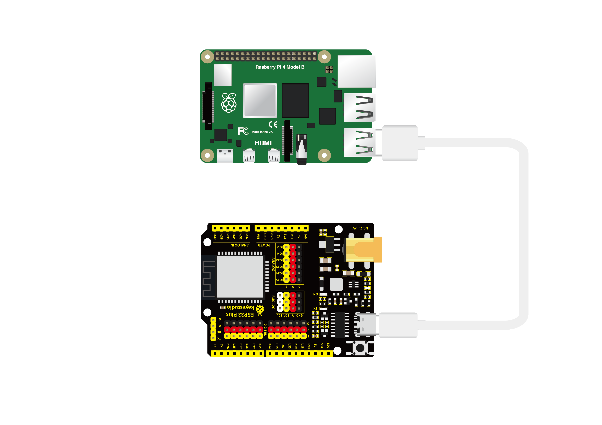

#### （2）实验代码

本项目中使用的代码保存在文件夹“<u>**/home/pi/代码**</u>”中，我们可以在此路径下打开代码文件''**Classic_Bluetooth.ino**"。

```c++
/*
 * 名称   : Classic Bluetooth
 * 功能   : ESP32通过蓝牙与手机通信，并通过串口打印手机数据
 * 作者   : http://www.keyes-robot.com/
*/
#include "BluetoothSerial.h"

BluetoothSerial SerialBT;
String buffer;
void setup() {
  Serial.begin(115200);
  SerialBT.begin("ESP32test"); //蓝牙设备名称
  Serial.println("\nThe device started, now you can pair it with bluetooth!");
}

void loop() {
  if (Serial.available()) {
    SerialBT.write(Serial.read());
  }
  if (SerialBT.available()) {
    Serial.write(SerialBT.read());
  }
  delay(20);
}
```

ESP32主板通过USB线连接到树莓派后开始上传代码。为了避免将代码上传至ESP32主板时出现错误，必须选择与树莓派连接正确的控制板和串行端口。

单击将代码上传到ESP32主控板，等待代码上传成功后查看实验结果。

#### （3）实验结果

代码上传成功后，打开串口监视器，设置波特率为**<u>115200</u>**。当串口监视器打印出如下图所示的内容时表示ESP32的蓝牙功能已就绪，等待与手机连接。

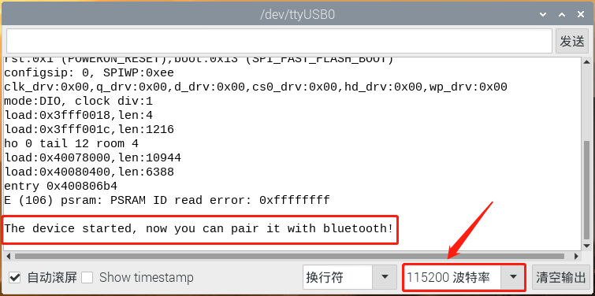

**注意：如果打开串口监视器且设置好波特率，串口监视器窗口还是没有显示任何信息，可以尝试按下ESP32的RESET按键。**


确保你的手机已经打开蓝牙且已安装“串口蓝牙终端”应用程序。搜索附近的蓝牙设备，选择 “ESP32test” 进行连接。

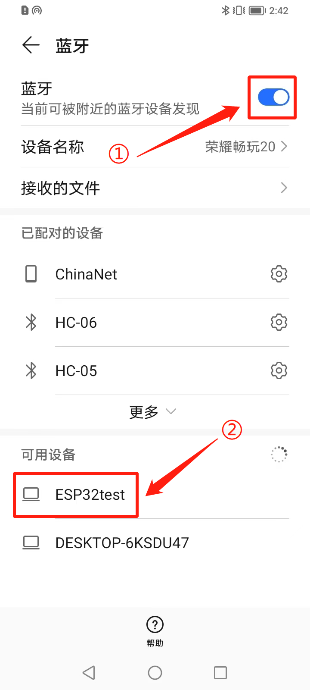

出现蓝牙配对请求，选择“**<u>配对</u>**”。

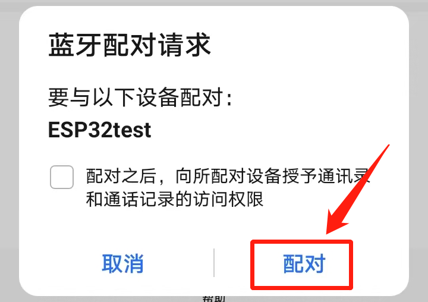

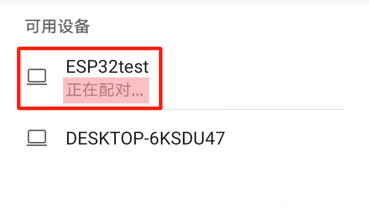

配对成功。

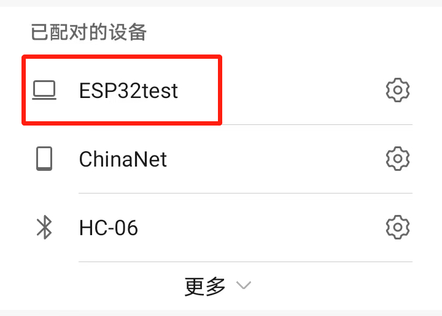

打开“串口蓝牙终端”应用程序，单击图示箭头所指地方。选择  "**<u>Devices</u>**"。

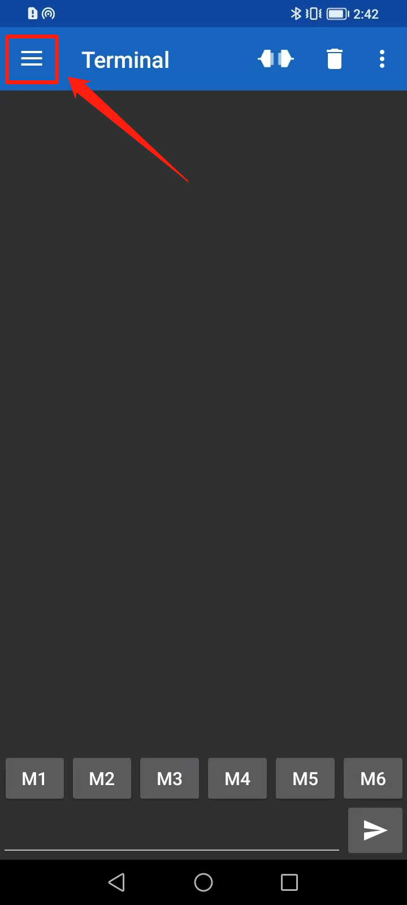

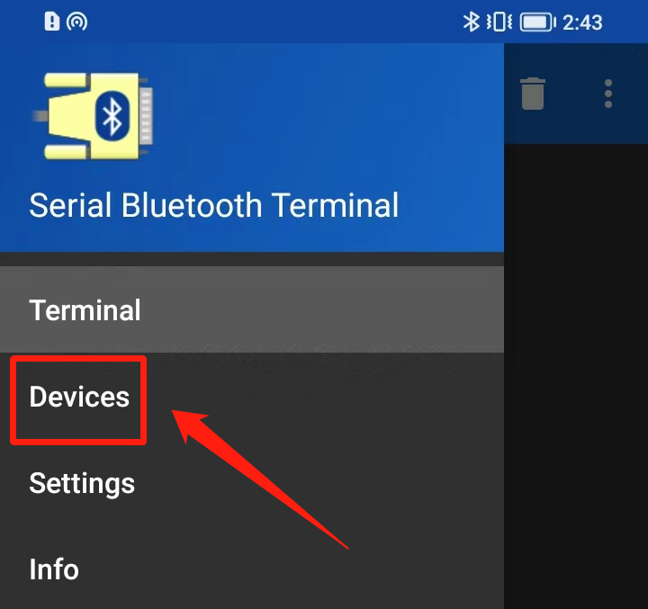

选择经典蓝牙模式下的"**<u>ESP32test</u>**"。

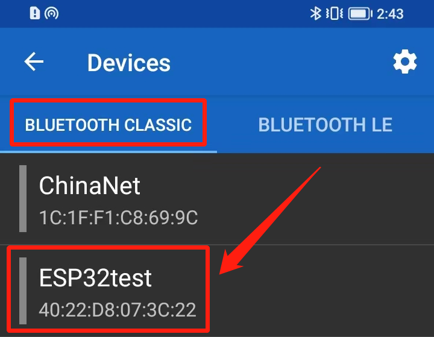

出现连接的成功提示，现在ESP32与你的手机已经建链成功了，可以在ESP32与你的手机之间传输数据了。

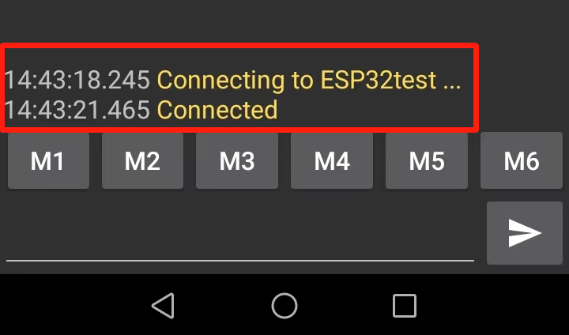

先来尝试一下主设备传输数据到从设备。
在“串口蓝牙终端”应用程序发送框内输入 “Hello！” 并发送。ESP32接收成功，在串口监视器打印出接收到的信息。

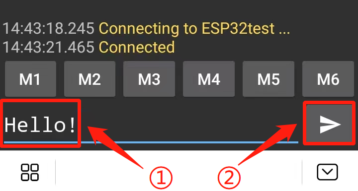

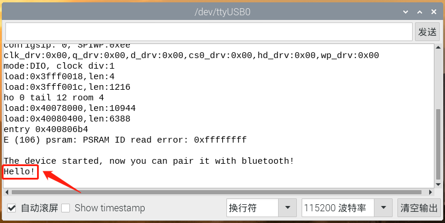

接下来尝试一下从设备传输数据到主设备。
在串口监视器的输入框内输入 “Hi！” 并发送。手机蓝牙接收成功，在“串口蓝牙终端”应用程序内打印出接收到的信息。

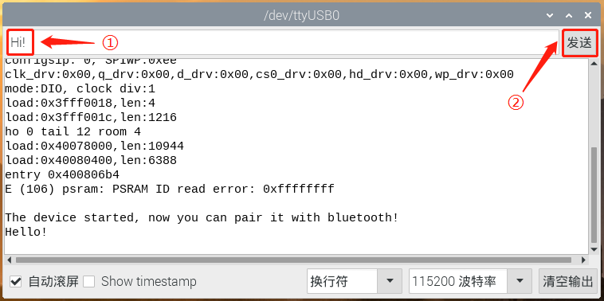

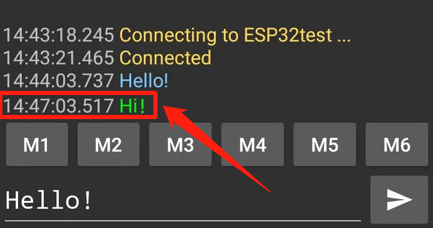

---

### **1.3.1 实验②：**

#### （1）实验接线图


#### （2）实验代码

本项目中使用的代码保存在文件夹“<u>**3. Arduino教程\2. Windows 系统\1. 项目课程\代码**</u>”中，我们可以在此路径下打开代码文件''**Bluetooth_Control_LED.ino**"。

**注意：为了避免上传代码不成功，请上传代码前不要连接模块。代码上传成功后，拔下USB线断电，按照接线图正确接好模块后再用USB线连接到树莓派上电，观察实验结果。**

```c++
/*
 * 名称   : Bluetooth Control LED
 * 功能   : 手机通过蓝牙控制esp32的led
            当手机发送“LED_on”时，ESP32的LED灯就会打开。
            当手机发送“LED_off”时，ESP32的LED灯就会关闭。
 * 作者   : http://www.keyes-robot.com/
*/
#include "BluetoothSerial.h"
#include "string.h"
#define LED 5
BluetoothSerial SerialBT;
char buffer[20];
static int count = 0;
void setup() {
  pinMode(LED, OUTPUT);
  SerialBT.begin("ESP32test"); //蓝牙设备名称

  Serial.begin(115200);
  Serial.println("\nThe device started, now you can pair it with bluetooth!");
}

void loop() {
  while(SerialBT.available())
  {
    buffer[count] = SerialBT.read();
    count++;
  }
  if(count>0){
    Serial.print(buffer);
    if(strncmp(buffer,"led_on",6)==0){
      digitalWrite(LED,HIGH);
    }
    if(strncmp(buffer,"led_off",7)==0){
      digitalWrite(LED,LOW);
    }
    count=0;
    memset(buffer,0,20);
  }
}
```

ESP32主板通过USB线连接到树莓派后开始上传代码。为了避免将代码上传至ESP32主板时出现错误，必须选择与树莓派连接正确的控制板和串行端口。

单击将代码上传到ESP32主控板，等待代码上传成功后查看实验结果。

#### （3）实验结果

代码上传成功后，拔下USB线断电，按照接线图正确接好模块后再用USB线连接到树莓派上电，打开串口监视器，设置波特率为**<u>115200</u>**。

参照 **1.3.1 实验①** 的内容，确保蓝牙已配对。在串行蓝牙终端的蓝牙应用程序上发送 "**led_on**"  实现紫色LED灯亮的效果。串口监视器打印出 “**led_on**”。

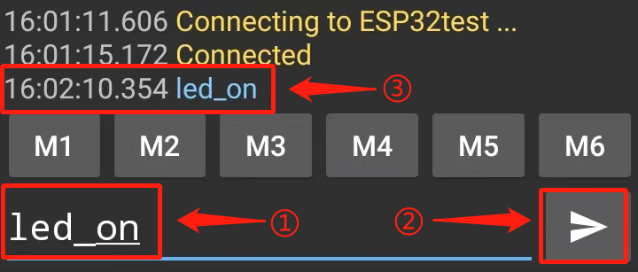

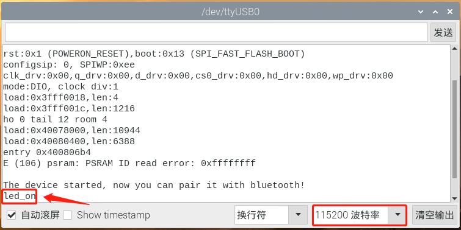

在串行蓝牙终端的蓝牙应用程序上发送 "**led_off**"  实现紫色LED灯灭的效果。串口监视器打印出 “**led_off**”。

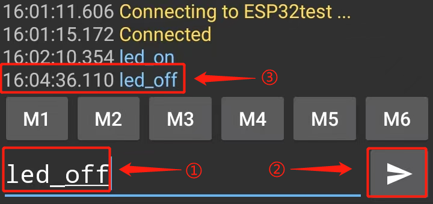

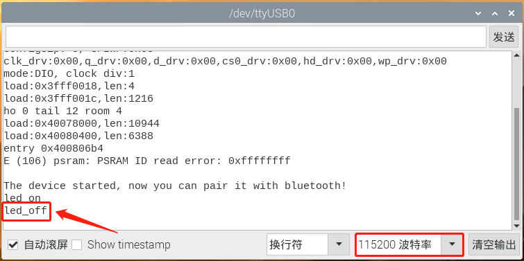

**注意：**如果发送的内容不是 "**led_on**“ 或 "**led_off**"，那么LED的当前状态不会被改变。如当LED亮时，接收到不相关内容时，LED保持亮的状态；当LED灭时，接收到不相关内容时，LED保持灭的状态。

---

## 1.4 代码说明

| 代码                                                    | 说明                                                         |
| ------------------------------------------------------- | ------------------------------------------------------------ |
| SerialBT.begin("ESP32test")                             | 设置蓝牙设备的名称。                                         |
| SerialBT.read()                                         | 读取手机发送的数据。                                         |
| int strncmp(const char str1, const char str2, size_t n) | 把 str1 和 str2 进行比较，最多比较前 n 个字节。              |
| strncmp(buffer,"led_on",6)                              | 把 buffer 的前6个字节和 “led_on” 进行比较。                  |
| void memset(void ptr, int value, size_t num)            | 复制 value 的值到 ptr 所指向的字符串的前 num 个字节。ptr：指向任意类型的指针，即指向我们需要修改的对象，譬如传进来一个数组首地址buff。value：赋给ptr所指对象的值。num:确定将ptr所指的对象中的num个字节全都用value代替。 |
| memset(buffer,0,20)                                     | 复制字符 “0” 到参数 buffer 所指向的字符串的前20个字节全部用 “0” 替代。 |

 
