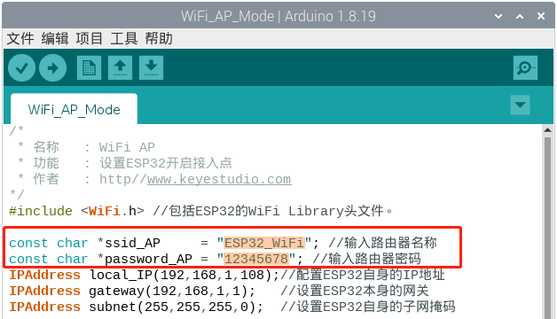
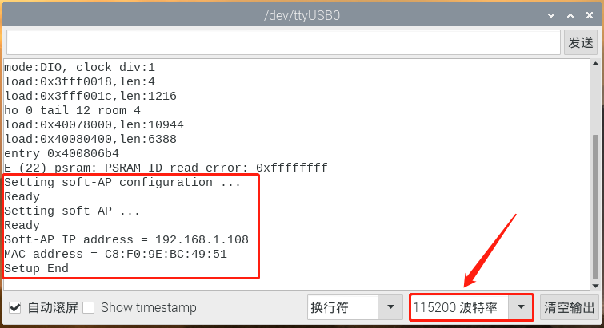
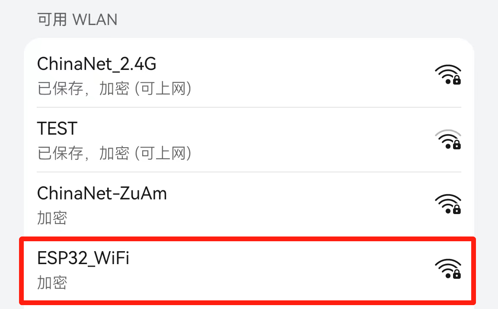

# 第六十二课 WiFi AP Mode

## 1.1 项目介绍

从上一课实验中我们知道ESP32有3种不同的WiFi工作模式：

- Station模式（作为WiFi设备主动连接路由器，也叫做WiFi Client）
- AP模式（作为一个Access Point，让其他WiFi设备来连接）即WiFi热点
- Station+AP共存模式（ESP32连接路由器的同时自身也是一个热点供其他WiFi设备来连接）

所有WiFi编程项目在使用WiFi前必须配置WiFi运行模式，否则无法使用WiFi。在这节实验课程中，我们将接着学习使用ESP32的WiFi AP模式。

**AP模式：**

接入点Access Point（AP）是一种提供 Wi-Fi 网络访问的设备，并将其连接到有线网络的装置。ESP32除了不具有与有线网络的接口外，还可以提供类似的功能。这种操作模式称为软接入点（soft-AP）。可以同时连接到soft-AP的最大站数可以设置4，默认为4。

当ESP32单独处于AP模式下时，可以被认为是一个无法访问外网的局域网WiFi路由器节点，它可以接受各类设备的连接请求。并可以和连接设备进行TCP、UDP连接，实现数据流。在局域物联网的设计中可以承担数据收发节点的作用。如下图所示，以ESP32为热点。如果手机或PC需要与ESP32通信，则必须连接到ESP32的热点。只有通过与ESP32建立连接后才能进行通信。


---

## 1.2 实验组件

|  |  |
| ------------------------ | --------------------- |
| ESP32 Plus主板 x1        | USB线  x1             |

---

## 1.3 模块接线图


---

## 1.4 实验代码

本项目中使用的代码保存在文件夹“<u>**3. Arduino教程\2. Windows 系统\1. 项目课程\代码**</u>”中，我们可以在此路径下打开代码文件''**WiFi_AP_Mode.ino**"。

在代码运行之前，需要配置ESP32的 AP名称和连接密码，如下图所示。当然，你也可以不修改它，使用默认的名称和连接密码。



```c++
/*
 * 名称   : WiFi AP
 * 功能   : 设置ESP32开启接入点
 * 作者   : http://www.keyes-robot.com/
*/
#include <WiFi.h> //包括ESP32的WiFi Library头文件。

const char *ssid_AP     = "ESP32_WiFi"; //输入路由器名称
const char *password_AP = "12345678"; //输入路由器密码
IPAddress local_IP(192,168,1,108);//配置ESP32自身的IP地址
IPAddress gateway(192,168,1,1);   //设置ESP32本身的网关
IPAddress subnet(255,255,255,0);  //设置ESP32自身的子网掩码

void setup(){
  Serial.begin(115200);
  delay(2000);
  Serial.println("Setting soft-AP configuration ... ");
  WiFi.disconnect();
  WiFi.mode(WIFI_AP);
  Serial.println(WiFi.softAPConfig(local_IP, gateway, subnet) ? "Ready" : "Failed!");
  Serial.println("Setting soft-AP ... ");
  boolean result = WiFi.softAP(ssid_AP, password_AP);
  if(result){
    Serial.println("Ready");
    Serial.println(String("Soft-AP IP address = ") + WiFi.softAPIP().toString());
    Serial.println(String("MAC address = ") + WiFi.softAPmacAddress().c_str());
  }else{
    Serial.println("Failed!");
  }
  Serial.println("Setup End");
}
 
void loop() {
}
```

ESP32主板通过USB线连接到树莓派后开始上传代码。为了避免将代码上传至ESP32主板时出现错误，必须选择与树莓派连接正确的控制板和串行端口。

单击将代码上传到ESP32主控板，等待代码上传成功后查看实验结果。

---

## 1.5 实验结果

代码上传成功后，打开串口监视器，设置波特率为**<u>115200</u>**，出现AP 以及 MAC 的IP地址。



**注意：如果打开串口监视器且设置好波特率，串口监视器窗口还是没有显示任何信息，可以尝试按下ESP32的RESET按键。**


打开手机的 WiFi 扫描功能，可以看到ESP32的 SSID ，在本课程代码中的名称为 “**ESP32_WiFi**” 。



你可以输入密码 “**12345678**” 连接它，也可以通过修改程序代码来修改它的AP名称和密码。


---

## 1.6 代码说明

| 代码                              | 说明                        |
| --------------------------------- | --------------------------- |
| IPAddress local_IP(192,168,1,108) | 配置ESP32自身的IP地址。     |
| IPAddress gateway(192,168,1,1)    | 配置ESP32自身的网关IP地址。 |
| IPAddress subnet(255,255,255,0)   | 设置ESP32自身的子网掩码。   |
| WiFi.mode(WIFI_AP)                | 设置WIFI模式为AP模式。      |

 
