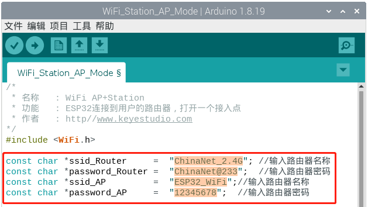
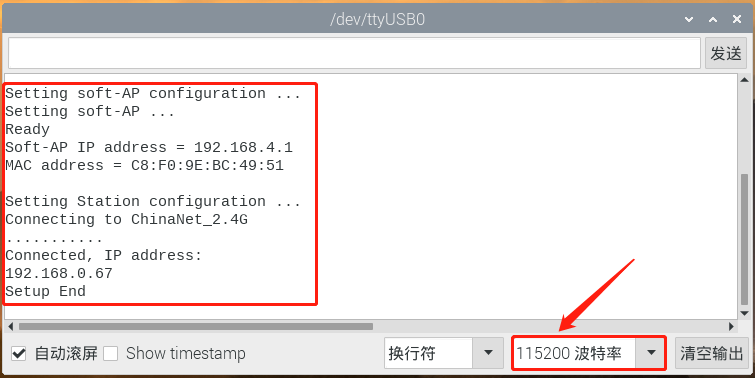

# 第六十三课 WiFi Station+AP Mode

## 1.1 项目介绍

从第六十一课实验中我们知道ESP32有3种不同的WiFi工作模式：

- Station模式（作为WiFi设备主动连接路由器，也叫做WiFi Client）
- AP模式（作为一个Access Point，让其他WiFi设备来连接）即WiFi热点
- Station+AP共存模式（ESP32连接路由器的同时自身也是一个热点供其他WiFi设备来连接）

所有WiFi编程项目在使用WiFi前必须配置WiFi运行模式，否则无法使用WiFi。在这节实验课程中，我们将接着学习使用ESP32的WiFi Station+AP模式。

**AP+Station模式：**

ESP32除AP模式和Station模式外，还可以同时使用AP模式和Station模式。此模式包含前两种模式的功能。打开ESP32的Station模式，将其连接到路由器网络，它可以通过路由器与Internet通信。同时开启其AP模式，创建热点网络。其他WiFi设备可以选择连接路由器网络或热点网络与ESP32通信。

---

## 1.2 实验组件

|  |  |
| ------------------------ | --------------------- |
| ESP32 Plus主板 x1        | USB线  x1             |

---

## 1.3 模块接线图


---

## 1.4 实验代码

本项目中使用的代码保存在文件夹“<u>**/home/pi/代码**</u>”中，我们可以在此路径下打开代码文件''**WiFi_Station_AP_Mode.ino**"。

在代码运行之前，需要配置 WiFi 名称和密码、ESP32的 AP名称和连接密码，如下图所示。



```c++
/*
 * 名称   : WiFi AP+Station
 * 功能   : ESP32连接到用户的路由器，打开一个接入点
 * 作者   : http://www.keyes-robot.com/
*/
#include <WiFi.h>
 
const char *ssid_Router     =  "ChinaNet_2.4G"; //输入路由器名称
const char *password_Router =  "ChinaNet@233";  //输入路由器密码
const char *ssid_AP         =  "ESP32_WiFi";//输入路由器名称
const char *password_AP     =  "12345678";  //输入路由器密码

void setup(){
  Serial.begin(115200);
  Serial.println("Setting soft-AP configuration ... ");
  WiFi.disconnect();
  WiFi.mode(WIFI_AP);
  Serial.println("Setting soft-AP ... ");
  boolean result = WiFi.softAP(ssid_AP, password_AP);
  if(result){
    Serial.println("Ready");
    Serial.println(String("Soft-AP IP address = ") + WiFi.softAPIP().toString());
    Serial.println(String("MAC address = ") + WiFi.softAPmacAddress().c_str());
  }else{
    Serial.println("Failed!");
  }
  
  Serial.println("\nSetting Station configuration ... ");
  WiFi.begin(ssid_Router, password_Router);
  Serial.println(String("Connecting to ")+ ssid_Router);
  while (WiFi.status() != WL_CONNECTED){
    delay(500);
    Serial.print(".");
  }
  Serial.println("\nConnected, IP address: ");
  Serial.println(WiFi.localIP());
  Serial.println("Setup End");
}

void loop() {
}
```

ESP32主板通过USB线连接到树莓派后开始上传代码。为了避免将代码上传至ESP32主板时出现错误，必须选择与树莓派连接正确的控制板和串行端口。

单击将代码上传到ESP32主控板，等待代码上传成功后查看实验结果。

---

## 1.5 实验结果

代码上传成功后，打开串口监视器，设置波特率为**<u>115200</u>**。



**注意：如果打开串口监视器且设置好波特率，串口监视器窗口还是没有显示任何信息，可以尝试按下ESP32的RESET按键。**


打开手机 WiFi 扫描功能，可以看到ESP32的SSID，名称为 “**ESP32_WiFi**” 。


---

## 1.6 代码说明

 此课程代码与第六十二课代码类似，这里就不多做介绍了。

