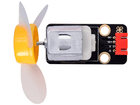
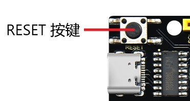

# 第六十五课 WiFi智能家居

## 1.1 项目介绍

在前面的实验中，我们已经了解了ESP32的WiFi Station、WiFi AP和WiFi AP+Station三种模式。在本课程实验中，我们将利用ESP32的WiFi Station模式通过APP连接WIFI来控制多个传感器/模块工作，模拟实现WiFi控制智能家居的效果。

---

## 1.2 实验组件

|   |  |         |           |
| ------------------------- | --------------------- | ---------------------------- | ------------------------------ |
| ESP32 Plus主板 x1         | Keyes 130电机模块 x1  | Keyes 单路5V继电器模块 x1    | Keyes DS18B20温度传感器 x1     |
|  |      |           |             |
| HC-SR04 超声波传感器 x1   | 9G 180度数字舵机 x1   | XH2.54-3P 转杜邦线母单线  x2 | XH2.54-4P 转杜邦线母单线  x2   |
|         |  |              |               |
| USB线  x1                 | 6节5号电池盒  x1      | 5号电池**(自备)**  x6        | 智能手机/平板电脑**(自备)** x1 |

---

## 1.3 模块接线图


---

## 1.4 安装APP

**安卓系统设备（手机/平板）APP：**

我们提供了Android APP 的安装包：


将Android APP 的安装包中的 keyes wifi.apk 文件转移到安卓系统手机或平板电脑上，点击 **keyes wifi.apk** 文件进入安装页面。


点击 “**ALLOW**” 按钮。


然后点击 “**INSTALL**” 按钮。


稍等片刻，安装完成后点击 “**OPEN**” 就可以进入APP界面。


**IOS系统设备（手机/iPad）APP**

打开APP Store


在搜索框输入 keyes link ，点击搜索，出现下载界面，点击,下载 keyes link 。

---

## 1.5实验代码

本项目中使用的代码保存在文件夹“<u>**/home/pi/代码**</u>”中，我们可以在此路径下打开代码文件''**WiFi_Smart_Home.ino**"。

在代码运行之前，需要配置 WiFi 名称和密码，将其修改为你自己使用的WiFi 名称和密码，如下图所示。


```c++
/*  
 * 名称   : WiFi Smart Home.
 * 功能   : WiFi APP控制多个传感器/模块工作，实现WiFi智能家居的效果
 * 作者   : http://www.keyes-robot.com/
*/
#include <Arduino.h>
#include <WiFi.h>
#include <ESPmDNS.h>
#include <WiFiClient.h>

#include "xht11.h"
//gpio27
xht11 xht(27);
unsigned char dht[4] = {0, 0, 0, 0};

#include <ESP32Servo.h>
Servo myservo;
int servoPin = 32;
#define Relay  4
#define IN1 23 //IN1 对应IN+
#define IN2 5  //IN2 对应IN-
#define trigPin  12
#define echoPin  13

int distance1;
String dis_str;
int ip_flag = 1;
int ultra_state = 1;
int temp_state = 1;
int humidity_state = 1;

String item = "0";
const char* ssid = "ChinaNet_2.4G";    //用户的wifi名称
const char* password = "ChinaNet@233"; //用户wifi的密码
WiFiServer server(80);
String unoData = "";

void setup() {
  Serial.begin(115200);
  pinMode(Relay, OUTPUT);
  myservo.setPeriodHertz(50);   
  myservo.attach(servoPin, 500, 2500);
  pinMode(IN1, OUTPUT);
  pinMode(IN2, OUTPUT);
  
  WiFi.begin(ssid, password);
  while (WiFi.status() != WL_CONNECTED) {
    delay(500);
    Serial.print(".");
  }
  Serial.println("");
  Serial.print("Connected to ");
  Serial.println(ssid);
  Serial.print("IP address: ");
  Serial.println(WiFi.localIP());
  server.begin();
  Serial.println("TCP server started");
  MDNS.addService("http", "tcp", 80);

  digitalWrite(IN1, LOW);
  digitalWrite(IN2, LOW);
  digitalWrite(Relay, LOW);
  pinMode(trigPin, OUTPUT);
  pinMode(echoPin, INPUT);
}

void loop() {
  WiFiClient client = server.available();
  if (!client) {
      return;
  }
  while(client.connected() && !client.available()){
      delay(1);
  }
  String req = client.readStringUntil('\r');
  int addr_start = req.indexOf(' ');
  int addr_end = req.indexOf(' ', addr_start + 1);
  if (addr_start == -1 || addr_end == -1) {
      Serial.print("Invalid request: ");
      Serial.println(req);
      return;
  }
  req = req.substring(addr_start + 1, addr_end);
  item=req;
  Serial.println(item);
  String s;
  if (req == "/")
  {
      IPAddress ip = WiFi.localIP();
      String ipStr = String(ip[0]) + '.' + String(ip[1]) + '.' + String(ip[2]) + '.' + String(ip[3]);
      s = "HTTP/1.1 200 OK\r\nContent-Type: text/html\r\n\r\n<!DOCTYPE HTML>\r\n<html>Hello from ESP32 at ";
      s += ipStr;
      s += "</html>\r\n\r\n";
      Serial.println("Sending 200");
      client.println(s);
  }
  else if(req == "/btn/0")
  {
    Serial.write('a');
    client.println(F("turn on the relay"));
    digitalWrite(Relay, HIGH);
  }
  else if(req == "/btn/1")
  {
    Serial.write('b');
    client.println(F("turn off the relay"));
    digitalWrite(Relay, LOW);
  }
  else if(req == "/btn/2")
  {
    Serial.write('c');
    client.println("Bring the steering gear over 180 degrees");
    myservo.write(180); 
    delay(200);
  }
  else if(req == "/btn/3")
  {
    Serial.write('d');
    client.println("Bring the steering gear over 0 degrees");
    myservo.write(0); 
    delay(200);
  }
  else if(req == "/btn/4")
  {
    Serial.write('e');
    client.println("esp32 already turn on the fans");
    digitalWrite(IN1, LOW); 
    digitalWrite(IN2, HIGH);
  }
  else if(req == "/btn/5")
  {
    Serial.write('f');
    client.println("esp32 already turn off the fans");
    digitalWrite(IN1, LOW); 
    digitalWrite(IN2, LOW);
  }
  else if(req == "/btn/6")
  {
    Serial.write('g');
    while(Serial.available() > 0)
    {
      unoData = Serial.readStringUntil('#');
      client.println("Data");
    }
    while(ultra_state>0)
       {
          Serial.print("Distance = "); 
          Serial.print(checkdistance());
          Serial.println("#");
          Serial1.print("Distance = "); 
          Serial1.print(checkdistance());
          Serial1.println("#");  
          int t_val1 = checkdistance();
          client.print("Distance(cm) = ");
          client.println(t_val1); 
          ultra_state = 0;
        }
  }
  else if(req == "/btn/7")
  {
    Serial.write('h');
    client.println("turn off the ultrasonic");
    ultra_state = 1;
  }
  else if(req == "/btn/8")
  {
    Serial.write('i');
    while(Serial.available() > 0)
     {
      unoData = Serial.readStringUntil('#');
      client.println(unoData);
     }
    while(temp_state>0)
      {
        if (xht.receive(dht)) {
          Serial.print("Temperature = "); 
          Serial.print(dht[2],1);
          Serial.println("#");
          Serial1.print("Temperature = "); 
          Serial1.print(dht[2],1);
          Serial1.println("#");
          int t_val2 = dht[2];
          client.print("Temperature(℃) = ");
          client.println(t_val2);
        }
        temp_state = 0;
      }
  }
  else if(req == "/btn/9")
  {
    Serial.write('j');
    client.println("turn off the temperature");
    temp_state = 1;
  }
  else if(req == "/btn/10")
  {
    Serial.write('k');
    while(Serial.available() > 0)
     {
       unoData = Serial.readStringUntil('#');
       client.println(unoData);
     }
    while(humidity_state > 0)
      {
        if (xht.receive(dht)) {
          Serial.print("Humidity = "); 
          Serial.print(dht[0],1);
          Serial.println("#");
          Serial1.print("Humidity = "); 
          Serial1.print(dht[0],1);
          Serial1.println("#");
          int t_val3 = dht[0];
          client.print("Humidity(%) = ");
          client.println(t_val3);
        }
        humidity_state = 0;
      }
  }
  else if(req == "/btn/11")
  {
    Serial.write('l');
    client.println("turn off the humidity");
    humidity_state = 1;
    }
  //client.print(s);
  client.stop();
}

int checkdistance() {
  digitalWrite(12, LOW);
  delayMicroseconds(2);
  digitalWrite(12, HIGH);
  delayMicroseconds(10);
  digitalWrite(12, LOW);
  int distance = pulseIn(13, HIGH) / 58;
  
  delay(10);
  return distance;
}
```

ESP32主板通过USB线连接到树莓派后开始上传代码。为了避免将代码上传至ESP32主板时出现错误，必须选择与树莓派连接正确的控制板和串行端口。

单击将代码上传到ESP32主控板，等待代码上传成功后查看实验结果。

---

## 1.6 实验结果

代码上传成功后，按照接线图正确接好模块。打开串口监视器，设置波特率为**<u>115200</u>**，串口显示IP信息如下图所示。


**注意：如果打开串口监视器且设置好波特率，串口监视器窗口还是没有显示任何信息，可以尝试按下ESP32的RESET按键。**



接着打开APP，在下图所示的白框里输入上面步骤检测到的WIFI的IP地址（192.168.0.79），接着点击 “**connect**” 连接WIFI。


当下图所示的白框显示 “**Hello from ESP32 at 192.168.0.79**” 时，说明APP已经成功连接上了WIFI。


| 按钮                  | 点击     | 效果                                                         |
| --------------------- | -------- | ------------------------------------------------------------ |
|  | 首次点击 | 继电器打开，APP上显示 “turn on the relay”，模块上的指示灯点亮。 |
|  | 再次点击 | 继电器关闭，APP上显示 “turn off the relay" ，模块上指示灯灭。 |
|  | 首次点击 | 舵机转动180°，APP上显示 “Bring the steering gear over 180"。 |
|  | 再次点击 | 舵机转动0°，APP上显示“Bring the steering gear over 0" 。     |
|  | 首次点击 | 电机（带小风扇叶)转动，APP 上显示 “esp32 already turn on the fans”。 |
|  | 再次点击 | 关闭电机，APP 上显示 “esp32 already turn off the fans” 。    |
|  | 首次点击 | 超声波传感器测距，在超声波传感器前放一个物体，APP 上显示 “Distance(cm) = X” ，X代表实测距离。 |
|  | 再次点击 | 关闭超声波传感器测距功能，APP 上显示 “turn off the ultrasonic" 。 |
|  | 首次点击 | 温湿度传感器测量环境中的温度，APP上显示 “ Temperature(°C) = X” ，X代表温度值，说明此时的环境温度为X°C 。 |
|  | 再次点击 | 关闭温湿度传感器，APP上显示 “turn off the temperature"。     |
|  | 首次点击 | 温湿度传感器测量环境中的湿度，APP上显示 ”Humidity(%) = X“ ，X代表湿度值，说明此时的环境湿度为X% 。 |
|  | 再次点击 | 关闭温湿度传感器，APP上显示 ”trun off the humidity" 。       |

---

