# 开发环境配置

## 一、下载安装Thonny

Thonny是一个免费、开源的软件平台，体积小，界面简单，操作简单，功能丰富，是一个适合初学者的Python IDE。在本教程中，我们使用 Thonny 这个IDE在整个实验课程过程中开发ESP32。Thonny支持多种操作系统，包括Windows, Mac OS,  Linux。

---

### 1.1 Windows系统

（1）软件下载和开源代码库分享

- Thonny的开源代码库：https://github.com/thonny/thonny

- Thonny软件官网：https://thonny.org （请根据您的操作系统选择相应的选项下载安装）

下载好后，鼠标触碰到下图箭头所示处，会出现Windows官方下载的版本选择。请根据您的操作系统选择相应的版本下载。最好下载最新版，否则可能不支持ESP32。

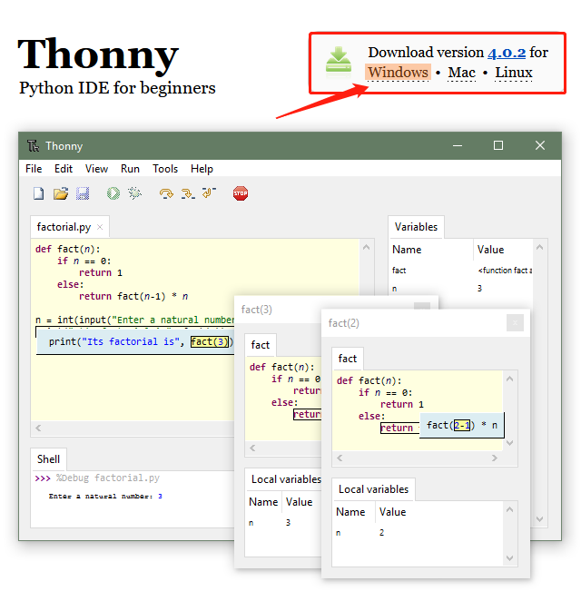

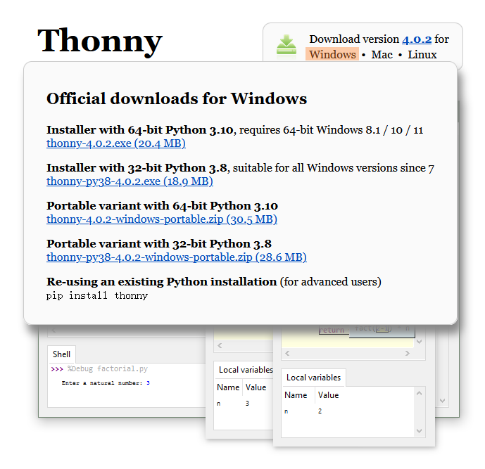

（2）下载完成后，鼠标左键双击“thonny-4.0.2.exe”。出现“Select Setup Install Mode”对话框，选择“**Install for all users**”。你也可以选择“Install for me only”进行操作。

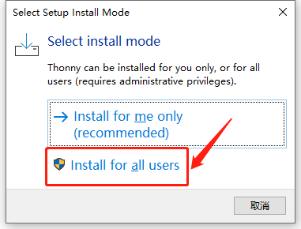

（3）如果你不熟系电脑软件的安装，可以一直单击“**Next**”直至安装完成。

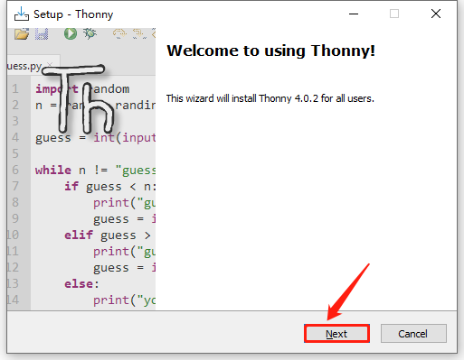

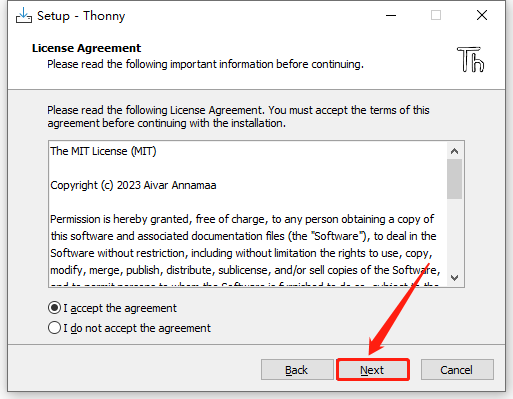

（4）Thonny软件的安装路径。默认此安装路径继续下一步，单击“**Next**”。如果您想选择一个不同的文件夹，请单击“**Browse...**”进行修改。

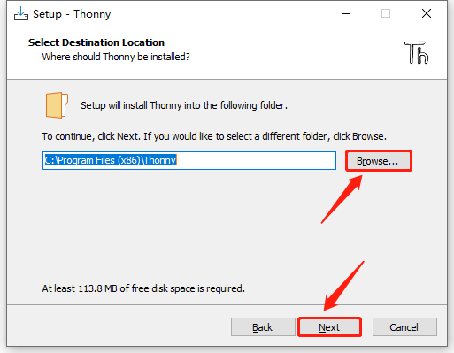

（5）程序将在下面的开始菜单文件夹中创建程序的快捷方式。默认此文件夹继续下一步，单击“**Next**”。如果您想选择一个不同的文件夹，请单击“**Browse...**”。

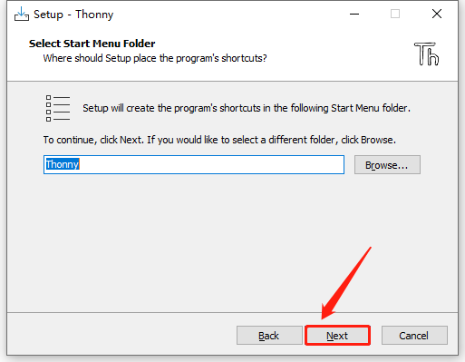

（6）选中“**Creak desktop icon**”，在桌面生成快捷方式。

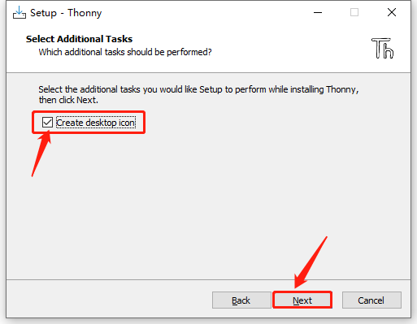

（7）单击“**Install**”安装软件。等待安装成功。

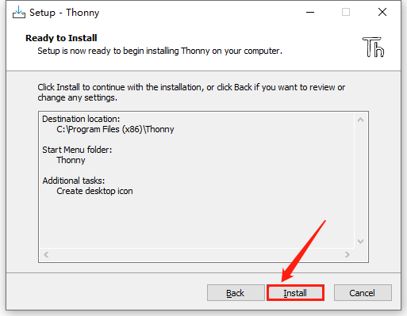

（8）安装完成，单击“**Finish**”结束安装。

---

### 1.2 Mac系统

鼠标触碰到下图箭头所示处，会出现MacOS的官方下载的版本选择。请根据您的操作系统选择相应的版本下载。最好下载最新版，否则可能不支持ESP32。

安装步骤请参考 **章节 1.1** 。

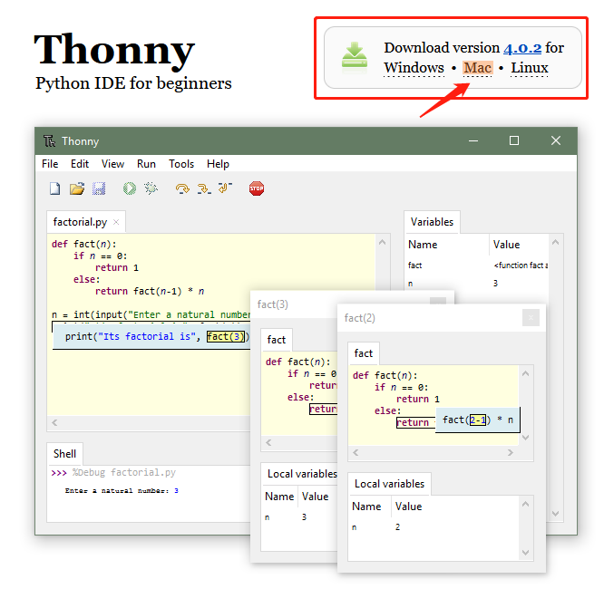

---

## 二、 Thonny软件基本配置与介绍

### 2.1 Thonny软件基本配置

（1）双击桌面的Thonny软件图标，出现语言选择和初始设置界面。

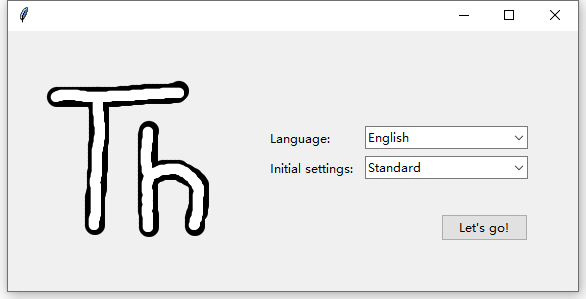

Language 选择“**简体中文**”。然后单击“**Let's go!**”结束设置。

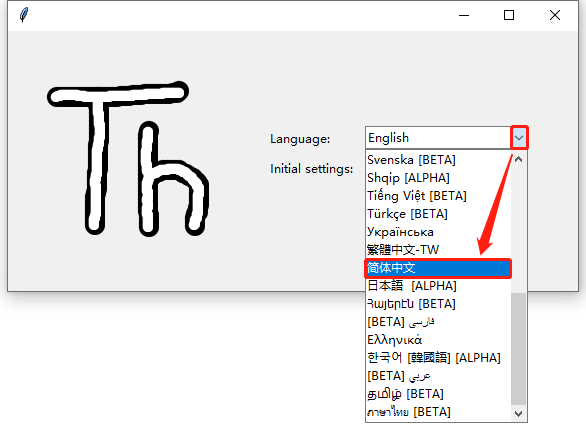

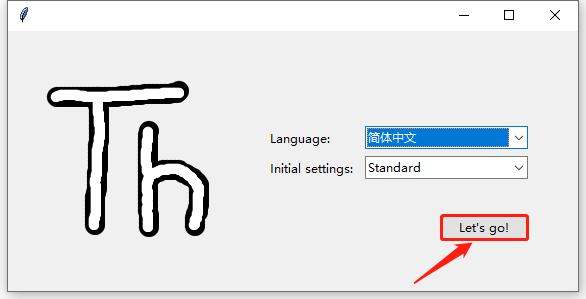

（2）单击“**视图**”，勾选“**Shell**”和“**文件**”

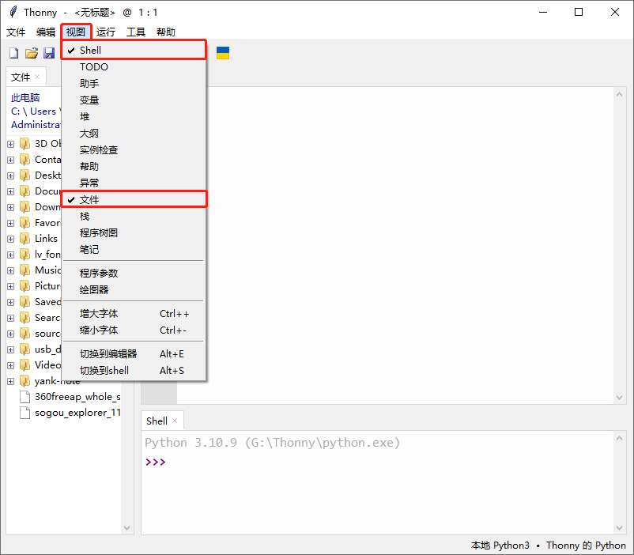

---

### 2.2 Thonny软件的介绍

#### （1）工具栏介绍

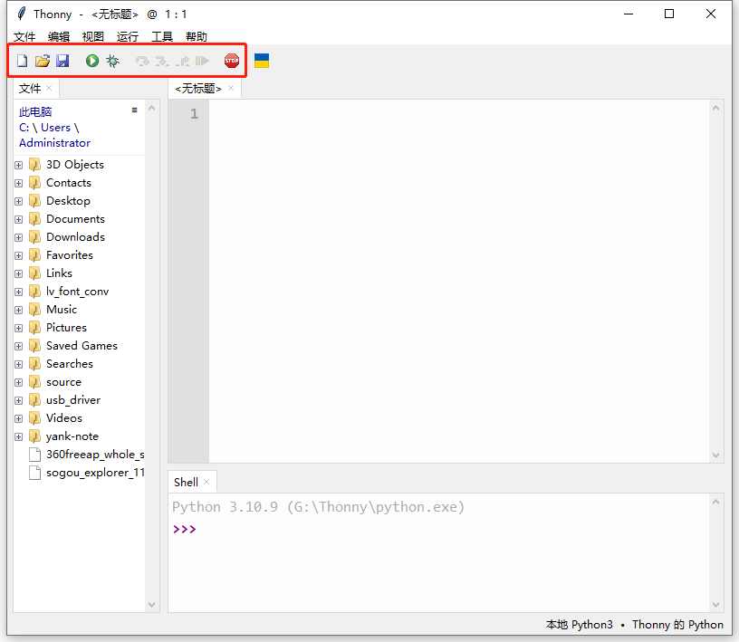

|                      按钮                       |       功能        |
| :---------------------------------------------: | :---------------: |
|  |       新建        |
|  |      打开...      |
|  |       保存        |
|  |   运行当前脚本    |
|  |   调试当前脚本    |
|  |       步过        |
|  |       步进        |
|  |       步出        |
|  |     恢复执行      |
|  | 停止/重启后端进程 |

#### （2）界面介绍

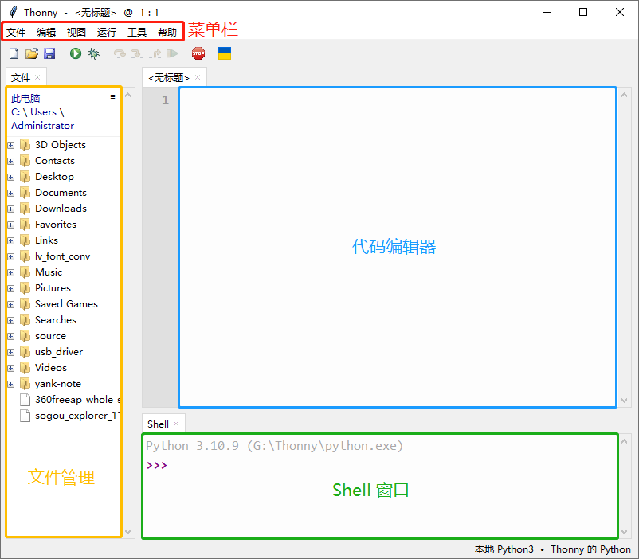

---

## 三、 安装驱动

### 3.1 Windows系统

在使用ESP32主板之前，必须安装驱动程序，否则ESP32主板将无法与计算机通信。win10系统会自动安装所有可识别的驱动，系统中也集成网卡驱动。如果你是win10用户，通常只需要将ESP32主板通过USB线连接到计算机，计算机识别到硬件，WINDOWS系统就会自动安装驱动。如果是其他系统电脑，如Windows7系统电脑，需要手动安装驱动。

与Arduino UNO R3的USB系列芯片(ATMEGA8U2)不同，ESP32主板采用了USB系列CH340C芯片，我们需要安装其的驱动，驱动为usb_ch341_3.1.2009.06。我们提供的驱动文件路径在下图，你可以将它移动到你想要的位置，记住路径，后面的步骤需要。

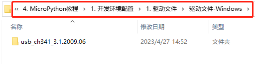

右键单击“**<u>此电脑</u>**”，选择“<u>**属性**</u>”，再选择“<u>**设备管理器**</u>”，如下图所示。

右键单击”**<u>USB Serial</u>**“后，点击“<u>**更新驱动程序**</u>”，开始安装驱动，如下图。

进入下图，选择'**'<u>浏览我的电脑以查找驱动程序</u>**’。

找到驱动文件 **usb_ch341_3.1.2009.06** 的文件夹，选中此路径，点击”**<u>下一步</u>**“。

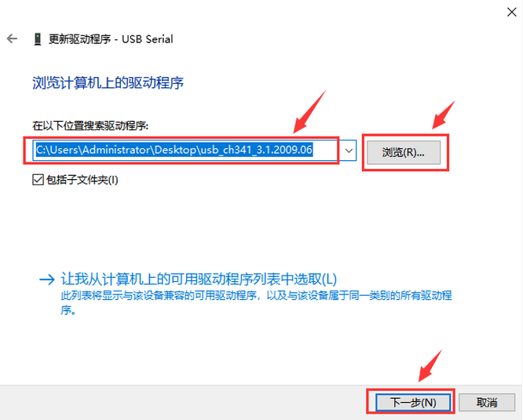

安装驱动完成，出现下图点击''**<u>关闭</u>**“。

驱动安装完成，可以看到串口号了。

---

### 3.2 Mac系统

请参考以下链接:
https://wiki.keyestudio.com/Download_CH340_Driver_on_MAC_System

---

## 四、烧录固件

要在ESP32主板上运行Python程序，我们需要先将固件烧入到ESP32主板。

### 4.1 下载Micropython固件

- microPython官方网站：http://micropython.org/

- microPython的ESP32固件：https://micropython.org/download/esp32/

打开microPython的ESP32固件网址，下载固件。

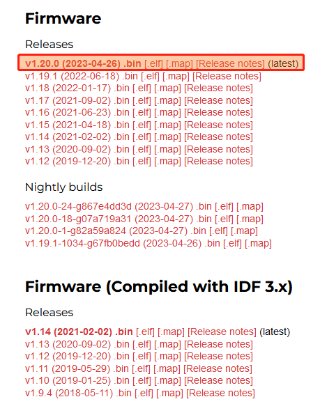

本教程中使用的固件是：**esp32-20230426-v1.20.0.bin** 。我们的资料中也提供了此版本的固件，路径如下图。

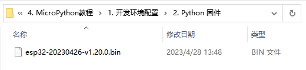

### 4.2 烧录Micropython固件

（1）将ESP32主板通过USB线连接到计算机。

（2）确保驱动程序已成功安装，并能正确识别COM端口。打开设备管理器并展开“**端口**”。（端口号不是固定的COM6，会有不同，是正常情况。）

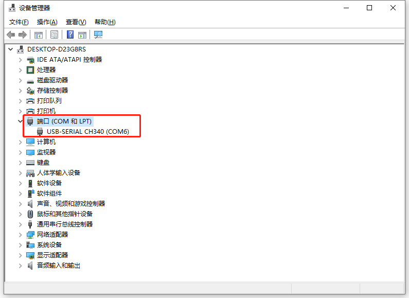

（3）打开Thonny，点击“**运行**” ，选择 “**配置解释器**”。

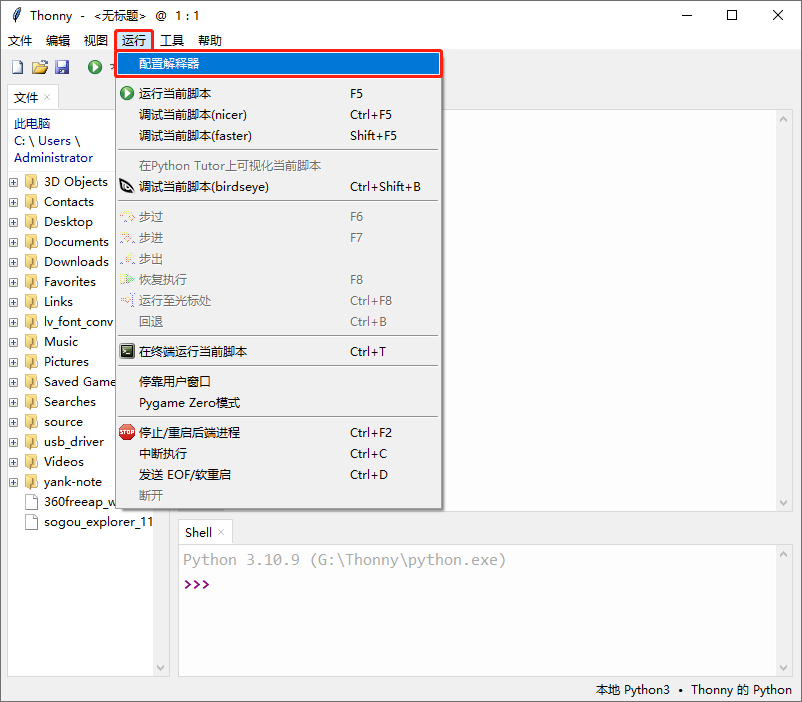

在解释器页面，解释器选择“**Micropython (ESP32)**”，端口或WebREPL选择“**USB-SERIAL CH340（COM6）**”（COM号以你电脑的端口为准）。然后单击“安装或更新MicroPython”。

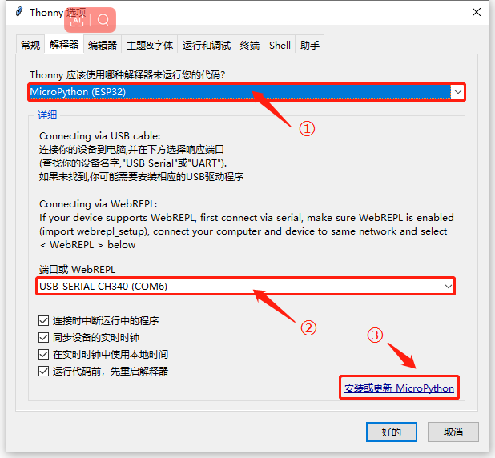

弹出“ESP32 firmware installer”页面，“**Port**”下拉选择“**USB-SERIAL CH340（COM6）**”。
“**Firmware**”单击“**Browse...**”，选择下载好的microPython固件 “**esp32-20230426-v1.20.0.bin**”。
检查“**Flash mode**”是否选择了“**From image file(Keep)**”，“**Erase flash before installing**”是否勾选。
最后，单击“**安装**”，等待安装完成提示。

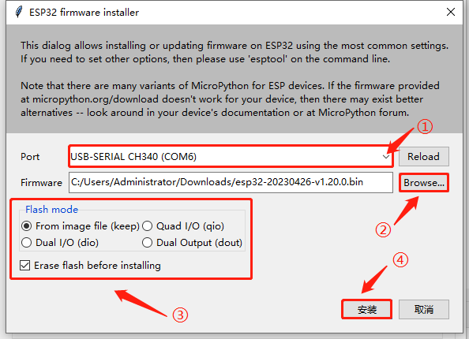

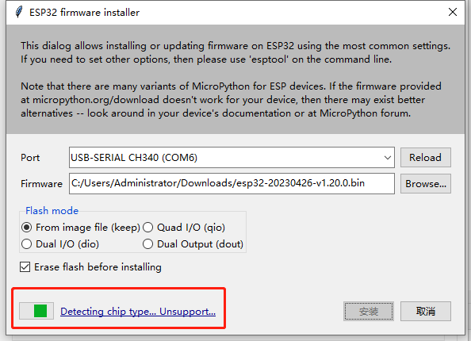

（4）安装完成，单击“**关闭**”。

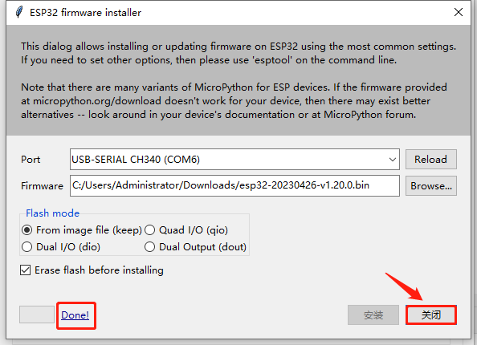

在“Thonny 选项”页面单击“**好的**”。

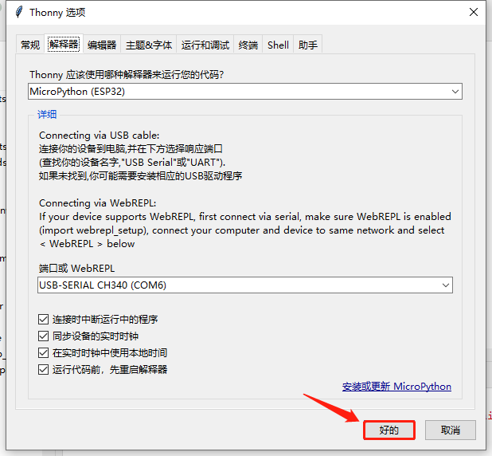

（5）点击“**停止/重启后端进程**”按钮。

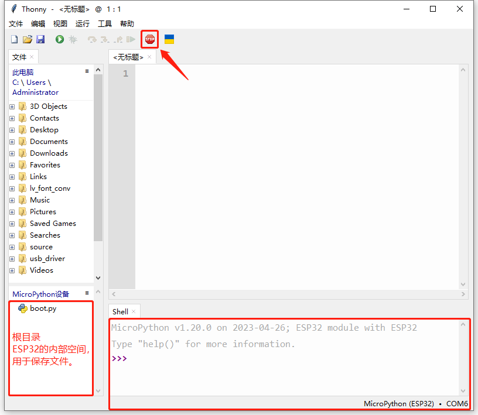

现在，一切准备工作都已就绪。

---

## 五、测试

### 5.1 测试Shell命令

在“**Shell**”窗口中输入“**print('hello world')**”，然后按下**Enter**键。

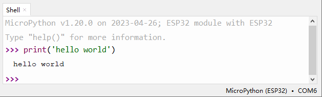

---

### 5.2 在线运行

ESP32需要连接到计算机时，是在线运行的。用户可以使用Thonny编写和调试程序。

（1）打开Tonny并单击，然后单击“**此电脑**”。

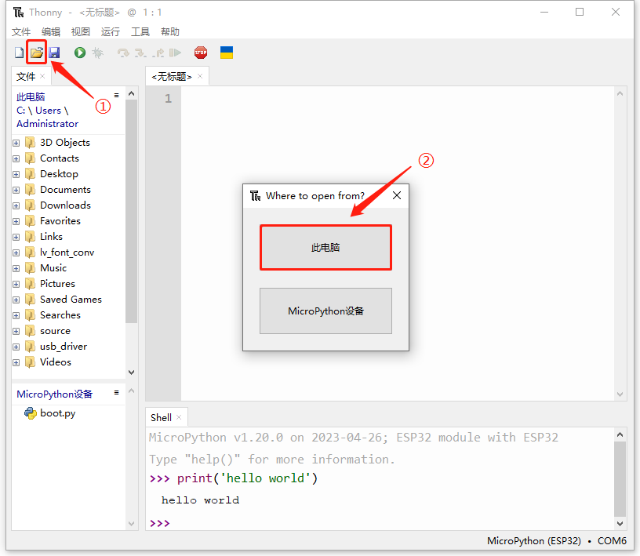

（2）在弹出的页面选择路径“**4. MicroPython教程\2. Windows 系统\1. 项目课程\代码\01 Hello World**”下的“**lesson_01_HelloWorld.py**“Python 文件，然后单击”**打开**“。

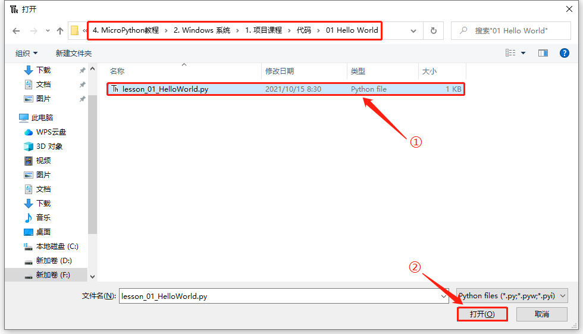

（3）单击或按下“**F5**”键，Shell窗口将打印出”**Hello World**“。

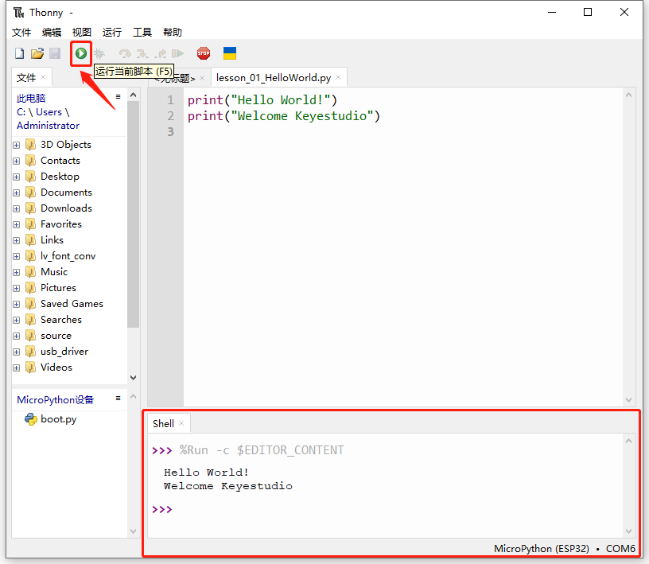

**注意：**如果在线运行时，按下ESP32的复位键，用户的代码将不会再次执行。如果你希望在重置代码后自动运行该代码，请参考下面章节 **5.3 离线运行** 的内容。

---

### 5.3 离线运行

ESP32复位后，首先运行根目录下的boot.py文件，然后运行你的代码文件，最后进入“Shell”。因此，为了让ESP32在重置后执行用户程序，我们需要在boot.py中添加一个引导程序来执行用户代码。

（1）将程序文件夹“**代码**”（路径为：“**4. MicroPython教程\2. Windows 系统\1. 项目课程\代码**”）移动到此电脑的(D：)，移动后路径为“**D:\代码**”。打开“Thonny”。

（2）打开Thonny，在文件管理框单击“**此电脑**”，双击“**（D:）**”，然后双击展开“**代码**”文件夹。

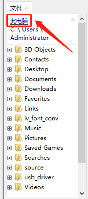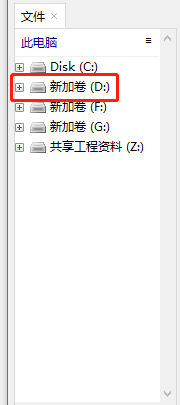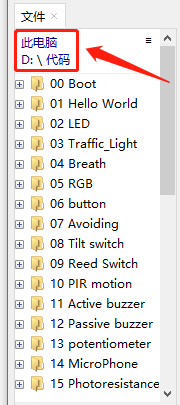

（3）展开“**00 Boot**”，然后鼠标左键双击“**boot.py**”，使 “**MicroPython 设备**”中的程序能够离线运行。

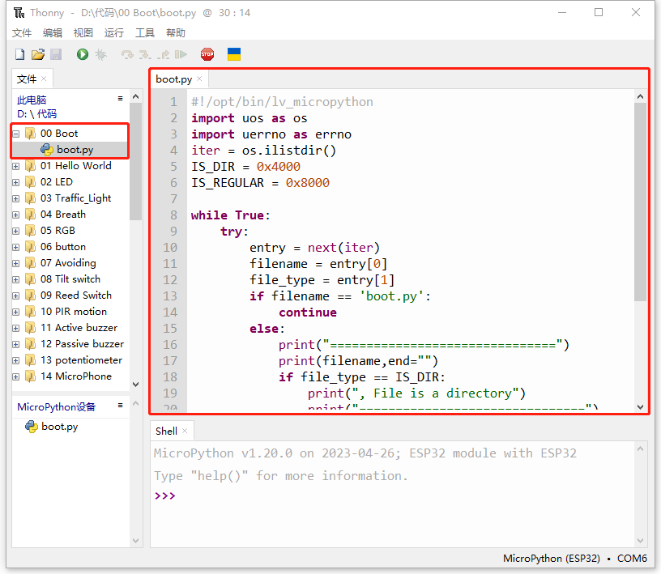

（4）如果想让编写的程序离线运行，需要上传我们提供的“**boot.py**”和你编写的程序代码到“**MicroPython 设备**”，然后按下ESP32的复位按键。

展开文件夹 00 Boot。右键单击“**boot.py**”，选择“**上传到/**”。

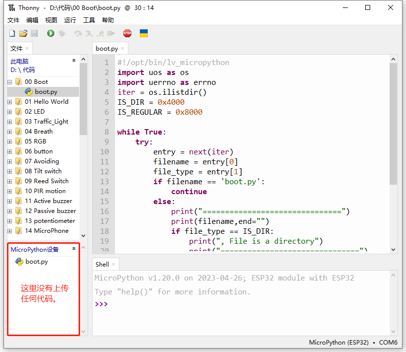

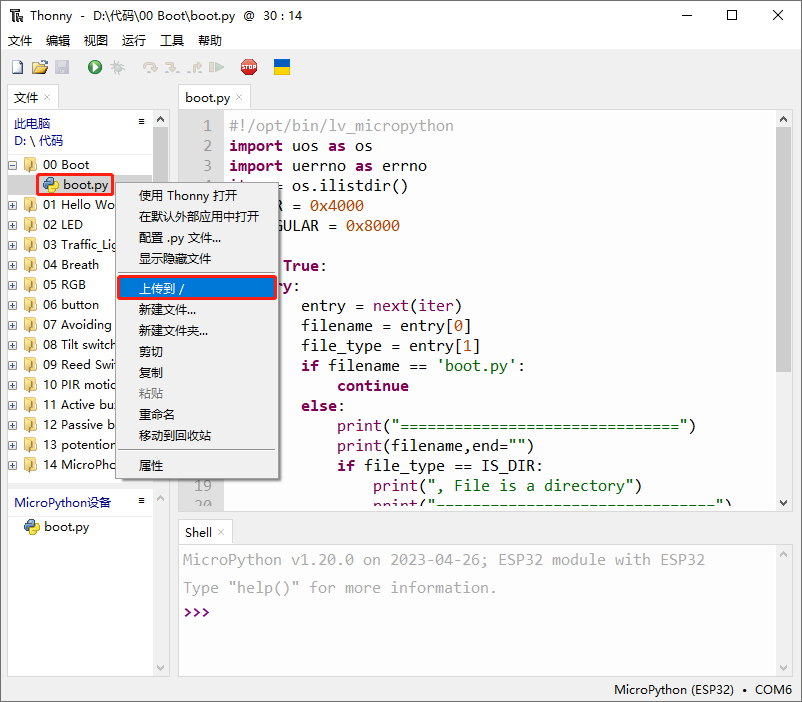

单击“**确定**”。

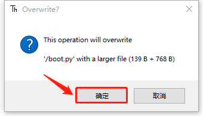

（5）同样，将“**lesson_01_HelloWorld.py**”上传到 “**MicroPython 设备**”。

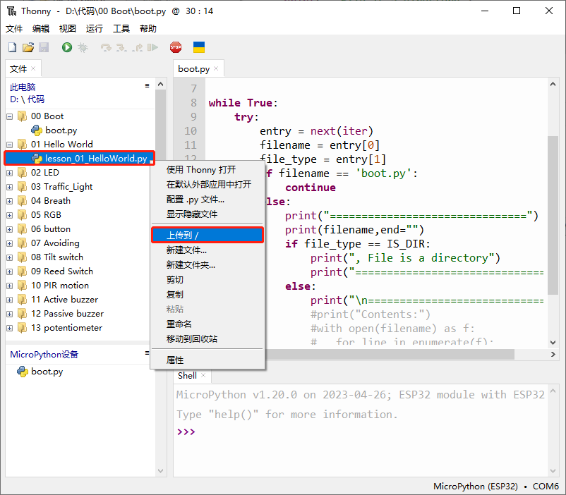

可以在 “**MicroPython 设备**”看到代码已成功上传。

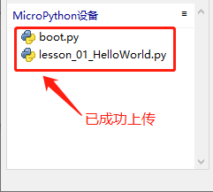

（6）按下ESP32的**Reset按键**，在Shell窗口中能看到代码被执行。

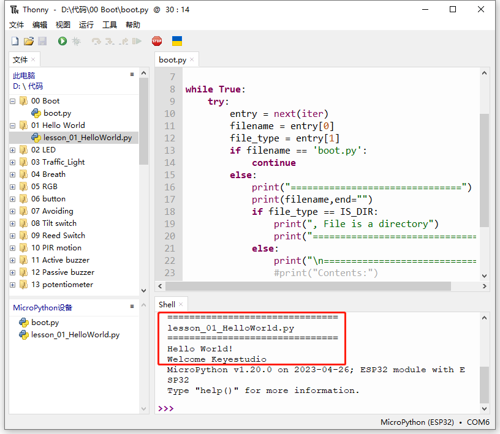

---

## 六、Thonny常见的操作

### 6.1 上传代码到ESP32

为了方便起见，我们以**boot.py**为例。如果我们在每个代码目录中都添加了boot.py。ESP32每次重启时，它将首先执行根目录中的“**boot.py**”。

在**02 LED**文件夹中选择“**boot.py**”，右键单击鼠标，选择“**Upload to /**”将代码上传到ESP32的根目录，然后选择“**确定**”。

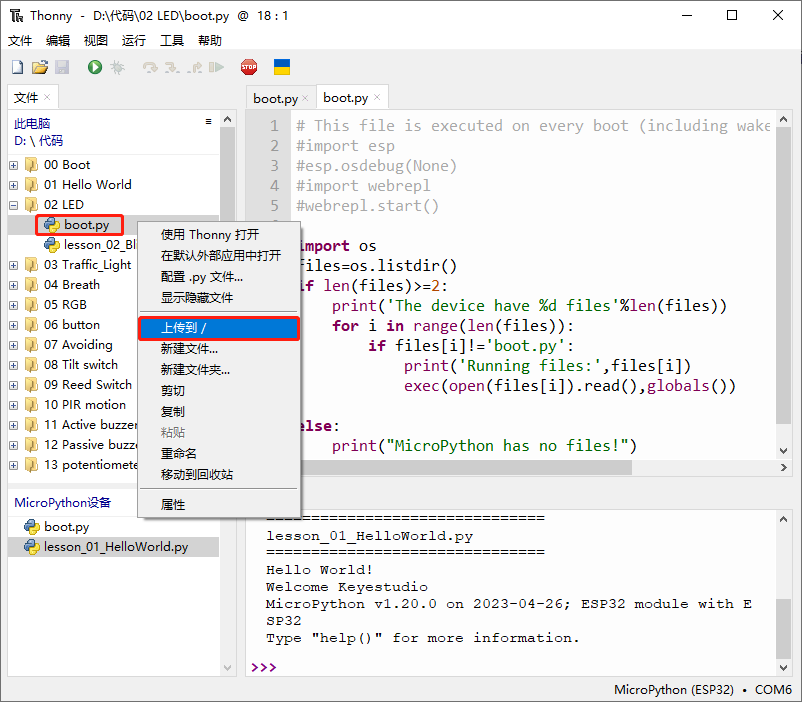

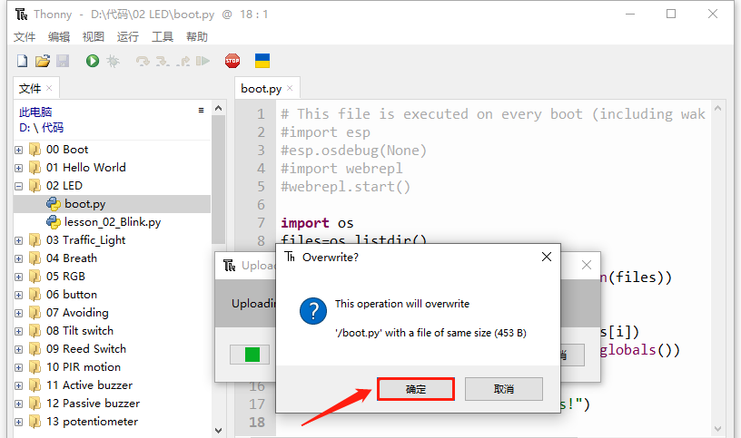

---

### 6.2 下载代码到电脑

在“**MicroPython 设备**”内选中“**boot.py**”，右键选择“**下载到 D:\代码**”把代码下载到你的电脑里。

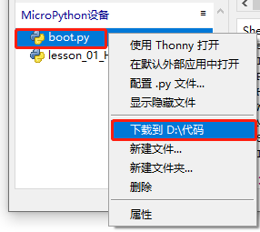

---

### 6.3 删除ESP32根目录下的文件

在“**MicroPython 设备**”内选中“**boot.py**”，右键单击它且选择“**删除”**，将“**boot.py”**从ESP32的根目录中删除。

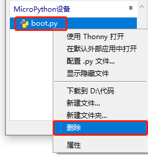

在02 LED文件夹内选中“**boot.py**”，右键单击它并选择“**移动到回收站**”将其从02 LED文件夹中删除。

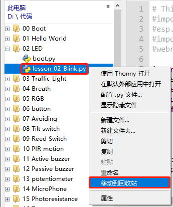

---

### 6.4 创建并保存代码

单击“**文件**”，然后选择“**新建**”。

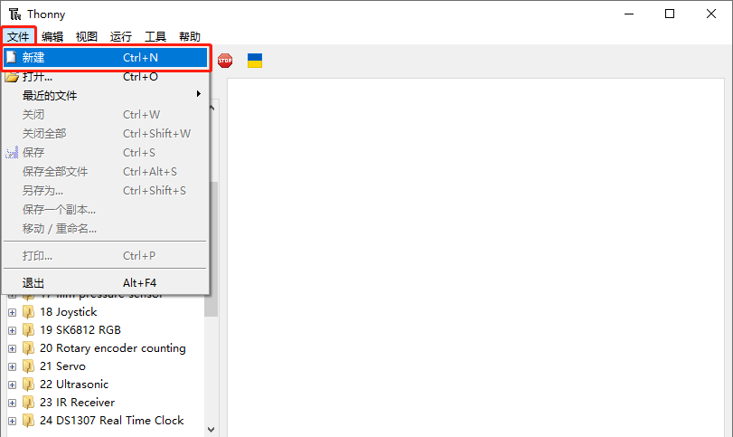

在新打开的文件中输写代码。（以lesson 02. LED.py的代码为例。）

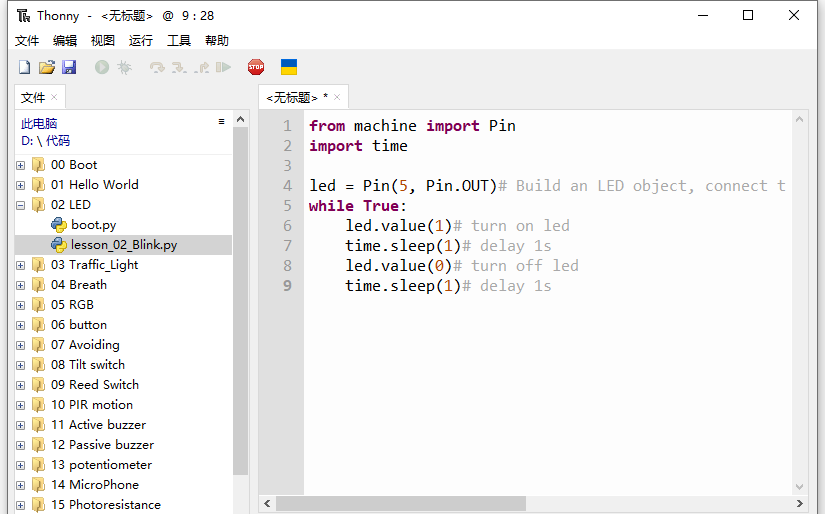

单击菜单栏上的,可以将代码保存到你的电脑或ESP32上。这里选择保存到“MicroPython 设备”。

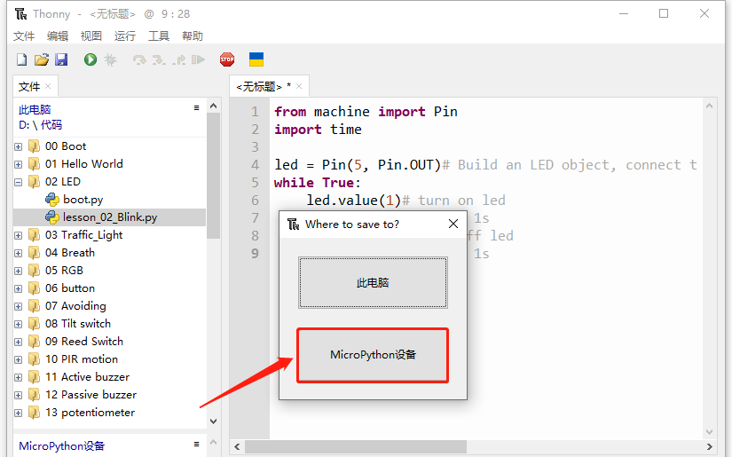

文件名命名为“**main.py**”，然后单击“**好的**”。

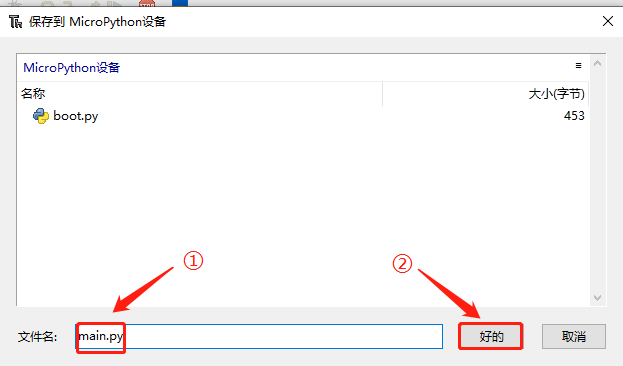

代码已经上传到ESP32。

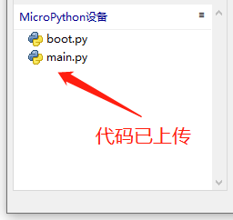

