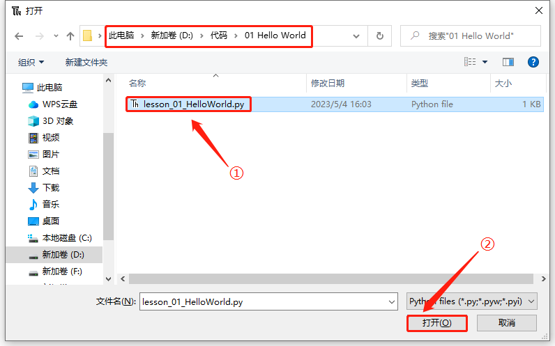
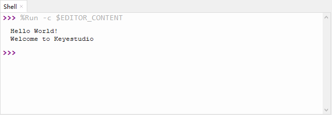

# 第一课 Hello World

## 1.1 项目介绍

对于ESP32的初学者，先从一些简单的开始学习吧！在这个项目中，你只需要一个ESP32主板和USB线就可以完成“Hello World!”项目。它不仅是ESP32主板和计算机的通信测试，也是ESP32的初级项目。这也是一个入门实验，让你进入Python的编程世界。

---

## 1.2 实验组件

|  |  |
| :----------------------: | :-------------------: |
|    ESP32 Plus主板 x1     |       USB线 x1        |

---

## 1.3 实验接线图


---

## 1.4 在线运行代码

在线运行ESP32，需要把ESP32连接到电脑上，才可以使用Thonny软件编译或调试程序。

优点：

1. 可以编译或调试程序。

2. 通过“Shell”窗口，可以查看程序运行过程中产生的错误信息和输出结果，并可以在线查询相关功能信息，帮助改进程序。

缺点：

1. 要在线运行ESP32，必须将ESP32连接到一台电脑上并和Thonny软件一起运行。

2. 如果ESP32与电脑断开连接，当它们重新连接时，程序将无法再次运行。

本项目中使用的代码保存在文件夹“**4. MicroPython教程\2. Windows 系统\1. 项目课程\代码**”中，你可以将代码移至任何你方便使用的地方。**本MicroPython课程的所有实验都是以将代码文件夹移动到（D:）盘中为例的**，移动后路径为“**D:\代码**”。

打开Thonny并单击，然后单击“**此电脑**”。


选中“**D:\代码**”路径，打开代码文件''**lesson_01_HelloWorld.py**"。



```python
print("Hello World!")
print("Welcome to Keyestudio")
```

---

## 1.5 实验结果

按照接线图正确接好模块，用USB线连接到计算机上电，单击来执行程序代码。代码开始执行，能看到“Shell”窗口打印出“**<u>Hello World!</u>**”、“**<u>Welcome  to Keyestudio</u>**”。

当在线运行时，单击或按Ctrl+C退出程序。



---

