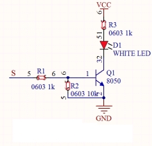
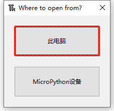
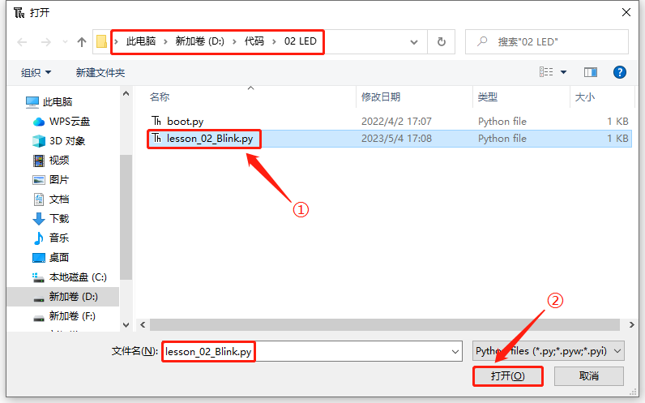

# 第二课 LED

## 1.1 项目介绍

LED，即发光二极管的简称。由含镓（Ga）、砷（As）、磷（P）、氮（N）等的[化合物](https://baike.baidu.com/item/化合物/1142931)制成。当电子与[空穴](https://baike.baidu.com/item/空穴/3517781)复合时能辐射出可见光，因而可以用来制成发光二极管。在电路及仪器中作为指示灯，或者组成文字或数字显示。砷化镓二极管发红光，磷化镓二极管发绿光，碳化硅二极管发黄光，氮化镓二极管发蓝光。因化学性质又分有机发光二极管OLED和无机发光二极管LED。

为了实验的方便，我们将紫色LED发光二极管做成了一个紫色LED模块。它的控制方法非常简单，只要让LED两端有一定的电压就可以点亮LED。在这个项目中，我们用一个最基本的测试代码来控制LED，亮一秒钟，灭一秒钟，来实现闪烁的效果。你可以改变代码中LED灯亮灭的时间，实现不同的闪烁效果。我们通过编程控制信号端S的高低电平，从而控制LED的亮灭。LED模块信号端S为高电平时LED亮起，S为低电平时LED熄灭。

---

## 1.2 模块参数

工作电压：DC 3.3-5V

控制信号：数字信号

尺寸：32 x 23.5 x 12 mm

定位孔大小：直径为 4.8 mm

接口：间距为2.54 mm 3pin防反接口

---

## 1.3 模块原理图



这是一个常用的LED模块，它采用F5-白发紫LED（外观白色，显示紫光）元件。同时，模块上自带一个间距为2.54mm的防反插红色端子。控制时，模块上GND VCC供电后，信号端S为高电平时，模块上LED亮起。

模块兼容各种单片机控制板，如arduino系列单片机。   

---

## 1.4 实验组件

|  |  |        |  |
| ------------------------ | ------------------------ | ---------------------------- | --------------------- |
| ESP32 Plus主板 x1        | Keyes 紫色LED模块 x1     | XH2.54-3P 转杜邦线母单线  x1 | USB线 x1              |

---

## 1.5 模块接线图


---

## 1.6 在线运行代码

本项目中使用的代码保存在文件夹“**4. MicroPython教程\2. Windows 系统\1. 项目课程\代码**”中，你可以将代码移至任何你方便使用的地方。本课程的所有实验都是以将代码文件夹移动到（D:)盘中为例的，移动后路径为“**D:\代码**”。

打开Thonny并单击，然后单击“**此电脑**”。



选中“**D:\代码**”路径，打开代码文件''**lesson_02_Blink.py**"。



```python
from machine import Pin
import time

led = Pin(5, Pin.OUT)# 搭建一个LED对象，将外接LED灯连接到5号引脚，设置5号引脚为输出模式
while True:
    led.value(1)#打开灯
    time.sleep(1)# 延迟1s
    led.value(0)# 关闭灯
    time.sleep(1)# 延迟1s
```

---

## 1.7 实验结果

按照接线图正确接好模块，用USB线连接到计算机上电，单击来执行程序代码。代码开始执行，能看到模块上的紫色LED一亮一灭，循环闪烁。


---

## 1.8 代码说明

| 代码                    | 说明                                                         |
| ----------------------- | ------------------------------------------------------------ |
| from machine import Pin | machine模块里对ESP32主板的一些配置等已经设置好了，我们需导入它，然后调用。 |
| time.sleep(1)           | time模块主要是用于时间延迟设置。括号里是1，延时1秒。         |
| led = Pin(5, Pin.OUT)   | 构建一个引脚类实例，我们将其命名为led，5表示我们连接的引脚为GP5，Pin.OUT表示引脚5为输出模式，即可以使用value()方法输出高电平(3.3V) ：led.value(1)，或者低电平(0V) ：led.value(0)。 |
| while True:             | 循环函数，在此函数下面的语句循环执行，除非True变False。      |

 
