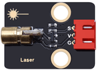

# 第四课 激光头传感器模块发出激光

## 1.1 项目介绍

在这个套件中，有一个Keyes 激光头传感器，激光与常见的光不同。一方面，激光的单色性好。另一方面，激光发射器内部特定的结构，使得激光能够被聚集成单束光，朝着同一方向射出，亮度高，方向性好。

正是由于这些特性，激光被广泛用于对特定材料进行切割、焊接、表面处理等等。激光的能量非常高，玩具激光笔照射人眼可能导致眩光，长时间可能导致视网膜损害，我国也禁止用激光照射航行的飞机。因此，**请注意不要用激光发射器对准人眼。**

---

## 1.2 模块参数

工作电压 ：DC 5V

工作温度 ：-10°C ~ +50°C

输入信号 ：数字信号

尺寸 ：32 x 23.8 x 10 mm

定位孔大小 ：直径为 4.8 mm

接口 ：间距为2.54 mm 3pin防反接口

---

## 1.3 模块原理图


激光头传感器主要由激光头组成，激光头由发光管芯、聚光透镜、铜可调套筒三部分组成。

从激光模块的电路原理图我们可以知道，它是用三极管驱动的。激光头的 1 脚始终上拉到VCC，在信号端 S 处输入一个高电平数字信号，NPN三极管Q1导通，激光头的 2 脚被下拉到GND，此时传感器开始工作。在信号端 S 处输入低电平时NPN三极管Q1不导通，传感器停止工作。

---

## 1.4 实验组件

|  |  |        |  |
| ------------------------ | ------------------------ | ---------------------------- | --------------------- |
| ESP32 Plus主板 x1        | Keyes 激光模块 x1        | XH2.54-3P 转杜邦线母单线  x1 | USB线  x1             |

---

## 1.5 模块接线图


---

## 1.6 在线运行代码

打开Thonny并单击，然后单击“**此电脑**”。

选中“**D:\代码**”路径，打开代码文件''**lesson_04_Laser.py**"。

```python
from machine import Pin
import time

laser = Pin(5, Pin.OUT)# 建立一个激光对象，将激光器连接到5号引脚，将5号引脚设置为输出模式
while True:
    laser.value(1) # 打开激光器
    time.sleep(2) # 延时2s
    laser.value(0) # 关掉激光
    time.sleep(2) # 延时2s
```

---

## 1.7 实验结果

按照接线图正确接好模块，用USB线连接到计算机上电，单击来执行程序代码。能看到模块上激光管发射红色激光信号2秒，然后关闭发射2秒，循环交替。

单击或按Ctrl+C退出程序。


---

## 1.8 代码说明

此课程代码与第二课代码类似，这里就不多做介绍了。 
