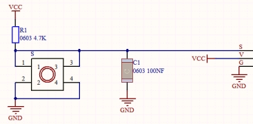
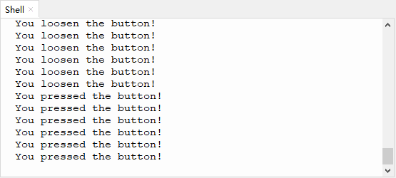

# 第七课 按键传感器检测实验

## 1.1 项目介绍

在这个套件中，有一个Keyes单路按键模块，它主要由1个轻触开关组成，自带1个黄色按键帽。第二课我们学习了怎么让单片机的引脚输出一个高电平或者低电平，这节课程我们就来学习怎么读取引脚的电平。

按键模块的按键按下，单片机读取到低电平，松开按键读取到高电平。通过读取传感器上S端的高低电平，判断按键是否按下，并且在"Shell"窗口上显示测试结果。

---

## 1.2 模块参数

工作电压 : DC 3.3 ~ 5V 

工作温度 ：-10°C ~ +50°C

控制信号 : 数字信号

尺寸 ：32 x 23.8 x 15.6 mm

定位孔大小：直径为 4.8 mm

接口 ：间距为2.54 mm 3pin防反接口

---

## 1.3 模块原理图



按键有四个引脚，其中1与3相连，2与4相连。按键未被按下时，13与24是断开的。信号端S读取的电平是被4.7K的上拉电阻R1所拉高的高电平。而当按键被按下时，13和24连通，原本上拉的13脚被24脚接的GND下拉至低电平，此时信号端S读取到低电平。即按下按键，传感器信号端S为低电平；松开按键时，信号端S为高电平。

---

## 1.4 实验组件

|  |  |        |  |
| ------------------------ | ------------------------ | ---------------------------- | --------------------- |
| ESP32 Plus主板 x1        | Keyes 单路按键模块 x1    | XH2.54-3P 转杜邦线母单线  x1 | USB线  x1             |

---

## 1.5 模块接线图


---

## 1.6 在线运行代码

打开Thonny并单击，然后单击“**此电脑**”。

选中“**D:\代码**”路径，打开代码文件''**lesson_07_button.py**"。

```python
from machine import Pin
import time

button = Pin(5, Pin.IN, Pin.PULL_UP)

while True:
    if button.value() == 0:
        print("You pressed the button!")   #按下打印相应信息
    else:
        print("You loosen the button!")
    time.sleep(0.1) #延时0.1秒
```

---

## 1.7 实验结果

按照接线图正确接好模块，用USB线连接到计算机上电，单击来执行程序代码。代码开始执行，当按下传感器模块上的按键时，按键值value为0，"Shell"窗口打印出“**<u>You pressed the button!</u>**”；松开按键时，按键值value为1，"Shell"窗口打印出“**<u>You loosen the button!</u>**”字符。

单击或按Ctrl+C退出程序。



---

## 1.8 代码说明

| 代码                                 | 说明                                                         |
| ------------------------------------ | ------------------------------------------------------------ |
| button = Pin(5, Pin.IN, Pin.PULL_UP) | 定义按键管脚为GPIO5，设置为输入上拉模式。如果使用button = Pin(5, Pin.IN)设置为输入模式而不使用输入上拉，此时引脚处于高阻抗状态，会导致不可预测的电平结果。为了确保开关断开时的读数正确，推荐使用上拉或下拉电阻。我们的模块已经使用上拉电阻R1，可以不设置输入上拉，该电阻的目的是在开关断开时将引脚拉至已知状态。通常选择一个4.7K/10 K欧姆的电阻，因为它的阻值足够低，可以可靠地防止输入悬空，同时，该阻值也要足够高，以使开关闭合时不会消耗太多电流。如果使用下拉电阻，则当开关断开时，输入引脚将为低电平；当开关闭合时，输入引脚将为高电平。如果使用上拉电阻，则当开关断开时，输入引脚将为高电平；当开关闭合时，输入引脚将为低电平。 |
| button.value()                       | 读取按键的数字电平，函数返回高(HIGH)或者低(LOW)。            |
| if.. else：..                        | 当if后面的逻辑判断为True时，执行if下缩进的代码；否则执行else下缩进的代码。python代码是严格使用缩进的。 |

