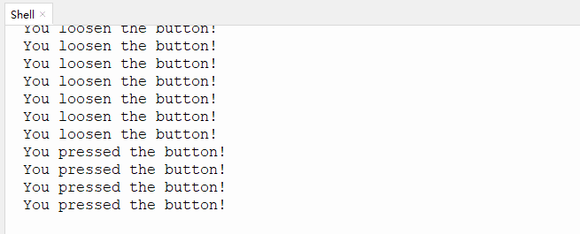

# 第八课 电容触摸传感器检测实验

## 1.1 项目介绍

在这个套件中，有一个Keyes 电容触摸模块，它主要由1个触摸检测芯片 TTP223-BA6 构成。模块上提供一个触摸按键，功能是用可变面积的按键取代传统按键。当我们上电之后，传感器需要约0.5秒的稳定时间，此时间段内不要触摸按键，此时所有功能都被禁止，始终进行自校准，校准周期约为4秒。

---

## 1.2 模块参数

工作电压 ：DC 3.3 ~ 5V

最大功率 ：0.3 W

工作温度 ：-10°C ~ +50°C

输出信号 ：数字信号

尺寸 ：32 x 23.8 x 9 mm

定位孔大小 ：直径为 4.8 mm

接口 ：间距为2.54 mm 3pin防反接口

---

## 1.3 模块原理图


TTP223N-BA6 的输出通过 AHLB（4）引脚选择高电平或低电平有效。通过 TOG（6）引脚选择直接模式或触发模式。

| TOG  | AHLB | 引脚Q的功能           |
| ---- | ---- | --------------------- |
| 0    | 0    | 直接模式，高电平有效  |
| 0    | 1    | 直接模式，低电平有效  |
| 1    | 0    | 触发模式，上电状态为0 |
| 1    | 1    | 触发模式，上电状态为1 |

从原理图我们可以知道 TOG 脚和 AHLB 脚是悬空的，此时输出为直接模式，高电平有效。

当我们用手指触摸模块上的感应区时，信号端 S 输出高电平（上一课学习的按键模块与之相反，当按键感应到按下输出低电平），板载红色LED点亮，我们通过读取模块上 S 端的高低电平，判断电容触摸模块上的感应区是否感应到触摸。

---

## 1.4 实验组件

|  |  |        |  |
| ------------------------ | ------------------------ | ---------------------------- | --------------------- |
| ESP32 Plus主板 x1        | Keyes 电容触摸模块 x1    | XH2.54-3P 转杜邦线母单线  x1 | USB线  x1             |

---

## 1.5 模块接线图


---

## 1.6 在线运行代码

打开Thonny并单击，然后单击“**此电脑**”。

选中“**D:\代码**”路径，打开代码文件''**lesson_08_Touch.py**"。

```python
from machine import Pin
import time

touch = Pin(5, Pin.IN, Pin.PULL_UP)

while True:
    if touch.value() == 1:
        print("You pressed the button!")   #按下打印相应信息
    else:
        print("You loosen the button!")
    time.sleep(0.1) #延迟0.1s
```

---

## 1.7 实验结果

按照接线图正确接好模块，用USB线连接到计算机上电，单击来执行程序代码。

代码开始执行，当触摸模块上的感应区感应到触摸时，板载红色LED点亮，value 值为 1，"Shell"窗口打印出“**You pressed the button!**”；当没有感应到触摸时，板载红色LED熄灭，value 值为 0，"Shell"窗口打印出“**You loosen the button!**”。

单击或按Ctrl+C退出程序。




---

## 1.8 代码说明

此课程代码与第七课代码类似，这里就不多做介绍了。
