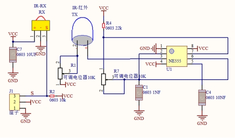
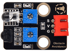
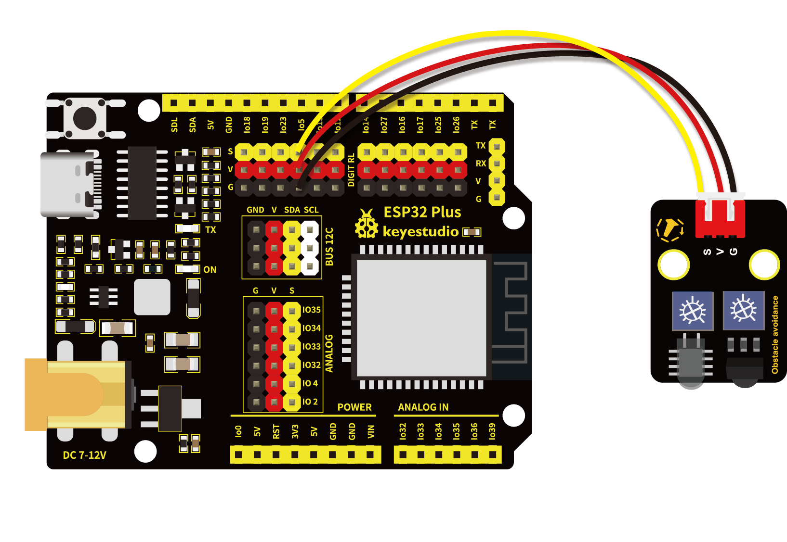
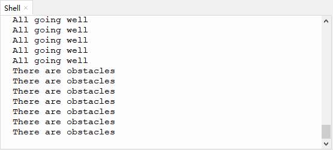

# 第九课 避障传感器检测障碍物

## 1.1 项目介绍

在这个套件中，有一个Keyes 避障传感器，它主要由一对红外线发射与接收管元件组成。实验中，我们通过读取传感器上S端高低电平，判断是否存在障碍物；并且，在串口监视器上显示测试结果。

---

## 1.2 模块参数

工作电压 : DC 5V 

电流 : 50 mA

最大功率 : 0.3 W

工作温度 ：-10°C ~ +50°C

输出信号 : 数字信号

感应距离 : 2 ~ 40 cm

尺寸 ：32 x 23.8 x 11 mm

定位孔大小：直径为 4.8 mm

接口 ：间距为2.54 mm 3pin防反接口

---

## 1.3 模块原理图



NE555时基电路提供给发射管TX发射出一定频率的红外信号，红外信号会随着传送距离的加大逐渐衰减，如果遇到障碍物，就会形成红外反射。当检测方向RX遇到反射回来的信号比较弱时，接收检测引脚输出高电平，说明障碍物比较远；当反射回来的信号比较强，接收检测引脚输出低电平，说明障碍物比较近，此时指示灯亮起。传感器上有两个电位器，一个用于调节发送功率，一个用于调节接收频率，通过调节两个电位器，我们可以调节它的有效距离。

---

## 1.4 实验组件

|  |  |        |  |
| ------------------------ | ------------------------ | ---------------------------- | --------------------- |
| ESP32 Plus主板 x1        | Keyes 避障传感器 x1      | XH2.54-3P 转杜邦线母单线  x1 | USB线  x1             |

---

## 1.5 模块接线图



---

## 1.6 在线运行代码

打开Thonny并单击，然后单击“**此电脑**”。

选中“**D:\代码**”路径，打开代码文件''**lesson_09_Avoiding.py**"。

```python
from machine import Pin
import time  

sensor = Pin(5, Pin.IN) 
while True:
    if sensor.value() == 0:
        print("There are obstacles")
    else:
        print("All going well")
    time.sleep(0.1)
```

---

## 1.7 实验结果

按照接线图正确接好模块，用USB线连接到计算机上电，单击来执行程序代码。代码开始执行，接着开始调节传感器模块上的两个电位器感应距离。避障传感器上有两个电位器，分别是接收频率调节电位器和发射功率调节电位器，如下图所示。

**注意：**调节时保持传感器前方没有障碍物阻挡，否则调节后的检测距离较短。


先调节发射功率调节电位器，先将电位器顺时针到尽头，然后逆时针慢慢往回调，当调节到SLED灯亮起时，微调使传感器上SLED灯介于亮与不亮之间的**不亮**状态。

接着设置接收频率调节电位器，同样将电位器顺时针到尽头，然后逆时针慢慢往回调，当SLED灯亮起时，微调使传感器上SLED灯介于亮与不亮之间的**不亮**状态，此时能检测障碍物的距离最长。

调节完成后查看“Shell”窗口。当传感器检测到障碍物时，value值为**<u>0</u>**，SLED灯亮，“Shell”窗口打印出 “**<u>There are obstacles</u>**” ；没有检测到障碍物时，value值为**<u>1</u>**，SLED灯灭，“Shell”窗口打印出 “**<u>All going well</u>**” 。

单击或按Ctrl+C退出程序。




---

## 1.8 代码说明

此课程代码与第七课代码类似，这里就不多做介绍了。 
