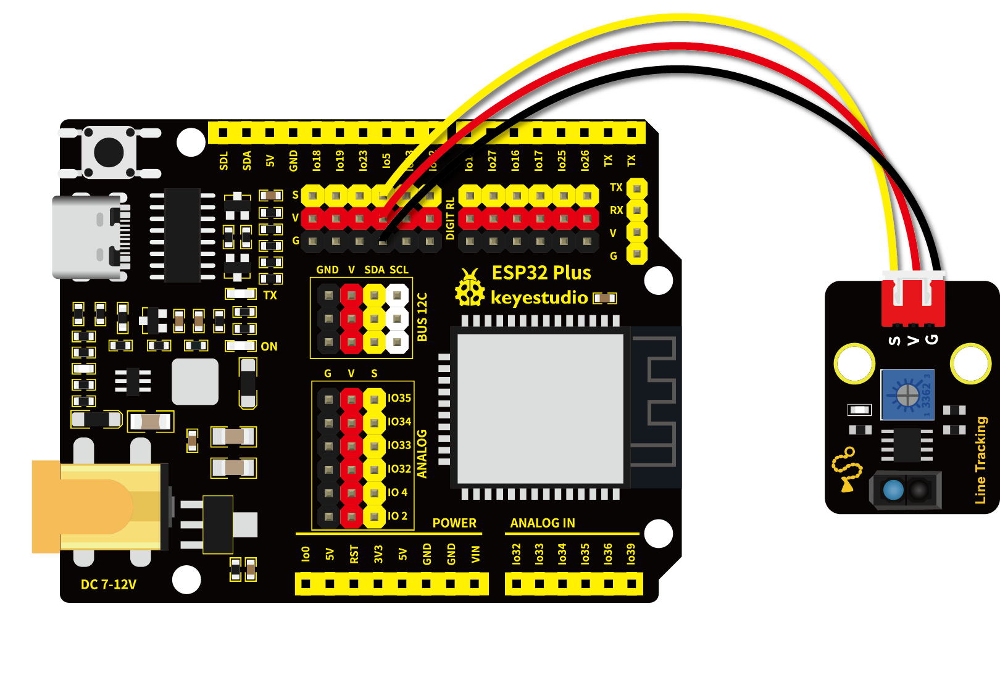
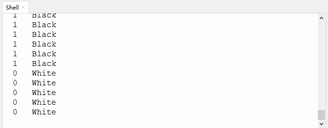

# 第十课 循迹传感器检测黑白线

## 1.1 项目介绍

在这个套件中，有一个Keyes 单路循线传感器，它主要由1个TCRT5000 反射型黑白线识别传感器元件组成。

---

## 1.2 模块参数

工作电压 ：DC 3.3 ~ 5V

工作温度 ：-10°C ~ +50°C

输入信号 ：PWM信号

尺寸 ：32 x 23.8 x 9.4 mm

定位孔大小 ：直径为 4.8 mm

接口 ：间距为2.54 mm 3pin防反接口

---

## 1.3 模块原理图


上一课我们学习了避障传感器的原理，而巡线传感器的原理也是相类似的。TCRT5000 反射型传感器包含了一个红外发射器和光电探测器，彼此相邻。巡线传感器的红外发射器持续发出红外线，红外线经过反射后被接收。接收后会产生电流，这个电流随着红外线光增强而变大。接收后利用电压比较器 LM393 ，将接收到红外线后 LM393 的 3 脚的电压值与可调电位器给 LM393 的 2 脚设置的阈值电压进行比较。

当发射出的红外线没有被反射回来或被反射回来但强度不够大时，红外接收管一直处于关闭状态，此时 R3 处的电压接近VCC，即 LM393 的 3 脚电压接近 VCC。而LM393 的 2 脚电压小于 VCC，通过 LM393 比较器后比较 1 脚输出高电平，LED不导通。随着反射回来的红外线光增强，电流也随之变大。此时 3 脚的电压值等于 VCC - I*R3，随着电流的增大，3 脚的电压就会越来越小。当电压小到比 2 脚的电压还小的时候，接收检测引脚 1 脚输出低电平，LED导通，被点亮。

当红外信号发送到黑色轨道时，由于黑色吸光能力比较强，红外信号发送出去后就会被吸收掉，反射部分很微弱。而白色反射率高，所以白色轨道就会把大部分红外信号反射回来。即检测到黑色或没检测到物体时，信号端为高电平；检测到白色物体时，信号端为低电平。它的检测高度为 0—3cm。我们可以通过旋转传感器上电位器，调节灵敏度，即调节检测高度。当旋转电位器，使传感器上红色 LED介于不亮与亮之间的临界点时，灵敏度最好。

---

## 1.4 实验组件

|  |  |        |  |
| ------------------------ | ------------------------ | ---------------------------- | --------------------- |
| ESP32 Plus主板 x1        | Keyes 单路循线传感器x1   | XH2.54-3P 转杜邦线母单线  x1 | USB线  x1             |

---

## 1.5 模块接线图



---

## 1.6 在线运行代码

打开Thonny并单击，然后单击“**此电脑**”。

选中“**D:\代码**”路径，打开代码文件''**lesson_10_Line_tracking.py**"。

```python
from machine import Pin
import time

sensor = Pin(5, Pin.IN, Pin.PULL_UP)

while True:
    if sensor.value() == 0:
        print("0   White")   #按下打印相应信息
    else:
        print("1   Black")
    time.sleep(0.1) #延时 0.1s
```

---

## 1.7 实验结果

按照接线图正确接好模块，用USB线连接到计算机上电，单击来执行程序代码。

代码开始执行，"Shell"窗口打印出对应的数据和字符。当传感器检测到黑色物体货检测距离太远时，value值为 1 ，LED不亮，"Shell"窗口打印出“**1 Black**”；检测到白色物体（能够反光）时，value值为 0 ，LED亮，"Shell"窗口打印出“**0 White**”。

单击或按Ctrl+C退出程序。



---

## 1.8 代码说明

此课程代码与第七课代码类似，这里就不多做介绍了。
