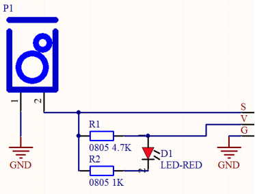
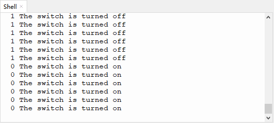

# 第十二课 倾斜模块的原理

## 1.1 项目介绍

在这个套件中，有一个Keyes 倾斜传感器，主要由一个倾斜开关组成，其内部带有一颗滚珠，用来监测倾斜情况。倾斜开关可以依据模块是否倾斜而输出不同的电平信号。当开关高于水平位置倾斜时开关导通，低于水平位置时开关断开。倾斜模块可用于倾斜检测、报警器制作或者其他检测。

---

## 1.2 模块参数

工作电压 : DC 3.3 ~ 5V 

电流 : 50 mA

最大功率 : 0.3 W

工作温度 ：-10°C ~ +50°C

输出信号 : 数字信号

尺寸 ：32 x 23.8 x 8 mm

定位孔大小：直径为 4.8 mm

接口 ：间距为2.54 mm 3pin防反接口

---

## 1.3 模块原理图



Keyes 倾斜传感器的原理非常简单，主要是利用滚珠在开关内随不同倾斜角度的变化使滚珠开关P1的引脚1和2导通或者不导通，当滚珠开关P1的引脚1和2导通时，由于1脚接GND，所以信号端S被拉低为低电平，此时红色LED和R2组成的电路形成回路，电流经过红色LED，点亮红色LED；当滚珠开关P1的引脚1和2不导通时，滚珠开关P1的引脚2被4.7K的上拉电阻R1拉高使得信号端S为高电平，电流不经过红色LED，红色LED熄灭。


---

## 1.4 实验组件

|  |  |        |  |
| ------------------------ | ------------------------ | ---------------------------- | --------------------- |
| ESP32 Plus主板 x1        | Keyes 倾斜传感器 x1      | XH2.54-3P 转杜邦线母单线  x1 | USB线  x1             |

---

## 1.5 模块接线图


---

## 1.6 在线运行代码

打开Thonny并单击，然后单击“**此电脑**”。

选中“**D:\代码**”路径，打开代码文件''**lesson_12_Tilt_switch.py**"。

```python
from machine import Pin
import time

TiltSensor = Pin(5, Pin.IN)

while True:
    value = TiltSensor.value()
    print(value, end = " ")
    if  value== 0:
        print("The switch is turned on")
    else:
        print("The switch is turned off")
    time.sleep(0.1)
```

---

## 1.7 实验结果

按照接线图正确接好模块，用USB线连接到计算机上电，单击来执行程序代码。代码开始执行，将倾斜模块往某一边倾斜，若模块上的红色LED**不亮**，“Shell”窗口打印出“**1 The switch is turned off**”；若模块上的红色LED点**亮**，“Shell”窗口打印出“**0 The switch is turned on**”。




---

## 1.8 代码说明

此课程代码与第七课代码类似，这里就不多做介绍了。

