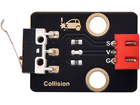

# 第十三课 碰撞传感器的原理

## 1.1 项目介绍

在这个套件中，有一个Keyes 碰撞传感器。上一课我们学习的倾斜模块用的是滚珠开关，这一课我们学习的碰撞传感器用的是轻触开关。碰撞传感器常用于3D打印机内做限位开关。

---

## 1.2 模块参数

工作电压：DC 3.3-5V

控制信号：数字信号

尺寸：39.5 x 23.5 x 9.2 mm

定位孔大小：直径为 4.8 mm

接口：间距为2.54 mm 3pin防反接口

---

## 1.3 模块原理图


碰撞传感器主要由 1 个轻触开关组成。当物体碰到轻触开关弹片，下压时，2 脚和 3 脚导通，传感器信号端 S 被下拉为低电平，模块上自带的红色 LED 点亮；当没有物体碰撞轻触开关时，2 脚和 3 脚不导通，3 脚被 4.7 K的电阻 R1 上拉为高电平，即传感器信号端S为高电平，此时自带红色 LED 熄灭。碰撞传感器的原理与倾斜模块的电路原理几乎一样，不同之处在于导通方式。

---

## 1.4 实验组件

|  |  |        |  |
| --------------------- | --------------------- | ---------------------------- | --------------------- |
| ESP32 Plus主板 x1     | Keyes 碰撞传感器 x1   | XH2.54-3P 转杜邦线母单线  x1 | USB线 x1              |

---

## 1.5 模块接线图


---

## 1.6 在线运行代码

打开Thonny并单击，然后单击“**此电脑**”。

选中“**D:\代码**”路径，打开代码文件''**lesson_13_collision_sensor.py**"。

```python
from machine import Pin
import time

CollisionSensor = Pin(5, Pin.IN)

while True:
    value = CollisionSensor.value()
    print(value, end = " ")
    if  value== 0:
        print("The end of this!")
    else:
        print("All going well")
    time.sleep(0.1)
```

---

## 1.7 实验结果

按照接线图正确接好模块，用USB线连接到计算机上电，单击来执行程序代码。

将传感器的上弹片下压时，value值为0，模块上LED点亮，"Shell"窗口打印出“**0  The end of this!**” ；当松开弹片时，value值为1，模块上LED熄灭，"Shell"窗口打印出“**1  All going well!**”。


---

## 1.8 代码说明

 此课程代码与第十二课代码类似，这里就不多做介绍了。
