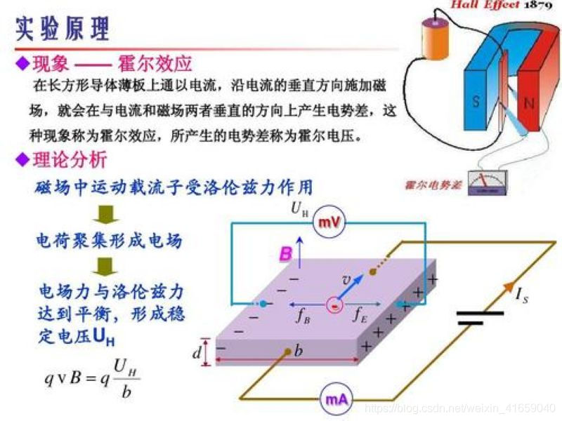
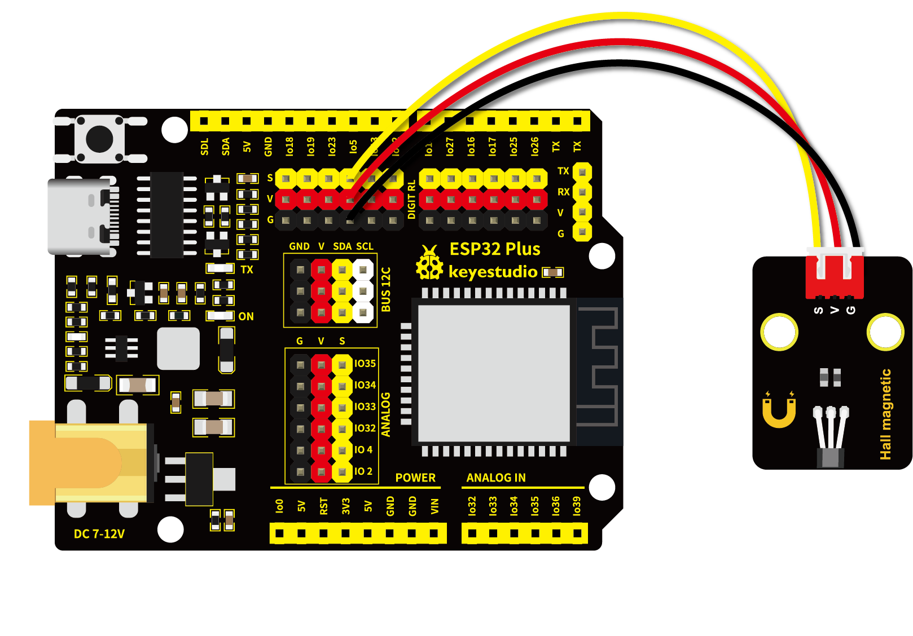

# 第十四课 霍尔传感器检测南极磁场

## 1.1 项目介绍

在这个套件中，有一个Keyes 霍尔传感器，它主要由 A3144 线性霍尔元件组成。该元件是由电压调整器、霍尔电压发生器、差分放大器、史密特触发器，温度补偿电路和集电极开路的输出级组成的磁敏传感电路，其输入为磁感应强度，输出是一个数字电压讯号。



霍尔效应传感器有两种主要类型，一种提供模拟输出，另一种提供数字输出。 A3144 是数字输出霍尔传感器。

---

## 1.2 模块参数

工作电压：DC 3.3-5V

控制信号：数字信号

尺寸：32 x 23.5 x 9.2 mm

定位孔大小：直径为 4.8 mm

接口：间距为2.54 mm 3pin防反接口

---

## 1.3 模块原理图


传感器感应到无磁场或北极磁场时，信号端为高电平；感应到南极磁场时，信号端为低电平。当感应磁场强度越强时，感应距离越长。

---

## 1.4 实验组件

|  |  |        |  |
| ------------------------ | --------------------- | ---------------------------- | --------------------- |
| ESP32 Plus主板 x1        | Keyes 霍尔传感器 x1   | XH2.54-3P 转杜邦线母单线  x1 | USB线 x1              |

---

## 1.5 模块接线图



---

## 1.6 在线运行代码

打开Thonny并单击，然后单击“**此电脑**”。

选中“**D:\代码**”路径，打开代码文件''**lesson_14_Hall.py**"。

```python
from machine import Pin
import time

hall = Pin(5, Pin.IN)
while True:
    value = hall.value()
    print(value, end = " ")
    if value == 0:
        print("A magnetic field")
    else:
        print("There is no magnetic field")
    time.sleep(0.1)
```

---

## 1.7 实验结果

按照接线图正确接好模块，用USB线连接到计算机上电，单击来执行程序代码。

当传感器感应到北极磁场或无磁场感应时，"Shell"窗口打印出“**1  There is no magnetic field**”，且传感器上的LED处于熄灭状态；当传感器感应到南极磁场时，"Shell"窗口打印出“**0  A magnetic field**”，且模块上的LED被点亮。


---

## 1.8 代码说明

 此课程代码与第七课代码类似，这里就不多做介绍了。
